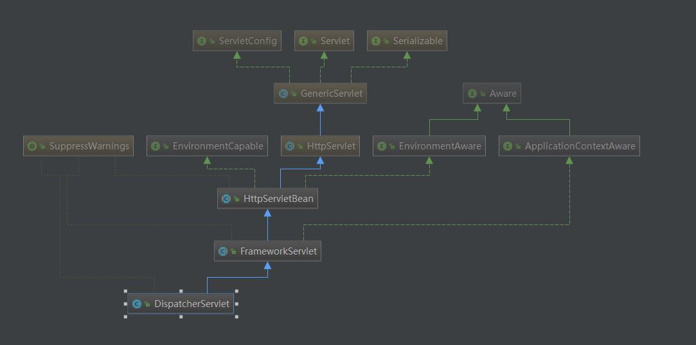
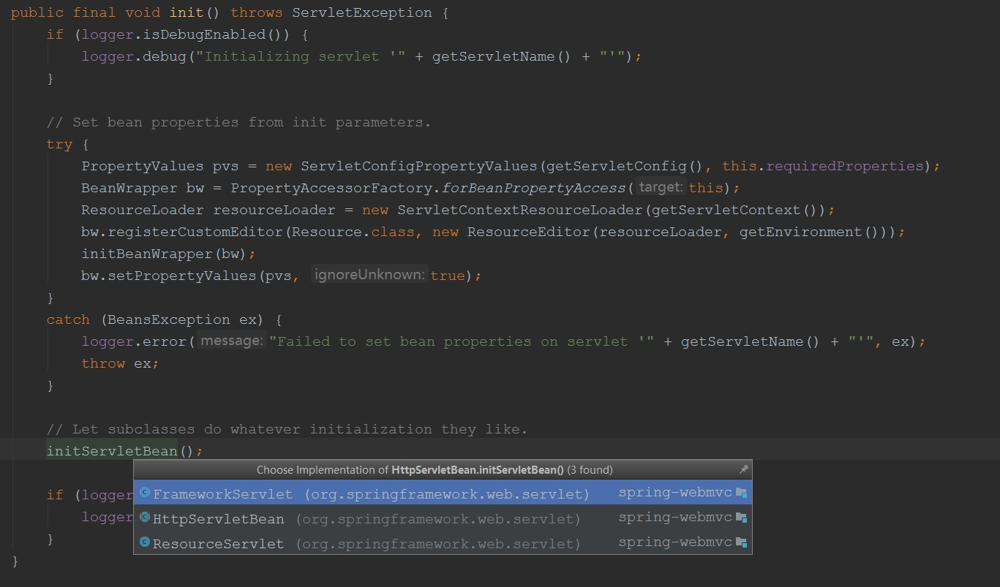
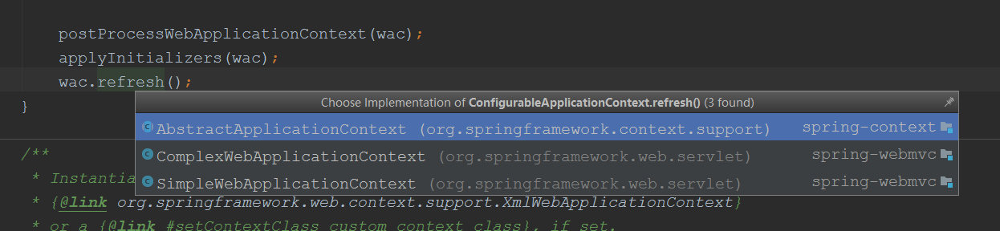
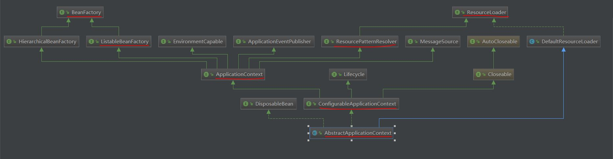
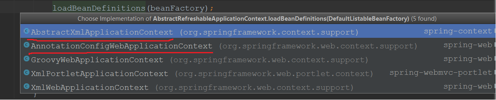
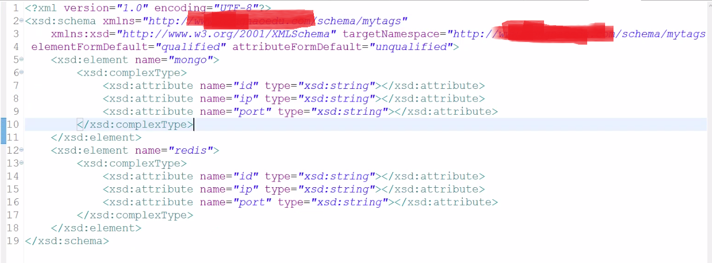
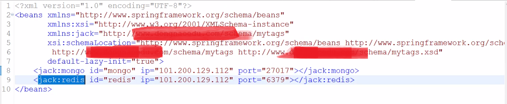
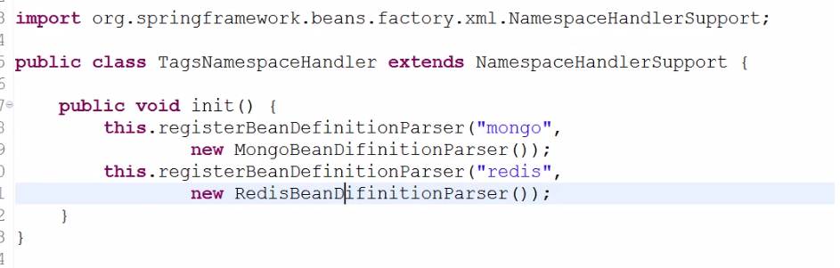
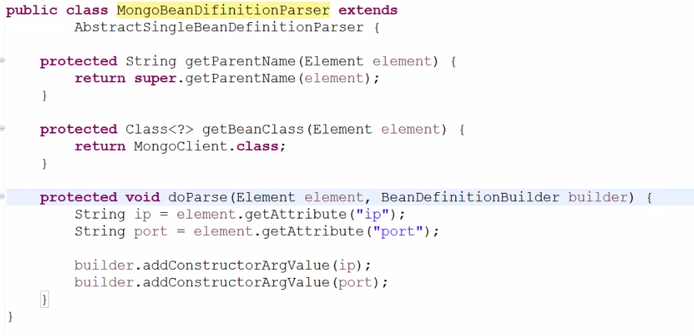

## spring mvc 源码解析
### spring mvc 入口 DispatcherServlet，类关系图如下所示：
  

DispatcherServlet 就是一个 Servlet，哪Servlet 的初始化方法 init()在哪里，通过类图可知，可以查看 HttpServletBean 中的 init() 方法，进行 Servlet初始化。init()方法代码如下：
```
    @Override
	public final void init() throws ServletException {	    
		if (logger.isDebugEnabled()) {
		    //当初始化容器时第一个打印的就是这个日志
			logger.debug("Initializing servlet '" + getServletName() + "'");
		}

		// Set bean properties from init parameters.
		try {
		    //包装 bean的属性
			PropertyValues pvs = new ServletConfigPropertyValues(getServletConfig(), this.requiredProperties);
			//包装 bean 实例
			BeanWrapper bw = PropertyAccessorFactory.forBeanPropertyAccess(this);
			//获取配置文件，如
			ResourceLoader resourceLoader = new ServletContextResourceLoader(getServletContext());
			bw.registerCustomEditor(Resource.class, new ResourceEditor(resourceLoader, getEnvironment()));
			initBeanWrapper(bw);
			bw.setPropertyValues(pvs, true);
		}
		catch (BeansException ex) {
			logger.error("Failed to set bean properties on servlet '" + getServletName() + "'", ex);
			throw ex;
		}

		// Let subclasses do whatever initialization they like.
		//调用子类方法，由上面的类图可知会调用：FrameworkServlet中的initServletBean()方法
		initServletBean();

		if (logger.isDebugEnabled()) {
			logger.debug("Servlet '" + getServletName() + "' configured successfully");
		}
	}
```

查看 initServletBean() 方法在哪些子类中  
  
由DispatcherServlet类关系图可知，进入 FrameworkServlet中的initServletBean()方法，查看 initWebApplicationContext() 方法，**重点**
```
protected WebApplicationContext initWebApplicationContext() {
		WebApplicationContext rootContext =
				WebApplicationContextUtils.getWebApplicationContext(getServletContext());
		WebApplicationContext wac = null;

		if (this.webApplicationContext != null) {
			// A context instance was injected at construction time -> use it
			wac = this.webApplicationContext;
			if (wac instanceof ConfigurableWebApplicationContext) {
				ConfigurableWebApplicationContext cwac = (ConfigurableWebApplicationContext) wac;
				if (!cwac.isActive()) {
					// The context has not yet been refreshed -> provide services such as
					// setting the parent context, setting the application context id, etc
					if (cwac.getParent() == null) {
						// The context instance was injected without an explicit parent -> set
						// the root application context (if any; may be null) as the parent
						cwac.setParent(rootContext);
					}
					// 查看该方法 重点
					configureAndRefreshWebApplicationContext(cwac);
				}
			}
		}
		if (wac == null) {
			// No context instance was injected at construction time -> see if one
			// has been registered in the servlet context. If one exists, it is assumed
			// that the parent context (if any) has already been set and that the
			// user has performed any initialization such as setting the context id
			wac = findWebApplicationContext();
		}
		if (wac == null) {
			// No context instance is defined for this servlet -> create a local one
			wac = createWebApplicationContext(rootContext);
		}

		if (!this.refreshEventReceived) {
			// Either the context is not a ConfigurableApplicationContext with refresh
			// support or the context injected at construction time had already been
			// refreshed -> trigger initial onRefresh manually here.
			
			//重点 调用 DispatcherServlet类中的 onRefresh()方法，对请求和响应做的一些初始化
			onRefresh(wac);
		}

		if (this.publishContext) {
			// Publish the context as a servlet context attribute.
			String attrName = getServletContextAttributeName();
			getServletContext().setAttribute(attrName, wac);
			if (this.logger.isDebugEnabled()) {
				this.logger.debug("Published WebApplicationContext of servlet '" + getServletName() +
						"' as ServletContext attribute with name [" + attrName + "]");
			}
		}

		return wac;
	}
```

### 分析 configureAndRefreshWebApplicationContext(cwac) 
```
protected void configureAndRefreshWebApplicationContext(ConfigurableWebApplicationContext wac) {
		if (ObjectUtils.identityToString(wac).equals(wac.getId())) {
			// The application context id is still set to its original default value
			// -> assign a more useful id based on available information
			if (this.contextId != null) {
				wac.setId(this.contextId);
			}
			else {
				// Generate default id...
				wac.setId(ConfigurableWebApplicationContext.APPLICATION_CONTEXT_ID_PREFIX +
						ObjectUtils.getDisplayString(getServletContext().getContextPath()) + "/" + getServletName());
			}
		}
        //在spring 中 设置servlet上下文
		wac.setServletContext(getServletContext());
		//在spring 中 设置 servlet 的配置信息 如xml 中的 <init-param> …… </init-param>
		wac.setServletConfig(getServletConfig());
		wac.setNamespace(getNamespace());
		wac.addApplicationListener(new SourceFilteringListener(wac, new ContextRefreshListener()));

		// The wac environment's #initPropertySources will be called in any case when the context
		// is refreshed; do it eagerly here to ensure servlet property sources are in place for
		// use in any post-processing or initialization that occurs below prior to #refresh
		
		//在spring 中获取工作环境，就是 beans 标签下的 profile元素 ，可以指定是生产环境还是测试环境
		ConfigurableEnvironment env = wac.getEnvironment();
		if (env instanceof ConfigurableWebEnvironment) {
			((ConfigurableWebEnvironment) env).initPropertySources(getServletContext(), getServletConfig());
		}

		postProcessWebApplicationContext(wac);
		applyInitializers(wac);
		//重点 进入子类 AbstractApplicationContext 中的 refresh()方法
		wac.refresh();
	}
```
refresh() 方法在哪些子类中   
  

### AbstractApplicationContext 类关系图，红色部分为重点类


### AbstractApplicationContext 中的 refresh()方法
```
    @Override
	public void refresh() throws BeansException, IllegalStateException {
		synchronized (this.startupShutdownMonitor) {
			// Prepare this context for refreshing.
			prepareRefresh();

			// Tell the subclass to refresh the internal bean factory.
			
			//重点 查看 obtainFreshBeanFactory()方法
			//1. xml解析  //2. annotation的解析
			ConfigurableListableBeanFactory beanFactory = obtainFreshBeanFactory();

			// Prepare the bean factory for use in this context.
			// 对 BeanFactory 进行的初始化
			prepareBeanFactory(beanFactory);

			try {
				// Allows post-processing of the bean factory in context subclasses.
				//该方法的分析请看 postProcessBeanFactory.md 文件
				postProcessBeanFactory(beanFactory);

				// Invoke factory processors registered as beans in the context.
				invokeBeanFactoryPostProcessors(beanFactory);

				// Register bean processors that intercept bean creation.
				registerBeanPostProcessors(beanFactory);

				// Initialize message source for this context.
				initMessageSource();

				// Initialize event multicaster for this context.
				initApplicationEventMulticaster();

				// Initialize other special beans in specific context subclasses.
				onRefresh();

				// Check for listener beans and register them.
				registerListeners();

				// Instantiate all remaining (non-lazy-init) singletons.
				finishBeanFactoryInitialization(beanFactory);

				// Last step: publish corresponding event.
				finishRefresh();
			}

			catch (BeansException ex) {
				if (logger.isWarnEnabled()) {
					logger.warn("Exception encountered during context initialization - " +
							"cancelling refresh attempt: " + ex);
				}

				// Destroy already created singletons to avoid dangling resources.
				destroyBeans();

				// Reset 'active' flag.
				cancelRefresh(ex);

				// Propagate exception to caller.
				throw ex;
			}

			finally {
				// Reset common introspection caches in Spring's core, since we
				// might not ever need metadata for singleton beans anymore...
				resetCommonCaches();
			}
		}
	}
```
### 分析 obtainFreshBeanFactory()
```
protected ConfigurableListableBeanFactory obtainFreshBeanFactory() {
        // 查看该方法
		refreshBeanFactory();
		ConfigurableListableBeanFactory beanFactory = getBeanFactory();
		if (logger.isDebugEnabled()) {
			logger.debug("Bean factory for " + getDisplayName() + ": " + beanFactory);
		}
		return beanFactory;
	}
```
查看refreshBeanFactory() 方法在哪些子类中  


### 进入 AbstractRefreshableApplicationContext 类中的 refreshBeanFactory()方法
```
@Override
	protected final void refreshBeanFactory() throws BeansException {
		//判断bean容器是否已经存在了,如果存在了就表示 bean容器已经启动成功了
		if (hasBeanFactory()) { // 这个不会执行，只是spring 的容错措施
			destroyBeans();
			closeBeanFactory();
		}
		try {
			DefaultListableBeanFactory beanFactory = createBeanFactory();
			beanFactory.setSerializationId(getId());
			customizeBeanFactory(beanFactory);
			
			//xml 的解析 查看 AbstractXmlApplicationContext 中 loadBeanDefinitions方法
			loadBeanDefinitions(beanFactory);
			synchronized (this.beanFactoryMonitor) {
				this.beanFactory = beanFactory;
			}
		}
		catch (IOException ex) {
			throw new ApplicationContextException("I/O error parsing bean definition source for " + getDisplayName(), ex);
		}
	}
```
loadBeanDefinitions方法在哪些子类中  
- xml的解析类  
  AbstractXmlApplicationContext
  
- 注解的解析类  
  AnnotationConfigWebApplicationContext
    
   

### xml 解析类 AbstractXmlApplicationContext 中 loadBeanDefinitions方法
```
    @Override
	protected void loadBeanDefinitions(DefaultListableBeanFactory beanFactory) throws BeansException, IOException {
		// Create a new XmlBeanDefinitionReader for the given BeanFactory.
		
		// xml Reade 对象的定义 Reader对象将xml配置封装成 BeanDefinition
		XmlBeanDefinitionReader beanDefinitionReader = new XmlBeanDefinitionReader(beanFactory);

		// Configure the bean definition reader with this context's
		// resource loading environment.
		beanDefinitionReader.setEnvironment(this.getEnvironment());
		
		//放入 this,即 AbstractXmlApplicationContext 对象，没有报错:
		//因为AbstractXmlApplicationContext的父类ApplicationContext实现了ResourceLoader
		//具体请看 AbstractXmlApplicationContext 的类图，如下所示
		beanDefinitionReader.setResourceLoader(this);
		beanDefinitionReader.setEntityResolver(new ResourceEntityResolver(this));

		// Allow a subclass to provide custom initialization of the reader,
		// then proceed with actually loading the bean definitions.
		initBeanDefinitionReader(beanDefinitionReader);
		
		//重点：查看这个方法
		loadBeanDefinitions(beanDefinitionReader);
	}
```
### xml 解析过程 类的流转
- 将xml 或 properties 通过 ResourceLoader 加载为 Resource 对象
- 每个 Resource 对象 都有对应的 Reader对象，Reader对象将配置封装成 BeanDefinition
- BeanDefinition 在放入 map或容器中　
> ResourceUtils 类中记录了所有 文件的资源位置的实用方法和位置表示符，例如：classpath: 、jar:、file: 等　


#### AbstractXmlApplicationContext 类图
- beanDefinitionReader.setResourceLoader(this)  没有报错的原因：  
  AbstractXmlApplicationContext的父类ApplicationContext实现了ResourceLoader接口，
  所以 AbstractXmlApplicationContext类也是 ResourceLoader 类型的对象


#### loadBeanDefinitions(beanDefinitionReader) 方法
```
protected void loadBeanDefinitions(XmlBeanDefinitionReader reader) throws BeansException, IOException {
		
		//getConfigResources() 方法进入子类 ClassPathXmlApplicationContext的 getConfigResources()方法中
		//通过 getConfigResources() 这个方法将 所有 xml 文件封装成 Resource对象
		//得到 Resource 对象就得到了文件所对应的 文件流，这个文件流在解析 xml 时会用到。
		//resource == applicationContext.xml封装成resource对象
		Resource[] configResources = getConfigResources();
		
		if (configResources != null) {
			//调用 xml 所对应的 Reader 类中的 loadBeanDefinitions 方法 
			reader.loadBeanDefinitions(configResources);
		}
		String[] configLocations = getConfigLocations();
		if (configLocations != null) {
			reader.loadBeanDefinitions(configLocations);
		}
	}
```

### 进入 AbstractBeanDefinitionReader 类中的 loadBeanDefinitions 方法
```
	@Override
	public int loadBeanDefinitions(Resource... resources) throws BeanDefinitionStoreException {
		Assert.notNull(resources, "Resource array must not be null");
		int counter = 0;
		for (Resource resource : resources) {
		    //查看该方法,进入 XmlBeanDefinitionReader 类中的 loadBeanDefinitions 方法,如下图所示
			counter += loadBeanDefinitions(resource);
		}
		return counter;
	}
```

### AbstractBeanDefinitionReader中的方法loadBeanDefinitions方法在哪些子类中


### 进入 XmlBeanDefinitionReader 类中的 loadBeanDefinitions 方法
```
    @Override
	public int loadBeanDefinitions(Resource resource) throws BeanDefinitionStoreException {
	   
	     //EncodedResource 类是对 Resource 的再次封装，将 Resource 所对应的编码方式也封装进来了	    
		return loadBeanDefinitions(new EncodedResource(resource));
	}
	
	public int loadBeanDefinitions(EncodedResource encodedResource) throws BeanDefinitionStoreException {
		Assert.notNull(encodedResource, "EncodedResource must not be null");
		if (logger.isInfoEnabled()) {
			logger.info("Loading XML bean definitions from " + encodedResource.getResource());
		}

		Set<EncodedResource> currentResources = this.resourcesCurrentlyBeingLoaded.get();
		if (currentResources == null) {
			currentResources = new HashSet<EncodedResource>(4);
			this.resourcesCurrentlyBeingLoaded.set(currentResources);
		}
		if (!currentResources.add(encodedResource)) {
			throw new BeanDefinitionStoreException(
					"Detected cyclic loading of " + encodedResource + " - check your import definitions!");
		}
		try {
		   
		    //获取 resource 的输入流，也就是配置文件xml的输入流
			InputStream inputStream = encodedResource.getResource().getInputStream();
			try {
			    //xml解析工具有：dom4j、sax
			    //spring 使用 xml解析工具，即dom解析---> jdk中的api
				InputSource inputSource = new InputSource(inputStream);
				if (encodedResource.getEncoding() != null) {
					inputSource.setEncoding(encodedResource.getEncoding());
				}
				//查看该方法
				return doLoadBeanDefinitions(inputSource, encodedResource.getResource());
			}
			finally {
				inputStream.close();
			}
		}
		catch (IOException ex) {
			throw new BeanDefinitionStoreException(
					"IOException parsing XML document from " + encodedResource.getResource(), ex);
		}
		finally {
			currentResources.remove(encodedResource);
			if (currentResources.isEmpty()) {
				this.resourcesCurrentlyBeingLoaded.remove();
			}
		}
	}
	
	
protected int doLoadBeanDefinitions(InputSource inputSource, Resource resource)
			throws BeanDefinitionStoreException {
		try {
		    //xml 解析的  Document 对象，applicationContext.xml 就是 Document，查看 doLoadDocument 方法
			Document doc = doLoadDocument(inputSource, resource);
			
			//方法分析请看下面，查看  registerBeanDefinitions 方法
			return registerBeanDefinitions(doc, resource);
		}
		catch (BeanDefinitionStoreException ex) {
			throw ex;
		}
		catch (SAXParseException ex) {
			throw new XmlBeanDefinitionStoreException(resource.getDescription(),
					"Line " + ex.getLineNumber() + " in XML document from " + resource + " is invalid", ex);
		}
		catch (SAXException ex) {
			throw new XmlBeanDefinitionStoreException(resource.getDescription(),
					"XML document from " + resource + " is invalid", ex);
		}
		catch (ParserConfigurationException ex) {
			throw new BeanDefinitionStoreException(resource.getDescription(),
					"Parser configuration exception parsing XML from " + resource, ex);
		}
		catch (IOException ex) {
			throw new BeanDefinitionStoreException(resource.getDescription(),
					"IOException parsing XML document from " + resource, ex);
		}
		catch (Throwable ex) {
			throw new BeanDefinitionStoreException(resource.getDescription(),
					"Unexpected exception parsing XML document from " + resource, ex);
		}
	}	
	
	
protected Document doLoadDocument(InputSource inputSource, Resource resource) throws Exception {
		return this.documentLoader.loadDocument(inputSource, getEntityResolver(), this.errorHandler,
				getValidationModeForResource(resource), isNamespaceAware());
	}

    //进入 this.documentLoader.loadDocument方法后代码如下：
    @Override
	public Document loadDocument(InputSource inputSource, EntityResolver entityResolver,
			ErrorHandler errorHandler, int validationMode, boolean namespaceAware) throws Exception {
        
        //jdk 中的 dom解析 工作  DocumentBuilderFactory
		DocumentBuilderFactory factory = createDocumentBuilderFactory(validationMode, namespaceAware);
		if (logger.isDebugEnabled()) {
			logger.debug("Using JAXP provider [" + factory.getClass().getName() + "]");
		}
		//获取 DocumentBuilder 对象
		DocumentBuilder builder = createDocumentBuilder(factory, entityResolver, errorHandler);
		
		//使用 DocumentBuilder 对象 解析 xml，返回 Document 对象
		return builder.parse(inputSource);
	}		
	
```

### 分析 XmlBeanDefinitionReader 类中的 registerBeanDefinitions(doc, resource)
```
public int registerBeanDefinitions(Document doc, Resource resource) throws BeanDefinitionStoreException {
		//获取reader对象，也就是 Document 的解析器
		BeanDefinitionDocumentReader documentReader = createBeanDefinitionDocumentReader();
		int countBefore = getRegistry().getBeanDefinitionCount();
		
		//查看该方法
		documentReader.registerBeanDefinitions(doc, createReaderContext(resource));
		return getRegistry().getBeanDefinitionCount() - countBefore;
	}

    // DefaultBeanDefinitionDocumentReader 中的	registerBeanDefinitions 方法
    @Override
	public void registerBeanDefinitions(Document doc, XmlReaderContext readerContext) {
		this.readerContext = readerContext;
		logger.debug("Loading bean definitions");
		
		//获取 Document 的根节点，根节点也就是 applicationContext.xml最外面的 beans 标签
		Element root = doc.getDocumentElement();
		
		//查看该方法
		doRegisterBeanDefinitions(root);
	}	
	
// DefaultBeanDefinitionDocumentReader 中的	doRegisterBeanDefinitions 方法	
protected void doRegisterBeanDefinitions(Element root) {
		BeanDefinitionParserDelegate parent = this.delegate;
		this.delegate = createDelegate(getReaderContext(), root, parent);

		if (this.delegate.isDefaultNamespace(root)) {
		    //查看 profile，也就是说 beans 上的标签可以配置 profile属性，来说明是生产环境还是测试环境
			String profileSpec = root.getAttribute(PROFILE_ATTRIBUTE);
			if (StringUtils.hasText(profileSpec)) {
				String[] specifiedProfiles = StringUtils.tokenizeToStringArray(
						profileSpec, BeanDefinitionParserDelegate.MULTI_VALUE_ATTRIBUTE_DELIMITERS);
				if (!getReaderContext().getEnvironment().acceptsProfiles(specifiedProfiles)) {
					if (logger.isInfoEnabled()) {
						logger.info("Skipped XML bean definition file due to specified profiles [" + profileSpec +
								"] not matching: " + getReaderContext().getResource());
					}
					return;
				}
			}
		}

		preProcessXml(root);
		//查看该方法
		parseBeanDefinitions(root, this.delegate);
		postProcessXml(root);
		this.delegate = parent;
	}	
	
// DefaultBeanDefinitionDocumentReader 中的	parseBeanDefinitions 方法	
protected void parseBeanDefinitions(Element root, BeanDefinitionParserDelegate delegate) {
		if (delegate.isDefaultNamespace(root)) {
			NodeList nl = root.getChildNodes();
			for (int i = 0; i < nl.getLength(); i++) {//循环根元素,即 beans 标签下的所有节点
				Node node = nl.item(i);
				if (node instanceof Element) {
					Element ele = (Element) node;
					if (delegate.isDefaultNamespace(ele)) {
						
						//解析默认的元素 默认元素：import标签、alias 标签、bean 标签 、beans 标签
						parseDefaultElement(ele, delegate);
					}
					else {
					    //解析自定义的元素，是spring mvc 自定义的元素 重点
						delegate.parseCustomElement(ele);
					}
				}
			}
		}
		else {
			delegate.parseCustomElement(root);
		}
	}
	
//解析默认的元素	
private void parseDefaultElement(Element ele, BeanDefinitionParserDelegate delegate) {
		if (delegate.nodeNameEquals(ele, IMPORT_ELEMENT)) { // 解析 import 标签
			importBeanDefinitionResource(ele);
		}
		//alias 标签 说明：可以给 bean标签的id 起个别名，可以对一个bean 标签的id 起多个别名，都可以获取到这个bean对象
		else if (delegate.nodeNameEquals(ele, ALIAS_ELEMENT)) {// 解析 alias 标签，
			processAliasRegistration(ele);
		}
		else if (delegate.nodeNameEquals(ele, BEAN_ELEMENT)) { // 解析 bean 标签，重点
			processBeanDefinition(ele, delegate);
		}
		else if (delegate.nodeNameEquals(ele, NESTED_BEANS_ELEMENT)) { // 解析 beans 标签
			// recurse
			doRegisterBeanDefinitions(ele);
		}
	}	
	
///解析 bean 标签	 重点	
protected void processBeanDefinition(Element ele, BeanDefinitionParserDelegate delegate) {
		//查看该方法，返回 某一个元素的解析，即 BeanDefinition 的封装类 BeanDefinitionHolder
		BeanDefinitionHolder bdHolder = delegate.parseBeanDefinitionElement(ele);
		if (bdHolder != null) {
			bdHolder = delegate.decorateBeanDefinitionIfRequired(ele, bdHolder);
			try {
				// Register the final decorated instance.
				BeanDefinitionReaderUtils.registerBeanDefinition(bdHolder, getReaderContext().getRegistry());
			}
			catch (BeanDefinitionStoreException ex) {
				getReaderContext().error("Failed to register bean definition with name '" +
						bdHolder.getBeanName() + "'", ele, ex);
			}
			// Send registration event.
			getReaderContext().fireComponentRegistered(new BeanComponentDefinition(bdHolder));
		}
	}	
	
//分析delegate.parseBeanDefinitionElement(ele) 方法
public BeanDefinitionHolder parseBeanDefinitionElement(Element ele) {
        // 查看该方法
		return parseBeanDefinitionElement(ele, null);
	}

//分析parseBeanDefinitionElement 方法
public BeanDefinitionHolder parseBeanDefinitionElement(Element ele, BeanDefinition containingBean) {
		// bean标签的id
		String id = ele.getAttribute(ID_ATTRIBUTE);
		// bean标签的 name
		String nameAttr = ele.getAttribute(NAME_ATTRIBUTE);

        // bean标签的 别名
		List<String> aliases = new ArrayList<String>();
		if (StringUtils.hasLength(nameAttr)) {
			String[] nameArr = StringUtils.tokenizeToStringArray(nameAttr, MULTI_VALUE_ATTRIBUTE_DELIMITERS);
			aliases.addAll(Arrays.asList(nameArr));
		}

        // beanName 对应的 就是 bean 的id
		String beanName = id;
		if (!StringUtils.hasText(beanName) && !aliases.isEmpty()) {
			beanName = aliases.remove(0);
			if (logger.isDebugEnabled()) {
				logger.debug("No XML 'id' specified - using '" + beanName +
						"' as bean name and " + aliases + " as aliases");
			}
		}

		if (containingBean == null) {
			// 检查 bean 的name是否唯一,也就是 bean 的id名字是否唯一
			checkNameUniqueness(beanName, aliases, ele);
		}
        
        //查看该方法 重点
		AbstractBeanDefinition beanDefinition = parseBeanDefinitionElement(ele, beanName, containingBean);
		if (beanDefinition != null) {
			if (!StringUtils.hasText(beanName)) {
				try {
					if (containingBean != null) {
						beanName = BeanDefinitionReaderUtils.generateBeanName(
								beanDefinition, this.readerContext.getRegistry(), true);
					}
					else {
						beanName = this.readerContext.generateBeanName(beanDefinition);
						// Register an alias for the plain bean class name, if still possible,
						// if the generator returned the class name plus a suffix.
						// This is expected for Spring 1.2/2.0 backwards compatibility.
						String beanClassName = beanDefinition.getBeanClassName();
						if (beanClassName != null &&
								beanName.startsWith(beanClassName) && beanName.length() > beanClassName.length() &&
								!this.readerContext.getRegistry().isBeanNameInUse(beanClassName)) {
							aliases.add(beanClassName);
						}
					}
					if (logger.isDebugEnabled()) {
						logger.debug("Neither XML 'id' nor 'name' specified - " +
								"using generated bean name [" + beanName + "]");
					}
				}
				catch (Exception ex) {
					error(ex.getMessage(), ele);
					return null;
				}
			}
			String[] aliasesArray = StringUtils.toStringArray(aliases);
			
			// 返回 BeanDefinition 的封装 对象 BeanDefinitionHolder，将bean的 名子和别名，以及BeanDefinition 放入该对象中
			return new BeanDefinitionHolder(beanDefinition, beanName, aliasesArray);
		}

		return null;
	}
	
// 分析 parseBeanDefinitionElement 重点				
public AbstractBeanDefinition parseBeanDefinitionElement(
			Element ele, String beanName, BeanDefinition containingBean) {

		this.parseState.push(new BeanEntry(beanName));

		String className = null;
		if (ele.hasAttribute(CLASS_ATTRIBUTE)) {
		    
		    //获取 bean标签的 class属性，也就是类名
			className = ele.getAttribute(CLASS_ATTRIBUTE).trim();
		}

		try {
			String parent = null;
			if (ele.hasAttribute(PARENT_ATTRIBUTE)) {
				parent = ele.getAttribute(PARENT_ATTRIBUTE);
			}
			
			//查看该方法,返回 BeanDefinition 对象			
			AbstractBeanDefinition bd = createBeanDefinition(className, parent);

            //解析 BeanDefinition 对象的属性，查看该方法，
            // 返回 BeanDefinition 对象，BeanDefinition就是对一系列元素的封装
            // 所有出现在 xml中的标签都会封装在 BeanDefinition 对象中
			parseBeanDefinitionAttributes(ele, beanName, containingBean, bd);
			bd.setDescription(DomUtils.getChildElementValueByTagName(ele, DESCRIPTION_ELEMENT));

			parseMetaElements(ele, bd);
			parseLookupOverrideSubElements(ele, bd.getMethodOverrides());
			parseReplacedMethodSubElements(ele, bd.getMethodOverrides());

			parseConstructorArgElements(ele, bd);
			parsePropertyElements(ele, bd);
			parseQualifierElements(ele, bd);

			bd.setResource(this.readerContext.getResource());
			bd.setSource(extractSource(ele));

			return bd;
		}
		catch (ClassNotFoundException ex) {
			error("Bean class [" + className + "] not found", ele, ex);
		}
		catch (NoClassDefFoundError err) {
			error("Class that bean class [" + className + "] depends on not found", ele, err);
		}
		catch (Throwable ex) {
			error("Unexpected failure during bean definition parsing", ele, ex);
		}
		finally {
			this.parseState.pop();
		}

		return null;
	}
	
// 分析 createBeanDefinition	方法
protected AbstractBeanDefinition createBeanDefinition(String className, String parentName)
			throws ClassNotFoundException {
        
        //查看该方法
		return BeanDefinitionReaderUtils.createBeanDefinition(
				parentName, className, this.readerContext.getBeanClassLoader());
	}	

// 分析 BeanDefinitionReaderUtils.createBeanDefinition 方法
public static AbstractBeanDefinition createBeanDefinition(
			String parentName, String className, ClassLoader classLoader) throws ClassNotFoundException {

		GenericBeanDefinition bd = new GenericBeanDefinition();
		bd.setParentName(parentName);
		if (className != null) {
			if (classLoader != null) {
			    
			    //设置 class 对象
				bd.setBeanClass(ClassUtils.forName(className, classLoader));
			}
			else {
			    
			    // 设置 class 对应的 className
				bd.setBeanClassName(className);
			}
		}
		
		// 返回 BeanDefinition 对象
		return bd;
	}																											
```
### GenericBeanDefinition类图


### 分析 解析 BeanDefinition 对象的属性
```
public AbstractBeanDefinition parseBeanDefinitionAttributes(Element ele, String beanName,
			BeanDefinition containingBean, AbstractBeanDefinition bd) {

		if (ele.hasAttribute(SINGLETON_ATTRIBUTE)) { // bean 的 singleton
			error("Old 1.x 'singleton' attribute in use - upgrade to 'scope' declaration", ele);
		}
		else if (ele.hasAttribute(SCOPE_ATTRIBUTE)) { // bean 的 scope
			bd.setScope(ele.getAttribute(SCOPE_ATTRIBUTE));
		}
		else if (containingBean != null) {
			// Take default from containing bean in case of an inner bean definition.
			bd.setScope(containingBean.getScope());
		}

		if (ele.hasAttribute(ABSTRACT_ATTRIBUTE)) {// bean 的 abstract
			bd.setAbstract(TRUE_VALUE.equals(ele.getAttribute(ABSTRACT_ATTRIBUTE)));
		}

		String lazyInit = ele.getAttribute(LAZY_INIT_ATTRIBUTE);
		if (DEFAULT_VALUE.equals(lazyInit)) {
			lazyInit = this.defaults.getLazyInit();
		}
		bd.setLazyInit(TRUE_VALUE.equals(lazyInit));

		String autowire = ele.getAttribute(AUTOWIRE_ATTRIBUTE);
		bd.setAutowireMode(getAutowireMode(autowire));

		String dependencyCheck = ele.getAttribute(DEPENDENCY_CHECK_ATTRIBUTE);
		bd.setDependencyCheck(getDependencyCheck(dependencyCheck));

		if (ele.hasAttribute(DEPENDS_ON_ATTRIBUTE)) {
			String dependsOn = ele.getAttribute(DEPENDS_ON_ATTRIBUTE);
			bd.setDependsOn(StringUtils.tokenizeToStringArray(dependsOn, MULTI_VALUE_ATTRIBUTE_DELIMITERS));
		}

		String autowireCandidate = ele.getAttribute(AUTOWIRE_CANDIDATE_ATTRIBUTE);
		if ("".equals(autowireCandidate) || DEFAULT_VALUE.equals(autowireCandidate)) {
			String candidatePattern = this.defaults.getAutowireCandidates();
			if (candidatePattern != null) {
				String[] patterns = StringUtils.commaDelimitedListToStringArray(candidatePattern);
				bd.setAutowireCandidate(PatternMatchUtils.simpleMatch(patterns, beanName));
			}
		}
		else {
			bd.setAutowireCandidate(TRUE_VALUE.equals(autowireCandidate));
		}

		if (ele.hasAttribute(PRIMARY_ATTRIBUTE)) {
			bd.setPrimary(TRUE_VALUE.equals(ele.getAttribute(PRIMARY_ATTRIBUTE)));
		}

		if (ele.hasAttribute(INIT_METHOD_ATTRIBUTE)) {
			String initMethodName = ele.getAttribute(INIT_METHOD_ATTRIBUTE);
			if (!"".equals(initMethodName)) {
				bd.setInitMethodName(initMethodName);
			}
		}
		else {
			if (this.defaults.getInitMethod() != null) {
				bd.setInitMethodName(this.defaults.getInitMethod());
				bd.setEnforceInitMethod(false);
			}
		}

		if (ele.hasAttribute(DESTROY_METHOD_ATTRIBUTE)) {
			String destroyMethodName = ele.getAttribute(DESTROY_METHOD_ATTRIBUTE);
			bd.setDestroyMethodName(destroyMethodName);
		}
		else {
			if (this.defaults.getDestroyMethod() != null) {
				bd.setDestroyMethodName(this.defaults.getDestroyMethod());
				bd.setEnforceDestroyMethod(false);
			}
		}

		if (ele.hasAttribute(FACTORY_METHOD_ATTRIBUTE)) {
			bd.setFactoryMethodName(ele.getAttribute(FACTORY_METHOD_ATTRIBUTE));
		}
		if (ele.hasAttribute(FACTORY_BEAN_ATTRIBUTE)) {
			bd.setFactoryBeanName(ele.getAttribute(FACTORY_BEAN_ATTRIBUTE));
		}

        
        //将一系列标签的属性封装 到 BeanDefinition 对象中
		return bd;
	}
```
### BeanDefinition 说明
- 我们会把xml里面的标签元素比如：bean、componentScan、annotation-config等标签封装成beanDefinition对象
- 我们会把annotation比如：@Service、@Controller、@Component、@Resource等注解封装成BeanDefinition


### 返回  DefaultBeanDefinitionDocumentReader 中的parseBeanDefinitions 方法 中，
### 分析 解析自定义的元素,也就 是spring mvc 自定义的元素 
```
public BeanDefinition parseCustomElement(Element ele) {
        // 查看该方法
		return parseCustomElement(ele, null);
	}

	
public BeanDefinition parseCustomElement(Element ele, BeanDefinition containingBd) {
        //命名空间 namespaceUri， 也就是 beans 标签的 xmlns 、 xmlns:context、xmlns:aop、xmlns:tx 后面uri
        // 根据某个标签获取对应的命名空间
		String namespaceUri = getNamespaceURI(ele);
		
		// NamespaceHandler 是自定义标签的知识点
		// getNamespaceHandlerResolver() 命名空间的解析器
		//查看 resolve(namespaceUri) 方法 ,则进入 DefaultNamespaceHandlerResolver 中的 resolve(namespaceUri) 方法
		
		// 分析结果：解析命名空间 uri,同时实例化所对应的 命名空间处理类对象，这个解析过程会调用 命名空间处理类中的 init()方法
	    //注册所有关于 这个命名空间 有关元素的所有 解析器，例如：`<context:annotation-config />` 的 annotation-config 元素解析器
		NamespaceHandler handler = this.readerContext.getNamespaceHandlerResolver().resolve(namespaceUri);

		if (handler == null) {
			error("Unable to locate Spring NamespaceHandler for XML schema namespace [" + namespaceUri + "]", ele);
			return null;
		}
		================================>> 分析完上面的代码后，继续分析，
		／／调用某个命名空间的处理器的 parse方法，如:ContextNamespaceHandler类 cotext 命名空间处理类. 请看下面的分析
		return handler.parse(ele, new ParserContext(this.readerContext, this, containingBd));
	}
	

// DefaultNamespaceHandlerResolver 中的 resolve(namespaceUri) 方法
@Override
public NamespaceHandler resolve(String namespaceUri) {
        // 查看 getHandlerMappings() 方法
		Map<String, Object> handlerMappings = getHandlerMappings();
		
		//通过上面返回的map对象，根据 namespaceUri 找到所对应的 处理类
		Object handlerOrClassName = handlerMappings.get(namespaceUri);
		if (handlerOrClassName == null) {
			return null;
		}
		else if (handlerOrClassName instanceof NamespaceHandler) {
			return (NamespaceHandler) handlerOrClassName;
		}
		else {
			String className = (String) handlerOrClassName;
			try {
			   
			    //找到 命名空间所对应的处理类，通过反射 出来 class 对象
				Class<?> handlerClass = ClassUtils.forName(className, this.classLoader);
				if (!NamespaceHandler.class.isAssignableFrom(handlerClass)) {
					throw new FatalBeanException("Class [" + className + "] for namespace [" + namespaceUri +
							"] does not implement the [" + NamespaceHandler.class.getName() + "] interface");
				}
				
				// 将 命名空间所对应的处理类 实例化出来
				NamespaceHandler namespaceHandler = (NamespaceHandler) BeanUtils.instantiateClass(handlerClass);
				
				//调用 命名空间所对应的处理类 的init() 方法
				namespaceHandler.init();
				
				// 将 命名空间的uri 和 命名空间处理类 对象 存放入 map 中
				handlerMappings.put(namespaceUri, namespaceHandler);
				return namespaceHandler;
			}
			catch (ClassNotFoundException ex) {
				throw new FatalBeanException("NamespaceHandler class [" + className + "] for namespace [" +
						namespaceUri + "] not found", ex);
			}
			catch (LinkageError err) {
				throw new FatalBeanException("Invalid NamespaceHandler class [" + className + "] for namespace [" +
						namespaceUri + "]: problem with handler class file or dependent class", err);
			}
		}
	}	
	
// DefaultNamespaceHandlerResolver 中的	getHandlerMappings() 方法
private Map<String, Object> getHandlerMappings() {
		if (this.handlerMappings == null) {
			synchronized (this) {
				if (this.handlerMappings == null) {
					try {
					    //加载所有 spring 模块 的 Propertie 配置文件，并放入 Properties 对象中
					    //查看其中的一个模块: 1.进入 spring-context 模块 2. 进入 resources/META-INF/ 文件夹下面
						Properties mappings =
								PropertiesLoaderUtils.loadAllProperties(this.handlerMappingsLocation, this.classLoader);
						
						if (logger.isDebugEnabled()) {
							logger.debug("Loaded NamespaceHandler mappings: " + mappings);
						}
						//创建 handlerMappings 对象，也就是map对象
						Map<String, Object> handlerMappings = new ConcurrentHashMap<String, Object>(mappings.size());
						
						//查看该方法，将 Properties 对象也就是 key=value 的形式 放入 handlerMappings 对象中，
						//key :命名空间uri  value:命名空间uri处理器
						CollectionUtils.mergePropertiesIntoMap(mappings, handlerMappings);
						this.handlerMappings = handlerMappings;
					}
					catch (IOException ex) {
						throw new IllegalStateException(
								"Unable to load NamespaceHandler mappings from location [" + this.handlerMappingsLocation + "]", ex);
					}
				}
			}
		}
		
		//返回 上面定义的 map对象
		return this.handlerMappings;
	}					
```

### 查看 xmlns:context  的命名空间
```
//加载所有 spring 模块 的 Propertie 配置文件，并放入 Properties 对象中
Properties mappings =
		PropertiesLoaderUtils.loadAllProperties(this.handlerMappingsLocation, this.classLoader);						
```
1. 进入 spring-context 模块
2. 进入 resources/META-INF/ 文件夹下面
3. 查看 spring.handlers 配置文件
   可以看到每个命名空间的url 对应一个类。
   例如 xmlns:context 对应的 uri `http\://www.springframework.org/schema/context` 对应 ContextNamespaceHandler 类
   每一个命名空间都有对应的解析类 NamespaceHandler ，每一个 命名空间解析类中都有所对应的 命名空间的元素解析器
   ```
    http\://www.springframework.org/schema/context=org.springframework.context.config.ContextNamespaceHandler
   ```
4. ContextNamespaceHandler 代码如下：
```
public class ContextNamespaceHandler extends NamespaceHandlerSupport {

    // 注册 context 标签中 元素的所对应的解析器 ，例如：<context:annotation-config />  annotation-config 元素的解析器
    // 每一个标签所对应的解析器都是不一样的。
    // 每一个命名空间 元素的解析器 就是在对应的 命名空间类中 注册的
	@Override
	public void init() {// init() 方法就是注册 标签元素的解析器的
	// init() 方法在哪里调用，在解析 命名空间的过程中调用的，具体请看上面的分析
	    
	    // 加载数据库配置文件 
	    // context:property-placeholder location="classpath:config.properties" profile="true" />
		registerBeanDefinitionParser("property-placeholder", new PropertyPlaceholderBeanDefinitionParser());
		registerBeanDefinitionParser("property-override", new PropertyOverrideBeanDefinitionParser());
		
		// 对应的标签 <context:annotation-config /> 
		// 根据 context 标签就可以找到 命名空间 uri ，根据uri 就可以找到 ContextNamespaceHandler 这个类
	    // 在这个类中就能找到 元素所对应的解析器
		registerBeanDefinitionParser("annotation-config", new AnnotationConfigBeanDefinitionParser());
		
		//组件扫描标签，是对注解的支持
		//激活Spring注解方式：自动扫描，并注入bean
		//例如：<context:component-scan base-package="com.zhang" />
		registerBeanDefinitionParser("component-scan", new ComponentScanBeanDefinitionParser());
		registerBeanDefinitionParser("load-time-weaver", new LoadTimeWeaverBeanDefinitionParser());
		registerBeanDefinitionParser("spring-configured", new SpringConfiguredBeanDefinitionParser());
		registerBeanDefinitionParser("mbean-export", new MBeanExportBeanDefinitionParser());
		registerBeanDefinitionParser("mbean-server", new MBeanServerBeanDefinitionParser());
	}
}
```  
### context 命名空间 说明
例如：`<context:annotation-config />`  
context找uri，beans有content对应的uri  
`spring.handlers`里面就有uri对应的处理类，实现NamespaceHandler，会把这个命名空间对应的标签对应的处理注册进来  
 
### 返回 BeanDefinitionParserDelegate 中的  parseCustomElement(Element ele, BeanDefinition containingBd) 方法中最后一行
### 调用某个命名空间的处理器的 parse方法，请看下面的分析 
```
／／调用某个命名空间的处理器的 parse方法，查看该方法
// 这里用了多态，调用的是 父类的 parse 方法，如:ContextNamespaceHandler类 context 命名空间处理类的父类方法。
return handler.parse(ele, new ParserContext(this.readerContext, this, containingBd));

//================================================>> handler.parse 方法的进一步说明
// 如果此时解析的是 context 命名空间，那么这时 handler 就是 ContextNamespaceHandler类，再进入 ContextNamespaceHandler类
// 发现没有 parse，则查看父类 NamespaceHandlerSupport，发现 有 parse方法，目体代码如下：
	@Override
	public BeanDefinition parse(Element element, ParserContext parserContext) {
		return findParserForElement(element, parserContext).parse(element, parserContext);
		 // ===============================>>
		    // 分析完 findParserForElement(element, parserContext) 方法 ，就获得到了某个具体的解析器，
		    // 在这里要重点分析一下  ComponentScanBeanDefinitionParser 解析类，具体看下面
		  // ===============================>>
	}
// 因为 ContextNamespaceHandler类 的 init 方法，注册了很多标签解析类，并且 registerBeanDefinitionParser 方法在父类
// 其实 registerBeanDefinitionParser 方法 就是将 命名空间下的 标签和对应的标签解析类，放入父类中的map中，代码如下：

//进入该方法
registerBeanDefinitionParser("annotation-config", new AnnotationConfigBeanDefinitionParser());

// NamespaceHandlerSupport 类中的 registerBeanDefinitionParser 方法
protected final void registerBeanDefinitionParser(String elementName, BeanDefinitionParser parser) {
		// this.parsers 就是个map ,
		// 存的结构如下：private final Map<String, BeanDefinitionParser> parsers =
        //                        			new HashMap<String, BeanDefinitionParser>();
        // key 就是 标签 ，value 就是 标签解析类
		this.parsers.put(elementName, parser);
	}
//================================================>>

//分析 handler.parse 方法
@Override
public BeanDefinition parse(Element element, ParserContext parserContext) {
	// 进入 findParserForElement 方法，
	// 分析结果：通过 标签名字获取到对应的标签解析类，
	//findParserForElement(element, parserContext) 就是获得 标签的解析类
	return findParserForElement(element, parserContext).parse(element, parserContext);
	
	// parse 方法分析：
	// 通过 findParserForElement(element, parserContext) 就获取了 标签对应的解析类
    // 例如：如果这时 component-scan 标签的那么解析类就是 ComponentScanBeanDefinitionParser 类，那么调用的 parse方法
    // 就是调用 component-scan 标签对应解析类的 parse 方法
     registerBeanDefinitionParser("annotation-config", new AnnotationConfigBeanDefinitionParser());
     
     //=========================>> component-scan 标签的解析类 ComponentScanBeanDefinitionParser的 parse方法
        @Override
     	public BeanDefinition parse(Element element, ParserContext parserContext) {
     		String basePackage = element.getAttribute(BASE_PACKAGE_ATTRIBUTE);
     		basePackage = parserContext.getReaderContext().getEnvironment().resolvePlaceholders(basePackage);
     		String[] basePackages = StringUtils.tokenizeToStringArray(basePackage,
     				ConfigurableApplicationContext.CONFIG_LOCATION_DELIMITERS);
     
     		// Actually scan for bean definitions and register them.
     		ClassPathBeanDefinitionScanner scanner = configureScanner(parserContext, element);
     		Set<BeanDefinitionHolder> beanDefinitions = scanner.doScan(basePackages);
     		registerComponents(parserContext.getReaderContext(), beanDefinitions, element);
     
     		return null;
     	}
     //=========================>> 
}

// findParserForElement 方法分析
private BeanDefinitionParser findParserForElement(Element element, ParserContext parserContext) {
		// 获得 标签的名字
		String localName = parserContext.getDelegate().getLocalName(element);
		// 从 this.parsers 也就是 从map 对象中 获取 标签的具体解析类，
		// 因为之前解析命名空间时，就已经将 命名空间下的标签解析类放入map中了，
		// 所以这里可以通过 标签名字获取到对应的标签解析类
		BeanDefinitionParser parser = this.parsers.get(localName);

		if (parser == null) {
			parserContext.getReaderContext().fatal(
					"Cannot locate BeanDefinitionParser for element [" + localName + "]", element);
		}
		return parser;
}
```

### 自定义spring标签 思路
1. 新建文件夹 resources/META-INF
   新建文件 spring.handlers文件，内容：命名空间uri = uri处理类
2. 新建文件 spring.schemas 文件 内容： http: xxx/xx/x.xsd = META-INF/x.xsd
   xsd 文件 是 xml 的 约束文件  
     
3. xml文件中使用
     

***说明***  
在xml文件中找到某个标签，通过标标签前缀就找到了 命名空间uri,在 spring.handlers文件中  
就找到了uri 对应的命名空间处理类,在该类中的 init 方法中，将 xml 中自定义的标签及自定义的标签
的解析器注册进来。

- uri命名空间处理类  


- 自定义标签解析器   
   
   
      
----        
## 分析 component-scan 标签解析类 ComponentScanBeanDefinitionParser
> 标签解析类在 ContextNamespaceHandler 类，即 context 命名空间处理类中

### 激活Spring注解方式：自动扫描 配置说明
```
<!-- 激活Spring注解方式：自动扫描，并注入bean -->
<context:component-scan base-package="com.consult.action" use-default-filters="" annotation-config="">
<context:include-filter type="annotation"
expression="org.springframework.stereotype.Controller" />
<context:exclude-filter type="annotation"
expression="org.springframework.stereotype.Service" />
</context:component-scan>
```
- base-package 扫描指定的包，即 com.consult.action
- type 的支持类型：（类型的支持情况在 ComponentScanBeanDefinitionParser类的createTypeFilter方法中）
    - annotation 时，表示只有 org.springframework.stereotype.Controller 这个注解时，采会扫描到，其它的不会被扫描到
    - Annotation 时，表示 org.example.SomeAnnotation符合SomeAnnoation的target class
        - 只有指定的注解时
    - ssignable 时， 表示 org.example.SomeClass指定class或interface的全名
        - 只有单个类或者接口
    - Aspectj  时，  表示 org.example..*Service+AspectJ语法
        - aop 的写法
    - Regex   时，   表示 org\.example\.Default.*   Regelar Expression 
        - 正则表达式的写法
    - Custom  时，   表示 org.example.MyTypeFilterSpring3新增自定义 Type，作org.springframework.core.type.TypeFilter
        - 自定义的写法
        
### 在ComponentScanBeanDefinitionParser解析类里面完成了
1. 基本包的扫描
2. 类型过滤器的配置
3. annotation-config配置的兼容
4. **注解处理器BeanPostProcessor的注册**

### ComponentScanBeanDefinitionParser 解析器 parse方法
```
    @Override
	public BeanDefinition parse(Element element, ParserContext parserContext) {
	    // 这里具体的标签为 <context:component-scan  base-package="com.consult.action" />
	    // 获取标签的属性 base-package的值
		String basePackage = element.getAttribute(BASE_PACKAGE_ATTRIBUTE);
		basePackage = parserContext.getReaderContext().getEnvironment().resolvePlaceholders(basePackage);
		
		//配置多个包是以 逗号分隔的，所以这里要将以逗号分隔的包转化为数组
		String[] basePackages = StringUtils.tokenizeToStringArray(basePackage,
				ConfigurableApplicationContext.CONFIG_LOCATION_DELIMITERS);

		// Actually scan for bean definitions and register them.
		
		// 查看该方法 ，俱体分析看下面，看到 分析 ComponentScanBeanDefinitionParser 类中的 parseTypeFilters 方法分析完毕为止
		ClassPathBeanDefinitionScanner scanner = configureScanner(parserContext, element);
		
		// 查看该方法 俱体的扫描操作,俱体分析看下面
		Set<BeanDefinitionHolder> beanDefinitions = scanner.doScan(basePackages);
		
		// 查看该方法，俱体分析看下面
		registerComponents(parserContext.getReaderContext(), beanDefinitions, element);

		return null;
	}
	
// 分析 	configureScanner 方法 
protected ClassPathBeanDefinitionScanner configureScanner(ParserContext parserContext, Element element) {
	
	    // 使用默认的过滤器，默认值为 true
		boolean useDefaultFilters = true;
		//当没有该属性 use-default-filters 时，就使用默认值，默认值为 true
		if (element.hasAttribute(USE_DEFAULT_FILTERS_ATTRIBUTE)) {
			useDefaultFilters = Boolean.valueOf(element.getAttribute(USE_DEFAULT_FILTERS_ATTRIBUTE));
		}

		// Delegate bean definition registration to scanner class.
		
		//创建 扫描器，扫描包下的所有文件 ，同时也是spring @Controller、@Service 的注册支持，查看该方法
		ClassPathBeanDefinitionScanner scanner = createScanner(parserContext.getReaderContext(), useDefaultFilters);
		
		scanner.setResourceLoader(parserContext.getReaderContext().getResourceLoader());
		scanner.setEnvironment(parserContext.getReaderContext().getEnvironment());
		
		scanner.setBeanDefinitionDefaults(parserContext.getDelegate().getBeanDefinitionDefaults());
		scanner.setAutowireCandidatePatterns(parserContext.getDelegate().getAutowireCandidatePatterns());

		if (element.hasAttribute(RESOURCE_PATTERN_ATTRIBUTE)) {
			scanner.setResourcePattern(element.getAttribute(RESOURCE_PATTERN_ATTRIBUTE));
		}

		try {
		    // 查看该方法,俱体看下面 ，不重要
			parseBeanNameGenerator(element, scanner);
		}
		catch (Exception ex) {
			parserContext.getReaderContext().error(ex.getMessage(), parserContext.extractSource(element), ex.getCause());
		}

		try {
			parseScope(element, scanner);
		}
		catch (Exception ex) {
			parserContext.getReaderContext().error(ex.getMessage(), parserContext.extractSource(element), ex.getCause());
		}

        //查看该方法，俱体分析看下面
		parseTypeFilters(element, scanner, parserContext);

		return scanner;
	}	
	

protected ClassPathBeanDefinitionScanner createScanner(XmlReaderContext readerContext, boolean useDefaultFilters) {
        // 查看该方法	
		return new ClassPathBeanDefinitionScanner(readerContext.getRegistry(), useDefaultFilters);
}	

public ClassPathBeanDefinitionScanner(BeanDefinitionRegistry registry, boolean useDefaultFilters) {
            // 查看该方法
    		this(registry, useDefaultFilters, getOrCreateEnvironment(registry));
	}

public ClassPathBeanDefinitionScanner(BeanDefinitionRegistry registry, boolean useDefaultFilters, Environment environment) {
		//查看 super 方法
		super(useDefaultFilters, environment);

		Assert.notNull(registry, "BeanDefinitionRegistry must not be null");
		this.registry = registry;

		// Determine ResourceLoader to use.
		if (this.registry instanceof ResourceLoader) {
			setResourceLoader((ResourceLoader) this.registry);
		}
}
// 分析 super 方法
public ClassPathScanningCandidateComponentProvider(boolean useDefaultFilters, Environment environment) {
		if (useDefaultFilters) {// spring 默认过滤器 注册；重点
		    //查看该方法
			registerDefaultFilters();
		}
		Assert.notNull(environment, "Environment must not be null");
		this.environment = environment;
}	

// 分析 spring 默认过滤器注册过程，也说是让 spring 支持 Annotation 注解
protected void registerDefaultFilters() {
         // this.includeFilters 的数据结构
        // private final List<TypeFilter> includeFilters = new LinkedList<TypeFilter>();
        
        //AnnotationTypeFilter 类 中的 annotationType 字段表示注解类型，例如：@Component、@Controller、@Service、@Resource
		//这里会扫描 @Component 注解，查看 Component 类所在的包，就会看到 Service、Controller 等注解
		// 在 Controller 类中看到 @Component 就说明 @Controller 是 @Component的子注解
		// 分析结果：这里会扫描到所有 @Component 的子注解，例如 @Controller、@Service等
		// 将这些注解加入到集合中 includeFilters
		this.includeFilters.add(new AnnotationTypeFilter(Component.class));
		
		ClassLoader cl = ClassPathScanningCandidateComponentProvider.class.getClassLoader();
		try {
		    // 添加 @ManagedBean 注解
			this.includeFilters.add(new AnnotationTypeFilter(
					((Class<? extends Annotation>) ClassUtils.forName("javax.annotation.ManagedBean", cl)), false));
			logger.debug("JSR-250 'javax.annotation.ManagedBean' found and supported for component scanning");
		}
		catch (ClassNotFoundException ex) {
			// JSR-250 1.1 API (as included in Java EE 6) not available - simply skip.
		}
		try {
		    // 添加 @Named 注解
			this.includeFilters.add(new AnnotationTypeFilter(
					((Class<? extends Annotation>) ClassUtils.forName("javax.inject.Named", cl)), false));
			logger.debug("JSR-330 'javax.inject.Named' annotation found and supported for component scanning");
		}
		catch (ClassNotFoundException ex) {
			// JSR-330 API not available - simply skip.
		}
	}	
```

### AnnotationTypeFilter注解类型类图
- annotationType 字段表示注解类型，例如：@Component、@Controller、@Service、@Resource
        

### 分析 ComponentScanBeanDefinitionParser 类中的 parseBeanNameGenerator方法
```
	protected void parseBeanNameGenerator(Element element, ClassPathBeanDefinitionScanner scanner) {
		if (element.hasAttribute(NAME_GENERATOR_ATTRIBUTE)) {
			BeanNameGenerator beanNameGenerator = (BeanNameGenerator) instantiateUserDefinedStrategy(
					element.getAttribute(NAME_GENERATOR_ATTRIBUTE), BeanNameGenerator.class,
					scanner.getResourceLoader().getClassLoader());
			scanner.setBeanNameGenerator(beanNameGenerator);
		}
	}
```

### 分析 ComponentScanBeanDefinitionParser 类中的 parseTypeFilters 方法
- 当xml 配置文件中配置了 use-default-filters="false" 时就会获取 两个子元素 include-filter 和 exclude-filter
- 这个方法解析完毕后，就要回到 ComponentScanBeanDefinitionParser 的 parse 方法中
```
	protected void parseTypeFilters(Element element, ClassPathBeanDefinitionScanner scanner, ParserContext parserContext) {
		// Parse exclude and include filter elements.
		ClassLoader classLoader = scanner.getResourceLoader().getClassLoader();
		
		NodeList nodeList = element.getChildNodes();
		for (int i = 0; i < nodeList.getLength(); i++) {
			Node node = nodeList.item(i);
			if (node.getNodeType() == Node.ELEMENT_NODE) {
			   
			     //获取子元素的名子
				String localName = parserContext.getDelegate().getLocalName(node);
				try {
					if (INCLUDE_FILTER_ELEMENT.equals(localName)) { //include-filter 元素的解析
					    // createTypeFilter 方法中就会有 type 属性支持的类型有哪些
						TypeFilter typeFilter = createTypeFilter((Element) node, classLoader, parserContext);
						
						// 将 该 type 属性类型加入到扫描器中
						scanner.addIncludeFilter(typeFilter);
					}
					else if (EXCLUDE_FILTER_ELEMENT.equals(localName)) { // exclude-filter 元素的解析
						TypeFilter typeFilter = createTypeFilter((Element) node, classLoader, parserContext);
						scanner.addExcludeFilter(typeFilter);
					}
				}
				catch (Exception ex) {
					parserContext.getReaderContext().error(
							ex.getMessage(), parserContext.extractSource(element), ex.getCause());
				}
			}
		}
	}
```
   
### scanner.doScan(basePackages) 方法分析      
```
protected Set<BeanDefinitionHolder> doScan(String... basePackages) {
		Assert.notEmpty(basePackages, "At least one base package must be specified");
		Set<BeanDefinitionHolder> beanDefinitions = new LinkedHashSet<BeanDefinitionHolder>();
		for (String basePackage : basePackages) {
		    //查看该方法，所有注解都封装在了 BeanDefinition 对象中
			Set<BeanDefinition> candidates = findCandidateComponents(basePackage);
			
			//循环 BeanDefinition 对象
			for (BeanDefinition candidate : candidates) {
				ScopeMetadata scopeMetadata = this.scopeMetadataResolver.resolveScopeMetadata(candidate);
				candidate.setScope(scopeMetadata.getScopeName());
				String beanName = this.beanNameGenerator.generateBeanName(candidate, this.registry);
				
				if (candidate instanceof AbstractBeanDefinition) {
					postProcessBeanDefinition((AbstractBeanDefinition) candidate, beanName);
				}
				
				//如果是注解类型 AnnotatedBeanDefinition的 
				if (candidate instanceof AnnotatedBeanDefinition) {
				    //查看该方法 ,俱体分析看下面的注解分析过程
					AnnotationConfigUtils.processCommonDefinitionAnnotations((AnnotatedBeanDefinition) candidate);
				}
				if (checkCandidate(beanName, candidate)) {
				    
				    //将  BeanDefinition 封装为 BeanDefinitionHolder 对象
					BeanDefinitionHolder definitionHolder = new BeanDefinitionHolder(candidate, beanName);
					definitionHolder = AnnotationConfigUtils.applyScopedProxyMode(scopeMetadata, definitionHolder, this.registry);
					beanDefinitions.add(definitionHolder);
					
					// 注册 BeanDefinitionHolder 对象,俱体分析看下面 也就是 注解对象BeanDefinitionHolder注册的过程
					registerBeanDefinition(definitionHolder, this.registry);
				}
			}
		}
		return beanDefinitions;
	}

//分析 findCandidateComponents 方法
public Set<BeanDefinition> findCandidateComponents(String basePackage) {
		Set<BeanDefinition> candidates = new LinkedHashSet<BeanDefinition>();
		try {
		    //将包中的 点　改为　/ 
			String packageSearchPath = ResourcePatternResolver.CLASSPATH_ALL_URL_PREFIX +
					resolveBasePackage(basePackage) + "/" + this.resourcePattern;
			
			// 把上面的包 路径下的 所有的 class 文件 封装 为  resources 对象
			// getResources 方法会递归配置包的路径，将 文件夹下的 class 文件 封装 为  resources 对象
			// 通过 getResources 方法 进入 PathMatchingResourcePatternResolver 类 中的 getResources 方法
			Resource[] resources = this.resourcePatternResolver.getResources(packageSearchPath);
			
			boolean traceEnabled = logger.isTraceEnabled();
			boolean debugEnabled = logger.isDebugEnabled();
			
			//循环 Resource对象，也就是 class 文件封装后的对象 
			for (Resource resource : resources) {
				if (traceEnabled) {
					logger.trace("Scanning " + resource);
				}
				if (resource.isReadable()) {
					try {
					    // 将class 文件中所有的 注解 封装为 MetadataReader 类
					    // MetadataReader 可以获取 类中的所有注解，包括类注解、方法注解 等
						MetadataReader metadataReader = this.metadataReaderFactory.getMetadataReader(resource);
						
						// 过滤类中的所有的注解
						if (isCandidateComponent(metadataReader)) {//是否有：@Component 、@Service、@Controller 等注解
							
							// 如果有这些注解，则创建 ScannedGenericBeanDefinition 对象 也就是 BeanDefinition 对象
							// ScannedGenericBeanDefinition 类为 AnnotatedBeanDefinition 类型
							ScannedGenericBeanDefinition sbd = new ScannedGenericBeanDefinition(metadataReader);
							sbd.setResource(resource);
							sbd.setSource(resource);
							if (isCandidateComponent(sbd)) {
								if (debugEnabled) {
									logger.debug("Identified candidate component class: " + resource);
								}
								
								//将对象添加到  BeanDefinition 集合中
								candidates.add(sbd);
								
								BeanDefinition 说明：
								1. 通过xml将xml上的属性也就是相关的数据封装成 BeanDefinition 对象
								    优点：
								        1.零侵入性，当去掉框架jar 时，项目不会报错
								    缺点：
								        1项目变大的时候，配置非常混乱
								2. 通过 注解，将注解及注解上的数据封装成 BeanDefinition 对象
								    优点：
								        1.使用简单，方便
								    缺点：
								        1.侵入性太强
								// =================>> scanner.doScan(basePackages) 方法分析
							}
							else {
								if (debugEnabled) {
									logger.debug("Ignored because not a concrete top-level class: " + resource);
								}
							}
						}
						else {
							if (traceEnabled) {
								logger.trace("Ignored because not matching any filter: " + resource);
							}
						}
					}
					catch (Throwable ex) {
						throw new BeanDefinitionStoreException(
								"Failed to read candidate component class: " + resource, ex);
					}
				}
				else {
					if (traceEnabled) {
						logger.trace("Ignored because not readable: " + resource);
					}
				}
			}
		}
		catch (IOException ex) {
			throw new BeanDefinitionStoreException("I/O failure during classpath scanning", ex);
		}
		return candidates;
	}	
```      
      
### 分析 PathMatchingResourcePatternResolver 类中的 getResources(String locationPattern) 方法
```
@Override
	public Resource[] getResources(String locationPattern) throws IOException {
		Assert.notNull(locationPattern, "Location pattern must not be null");
		if (locationPattern.startsWith(CLASSPATH_ALL_URL_PREFIX)) {
			// a class path resource (multiple resources for same name possible)
			if (getPathMatcher().isPattern(locationPattern.substring(CLASSPATH_ALL_URL_PREFIX.length()))) {
				// a class path resource pattern
				return findPathMatchingResources(locationPattern);
			}
			else {
				// all class path resources with the given name
				return findAllClassPathResources(locationPattern.substring(CLASSPATH_ALL_URL_PREFIX.length()));
			}
		}
		else {
			// Only look for a pattern after a prefix here
			// (to not get fooled by a pattern symbol in a strange prefix).
			int prefixEnd = locationPattern.indexOf(":") + 1;
			if (getPathMatcher().isPattern(locationPattern.substring(prefixEnd))) {
				// a file pattern
				
				//进入该方法
				return findPathMatchingResources(locationPattern);
			}
			else {
				// a single resource with the given name
				return new Resource[] {getResourceLoader().getResource(locationPattern)};
			}
		}
	}

分析 findPathMatchingResources(locationPattern) 方法
protected Resource[] findPathMatchingResources(String locationPattern) throws IOException {
		String rootDirPath = determineRootDir(locationPattern);
		String subPattern = locationPattern.substring(rootDirPath.length());
		
		Resource[] rootDirResources = getResources(rootDirPath);
		Set<Resource> result = new LinkedHashSet<Resource>(16);
		for (Resource rootDirResource : rootDirResources) {
			rootDirResource = resolveRootDirResource(rootDirResource);
			
			======================>>
			//获取url
			URL rootDirURL = rootDirResource.getURL();
			if (equinoxResolveMethod != null) {
				if (rootDirURL.getProtocol().startsWith("bundle")) {
					rootDirURL = (URL) ReflectionUtils.invokeMethod(equinoxResolveMethod, null, rootDirURL);
					rootDirResource = new UrlResource(rootDirURL);
				}
			}
			// vfs 文件的情况
			if (rootDirURL.getProtocol().startsWith(ResourceUtils.URL_PROTOCOL_VFS)) {
				result.addAll(VfsResourceMatchingDelegate.findMatchingResources(rootDirURL, subPattern, getPathMatcher()));
			}
			
			// jar 文件的情况
			else if (ResourceUtils.isJarURL(rootDirURL) || isJarResource(rootDirResource)) {
				result.addAll(doFindPathMatchingJarResources(rootDirResource, rootDirURL, subPattern));
			}
			else {
			    // .class 文件的情况 重点
			    // 查看该方法 doFindPathMatchingFileResources 方法
				result.addAll(doFindPathMatchingFileResources(rootDirResource, subPattern));
			}
		}
		if (logger.isDebugEnabled()) {
			logger.debug("Resolved location pattern [" + locationPattern + "] to resources " + result);
		}
		return result.toArray(new Resource[result.size()]);
	}	
// 分析 doFindPathMatchingFileResources 方法
protected Set<Resource> doFindPathMatchingFileResources(Resource rootDirResource, String subPattern)
			throws IOException {

		File rootDir;
		try {
		    // 获取文件的绝对路径
			rootDir = rootDirResource.getFile().getAbsoluteFile();
		}
		catch (IOException ex) {
			if (logger.isWarnEnabled()) {
				logger.warn("Cannot search for matching files underneath " + rootDirResource +
						" because it does not correspond to a directory in the file system", ex);
			}
			return Collections.emptySet();
		}
		// 查看该方法
		return doFindMatchingFileSystemResources(rootDir, subPattern);
	}

// 分析 doFindMatchingFileSystemResources 方法	
protected Set<Resource> doFindMatchingFileSystemResources(File rootDir, String subPattern) throws IOException {
		if (logger.isDebugEnabled()) {
			logger.debug("Looking for matching resources in directory tree [" + rootDir.getPath() + "]");
		}
		// 查看该方法，其中就有递归获取所有配置包路径下的所有目录及文件
		Set<File> matchingFiles = retrieveMatchingFiles(rootDir, subPattern);
		
		// 通过上面的集合获取所有文件集合，也就是 class 文件
		Set<Resource> result = new LinkedHashSet<Resource>(matchingFiles.size());
		for (File file : matchingFiles) {
		    // 将 class 文件加入到 Resource 对象中
			result.add(new FileSystemResource(file));
		}
		return result;
	}	
// 分析 retrieveMatchingFiles 方法
protected Set<File> retrieveMatchingFiles(File rootDir, String pattern) throws IOException {
		if (!rootDir.exists()) {
			// Silently skip non-existing directories.
			if (logger.isDebugEnabled()) {
				logger.debug("Skipping [" + rootDir.getAbsolutePath() + "] because it does not exist");
			}
			return Collections.emptySet();
		}
		if (!rootDir.isDirectory()) {
			// Complain louder if it exists but is no directory.
			if (logger.isWarnEnabled()) {
				logger.warn("Skipping [" + rootDir.getAbsolutePath() + "] because it does not denote a directory");
			}
			return Collections.emptySet();
		}
		if (!rootDir.canRead()) {
			if (logger.isWarnEnabled()) {
				logger.warn("Cannot search for matching files underneath directory [" + rootDir.getAbsolutePath() +
						"] because the application is not allowed to read the directory");
			}
			return Collections.emptySet();
		}
		// 将文件路径中的 . 改为 /
		String fullPattern = StringUtils.replace(rootDir.getAbsolutePath(), File.separator, "/");
		if (!pattern.startsWith("/")) {
			fullPattern += "/";
		}
		fullPattern = fullPattern + StringUtils.replace(pattern, File.separator, "/");
		Set<File> result = new LinkedHashSet<File>(8);
		
		// 查看该方法
		doRetrieveMatchingFiles(fullPattern, rootDir, result);
		return result;
	}
// 分析 doRetrieveMatchingFiles 方法
protected void doRetrieveMatchingFiles(String fullPattern, File dir, Set<File> result) throws IOException {
		if (logger.isDebugEnabled()) {
			logger.debug("Searching directory [" + dir.getAbsolutePath() +
					"] for files matching pattern [" + fullPattern + "]");
		}
		
		// 获取文件路径下的所有文件和目录
		File[] dirContents = dir.listFiles();
		if (dirContents == null) {
			if (logger.isWarnEnabled()) {
				logger.warn("Could not retrieve contents of directory [" + dir.getAbsolutePath() + "]");
			}
			return;
		}
		Arrays.sort(dirContents);
		
		／／循环当前目录下的 所有文件及目录
		for (File content : dirContents) {
			String currPath = StringUtils.replace(content.getAbsolutePath(), File.separator, "/");
			
			// 如果是文件夹时，就会递归调用 doRetrieveMatchingFiles 方法
			if (content.isDirectory() && getPathMatcher().matchStart(fullPattern, currPath + "/")) {
				if (!content.canRead()) {
					if (logger.isDebugEnabled()) {
						logger.debug("Skipping subdirectory [" + dir.getAbsolutePath() +
								"] because the application is not allowed to read the directory");
					}
				}
				else {
				    // 递归调用
					doRetrieveMatchingFiles(fullPattern, content, result);
				}
			}
			
			// 如果时文件，就加入 集合中,分析到 此时，回到 ClassPathScanningCandidateComponentProvider 类中的 findCandidateComponents方法中
			if (getPathMatcher().match(fullPattern, currPath)) {
				result.add(content);
			}
		}
	}			
```      
   
### 分析注解 解析
```
if (candidate instanceof AnnotatedBeanDefinition) {
    AnnotationConfigUtils.processCommonDefinitionAnnotations((AnnotatedBeanDefinition) candidate);
	}
public static void processCommonDefinitionAnnotations(AnnotatedBeanDefinition abd) {
		processCommonDefinitionAnnotations(abd, abd.getMetadata());
	}

// 注解解析过程	
static void processCommonDefinitionAnnotations(AnnotatedBeanDefinition abd, AnnotatedTypeMetadata metadata) {
		if (metadata.isAnnotated(Lazy.class.getName())) {
			abd.setLazyInit(attributesFor(metadata, Lazy.class).getBoolean("value"));
		}
		else if (abd.getMetadata() != metadata && abd.getMetadata().isAnnotated(Lazy.class.getName())) {
			abd.setLazyInit(attributesFor(abd.getMetadata(), Lazy.class).getBoolean("value"));
		}

		if (metadata.isAnnotated(Primary.class.getName())) {
			abd.setPrimary(true);
		}
		if (metadata.isAnnotated(DependsOn.class.getName())) {
			abd.setDependsOn(attributesFor(metadata, DependsOn.class).getStringArray("value"));
		}

		if (abd instanceof AbstractBeanDefinition) {
			AbstractBeanDefinition absBd = (AbstractBeanDefinition) abd;
			if (metadata.isAnnotated(Role.class.getName())) {
				absBd.setRole(attributesFor(metadata, Role.class).getNumber("value").intValue());
			}
			if (metadata.isAnnotated(Description.class.getName())) {
				absBd.setDescription(attributesFor(metadata, Description.class).getString("value"));
			}
		}
	}		
```  

### 注解封装为BeanDefinition对象后， BeanDefinition对象再封装为BeanDefinitionHolder 对象, 注解对象BeanDefinitionHolder注册的过程
```
if (checkCandidate(beanName, candidate)) {
				    
     //将  BeanDefinition 封装为 BeanDefinitionHolder 对象
	   BeanDefinitionHolder definitionHolder = new BeanDefinitionHolder(candidate, beanName);
	   definitionHolder = AnnotationConfigUtils.applyScopedProxyMode(scopeMetadata, definitionHolder, this.registry);
	   beanDefinitions.add(definitionHolder);
	   				
	   // 注册 BeanDefinitionHolder 对象,查看该方法俱体分析看下面
	   // registerBeanDefinition 方法的注册，其实就是将 BeanDefinition 对象放入map中
	   // 分析完这个方法，注解 注册过程就完了，返回 ComponentScanBeanDefinitionParser 类中的 parse 方法中
	   registerBeanDefinition(definitionHolder, this.registry);
}
protected void registerBeanDefinition(BeanDefinitionHolder definitionHolder, BeanDefinitionRegistry registry) {
		BeanDefinitionReaderUtils.registerBeanDefinition(definitionHolder, registry);
}
public static void registerBeanDefinition(
			BeanDefinitionHolder definitionHolder, BeanDefinitionRegistry registry)
			throws BeanDefinitionStoreException {

		// Register bean definition under primary name.
		String beanName = definitionHolder.getBeanName();
		
		// 注册 BeanDefinitionHolder 对象 ，查看该方法 DefaultListableBeanFactory 类中的 registerBeanDefinition 方法
		registry.registerBeanDefinition(beanName, definitionHolder.getBeanDefinition());

		// Register aliases for bean name, if any.
		String[] aliases = definitionHolder.getAliases();
		if (aliases != null) {
			for (String alias : aliases) {
				registry.registerAlias(beanName, alias);
			}
		}
	}
	
// 分析 registerBeanDefinition 方法
@Override
	public void registerBeanDefinition(String beanName, BeanDefinition beanDefinition)
			throws BeanDefinitionStoreException {

		Assert.hasText(beanName, "Bean name must not be empty");
		Assert.notNull(beanDefinition, "BeanDefinition must not be null");

		if (beanDefinition instanceof AbstractBeanDefinition) {
			try {
				((AbstractBeanDefinition) beanDefinition).validate();
			}
			catch (BeanDefinitionValidationException ex) {
				throw new BeanDefinitionStoreException(beanDefinition.getResourceDescription(), beanName,
						"Validation of bean definition failed", ex);
			}
		}

		BeanDefinition oldBeanDefinition;

      
		oldBeanDefinition = this.beanDefinitionMap.get(beanName);
		if (oldBeanDefinition != null) {
			if (!isAllowBeanDefinitionOverriding()) {
				throw new BeanDefinitionStoreException(beanDefinition.getResourceDescription(), beanName,
						"Cannot register bean definition [" + beanDefinition + "] for bean '" + beanName +
						"': There is already [" + oldBeanDefinition + "] bound.");
			}
			else if (oldBeanDefinition.getRole() < beanDefinition.getRole()) {
				// e.g. was ROLE_APPLICATION, now overriding with ROLE_SUPPORT or ROLE_INFRASTRUCTURE
				if (this.logger.isWarnEnabled()) {
					this.logger.warn("Overriding user-defined bean definition for bean '" + beanName +
							"' with a framework-generated bean definition: replacing [" +
							oldBeanDefinition + "] with [" + beanDefinition + "]");
				}
			}
			else if (!beanDefinition.equals(oldBeanDefinition)) {
				if (this.logger.isInfoEnabled()) {
					this.logger.info("Overriding bean definition for bean '" + beanName +
							"' with a different definition: replacing [" + oldBeanDefinition +
							"] with [" + beanDefinition + "]");
				}
			}
			else {
				if (this.logger.isDebugEnabled()) {
					this.logger.debug("Overriding bean definition for bean '" + beanName +
							"' with an equivalent definition: replacing [" + oldBeanDefinition +
							"] with [" + beanDefinition + "]");
				}
			}
			
			// 将 beanDefinition 缓存到 map 中
			this.beanDefinitionMap.put(beanName, beanDefinition);
		}
		else {
			if (hasBeanCreationStarted()) {
				// Cannot modify startup-time collection elements anymore (for stable iteration)
				synchronized (this.beanDefinitionMap) {
					
					// 将 beanDefinitionMap 变为 list
					this.beanDefinitionMap.put(beanName, beanDefinition);
					List<String> updatedDefinitions = new ArrayList<String>(this.beanDefinitionNames.size() + 1);
					
					updatedDefinitions.addAll(this.beanDefinitionNames);
					updatedDefinitions.add(beanName);
					
					// 将 list 赋值给 beanDefinitionNames ，beanDefinitionNames非常重要
					this.beanDefinitionNames = updatedDefinitions;
					if (this.manualSingletonNames.contains(beanName)) {
						Set<String> updatedSingletons = new LinkedHashSet<String>(this.manualSingletonNames);
						updatedSingletons.remove(beanName);
						this.manualSingletonNames = updatedSingletons;
					}
				}
			}
			else {
				// Still in startup registration phase
				this.beanDefinitionMap.put(beanName, beanDefinition);
				
				// 在beanDefinitionNames 中放入 beanName 
				this.beanDefinitionNames.add(beanName);
				this.manualSingletonNames.remove(beanName);
			}
			this.frozenBeanDefinitionNames = null;
		}

		if (oldBeanDefinition != null || containsSingleton(beanName)) {
			resetBeanDefinition(beanName);
		}
	}			
```

### beanDefinitionNames非常重要
beanDefinitionNames 中将 beanName 也添加到了这个集合中

### 分析 ComponentScanBeanDefinitionParser 类中的 parse 方法中的 registerComponents 方法
```
 //查看该方法
 registerComponents(parserContext.getReaderContext(), beanDefinitions, element);
 

protected void registerComponents(
            XmlReaderContext readerContext, Set<BeanDefinitionHolder> beanDefinitions, Element element) {

        Object source = readerContext.extractSource(element);
        CompositeComponentDefinition compositeDef = new CompositeComponentDefinition(element.getTagName(), source);

        for (BeanDefinitionHolder beanDefHolder : beanDefinitions) {
            compositeDef.addNestedComponent(new BeanComponentDefinition(beanDefHolder));
        }

        // Register annotation config processors, if necessary.
        boolean annotationConfig = true;
        
        // 这里主要是与 annotation-config 标签的兼容,也就是说 配置了 component-scan 就不需要配置了annotation-config了         
        //如何做到兼容的。在 component-scan标签上可以配置 这个属性 annotation-config，这个属性默认为true
        if (element.hasAttribute(ANNOTATION_CONFIG_ATTRIBUTE)) {
            annotationConfig = Boolean.valueOf(element.getAttribute(ANNOTATION_CONFIG_ATTRIBUTE));
        }
        if (annotationConfig) {
           
            Set<BeanDefinitionHolder> processorDefinitions =
                    // 查看该方法，很重要
                    AnnotationConfigUtils.registerAnnotationConfigProcessors(readerContext.getRegistry(), source);
           
            for (BeanDefinitionHolder processorDefinition : processorDefinitions) {
                compositeDef.addNestedComponent(new BeanComponentDefinition(processorDefinition));
            }
        }

        readerContext.fireComponentRegistered(compositeDef);
    } 
// 分析 AnnotationConfigUtils.registerAnnotationConfigProcessors    
public static Set<BeanDefinitionHolder> registerAnnotationConfigProcessors(
			BeanDefinitionRegistry registry, Object source) {

		DefaultListableBeanFactory beanFactory = unwrapDefaultListableBeanFactory(registry);
		if (beanFactory != null) {
			if (!(beanFactory.getDependencyComparator() instanceof AnnotationAwareOrderComparator)) {
				beanFactory.setDependencyComparator(AnnotationAwareOrderComparator.INSTANCE);
			}
			if (!(beanFactory.getAutowireCandidateResolver() instanceof ContextAnnotationAutowireCandidateResolver)) {
				beanFactory.setAutowireCandidateResolver(new ContextAnnotationAutowireCandidateResolver());
			}
		}

		Set<BeanDefinitionHolder> beanDefs = new LinkedHashSet<BeanDefinitionHolder>(4);

		if (!registry.containsBeanDefinition(CONFIGURATION_ANNOTATION_PROCESSOR_BEAN_NAME)) {
			RootBeanDefinition def = new RootBeanDefinition(ConfigurationClassPostProcessor.class);
			def.setSource(source);
			beanDefs.add(registerPostProcessor(registry, def, CONFIGURATION_ANNOTATION_PROCESSOR_BEAN_NAME));
		}

        // 重点 分析，看下面
        // AutowiredAnnotationBeanPostProcessor 类 就是 @Autowire 注解的支持
		if (!registry.containsBeanDefinition(AUTOWIRED_ANNOTATION_PROCESSOR_BEAN_NAME)) {
			// 将 @Autowire 注解 注册进来
			RootBeanDefinition def = new RootBeanDefinition(AutowiredAnnotationBeanPostProcessor.class);
			def.setSource(source);
			beanDefs.add(registerPostProcessor(registry, def, AUTOWIRED_ANNOTATION_PROCESSOR_BEAN_NAME));
		}

        // 重点
        // RequiredAnnotationBeanPostProcessor 类 就是 @Required 注解的支持
		if (!registry.containsBeanDefinition(REQUIRED_ANNOTATION_PROCESSOR_BEAN_NAME)) {
			RootBeanDefinition def = new RootBeanDefinition(RequiredAnnotationBeanPostProcessor.class);
			def.setSource(source);
			beanDefs.add(registerPostProcessor(registry, def, REQUIRED_ANNOTATION_PROCESSOR_BEAN_NAME));
		}

		// Check for JSR-250 support, and if present add the CommonAnnotationBeanPostProcessor.
		
		// 重点
		// CommonAnnotationBeanPostProcessor 类就是对 jsr250的支持，也就是 @Resources
		if (jsr250Present && !registry.containsBeanDefinition(COMMON_ANNOTATION_PROCESSOR_BEAN_NAME)) {
			RootBeanDefinition def = new RootBeanDefinition(CommonAnnotationBeanPostProcessor.class);
			def.setSource(source);
			beanDefs.add(registerPostProcessor(registry, def, COMMON_ANNOTATION_PROCESSOR_BEAN_NAME));
		}

		// Check for JPA support, and if present add the PersistenceAnnotationBeanPostProcessor.
		if (jpaPresent && !registry.containsBeanDefinition(PERSISTENCE_ANNOTATION_PROCESSOR_BEAN_NAME)) {
			RootBeanDefinition def = new RootBeanDefinition();
			try {
				def.setBeanClass(ClassUtils.forName(PERSISTENCE_ANNOTATION_PROCESSOR_CLASS_NAME,
						AnnotationConfigUtils.class.getClassLoader()));
			}
			catch (ClassNotFoundException ex) {
				throw new IllegalStateException(
						"Cannot load optional framework class: " + PERSISTENCE_ANNOTATION_PROCESSOR_CLASS_NAME, ex);
			}
			def.setSource(source);
			beanDefs.add(registerPostProcessor(registry, def, PERSISTENCE_ANNOTATION_PROCESSOR_BEAN_NAME));
		}

		if (!registry.containsBeanDefinition(EVENT_LISTENER_PROCESSOR_BEAN_NAME)) {
			RootBeanDefinition def = new RootBeanDefinition(EventListenerMethodProcessor.class);
			def.setSource(source);
			beanDefs.add(registerPostProcessor(registry, def, EVENT_LISTENER_PROCESSOR_BEAN_NAME));
		}
		if (!registry.containsBeanDefinition(EVENT_LISTENER_FACTORY_BEAN_NAME)) {
			RootBeanDefinition def = new RootBeanDefinition(DefaultEventListenerFactory.class);
			def.setSource(source);
			beanDefs.add(registerPostProcessor(registry, def, EVENT_LISTENER_FACTORY_BEAN_NAME));
		}

		return beanDefs;
	}    
```

### 分析 @Autowire 注解的支持
```
 // AutowiredAnnotationBeanPostProcessor 类 就是 @Autowire 注解的支持
		if (!registry.containsBeanDefinition(AUTOWIRED_ANNOTATION_PROCESSOR_BEAN_NAME)) {
			// 将 @Autowire 注解 注册进来，并创建了BeanDefinition对象
			RootBeanDefinition def = new RootBeanDefinition(AutowiredAnnotationBeanPostProcessor.class);
			def.setSource(source);
			
			// 查看该方法 registerPostProcessor 
			beanDefs.add(registerPostProcessor(registry, def, AUTOWIRED_ANNOTATION_PROCESSOR_BEAN_NAME));
		}
		
private static BeanDefinitionHolder registerPostProcessor(
			BeanDefinitionRegistry registry, RootBeanDefinition definition, String beanName) {

		definition.setRole(BeanDefinition.ROLE_INFRASTRUCTURE);
		
		// 将上面的 RootBeanDefinition 也就是 BeanDefinition 对象进行缓存
		// 查看 registerBeanDefinition 方法，就又进入了 缓存代码中了，也就是 DefaultListableBeanFactory 类中的 registerBeanDefinition 方法中
		registry.registerBeanDefinition(beanName, definition);
		
		// 又把 BeanDefinition 封装成  BeanDefinitionHolder 对象了
		return new BeanDefinitionHolder(definition, beanName);
	}		
```

### 上面的分析 完成了 xml解析 和 annotation的解析
### 到此为止 AbstractApplicationContext 类中的 refresh() 方法分析完毕
代码片段为：
```
// FIXME: 2017/11/6 1. xml解析   2. annotation的解析
ConfigurableListableBeanFactory beanFactory = obtainFreshBeanFactory();
```
上一层 是 FrameworkServlet 类中的 configureAndRefreshWebApplicationContext 方法中的 wac.refresh() 方法