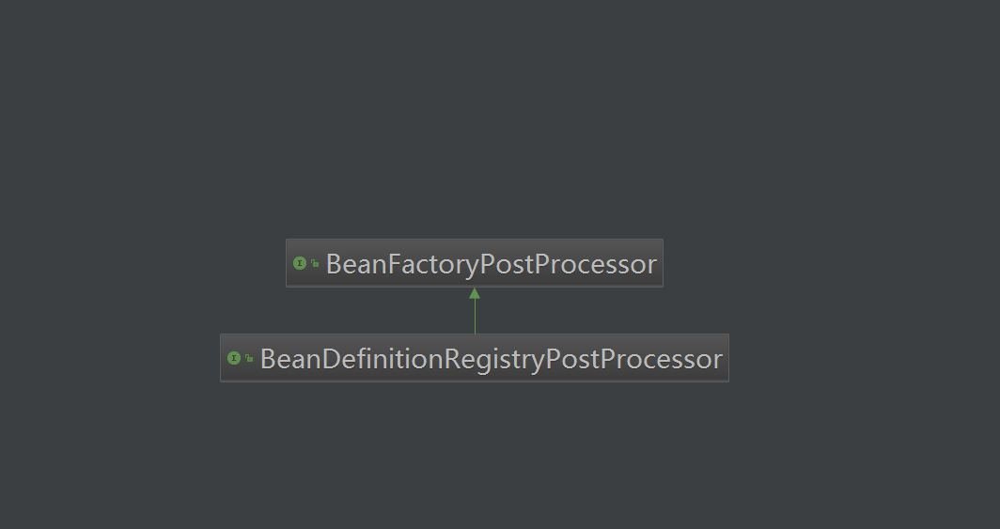
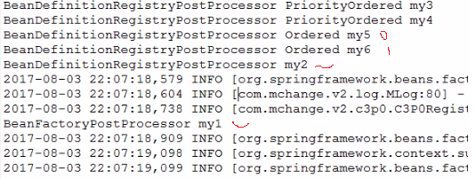
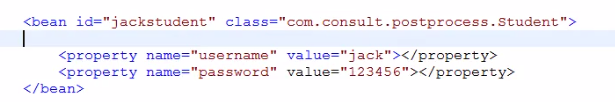
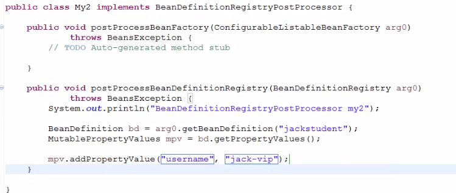
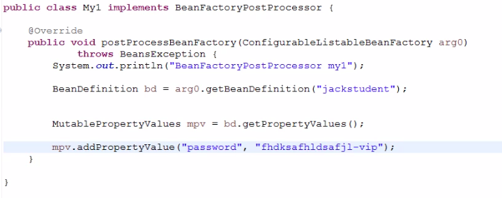
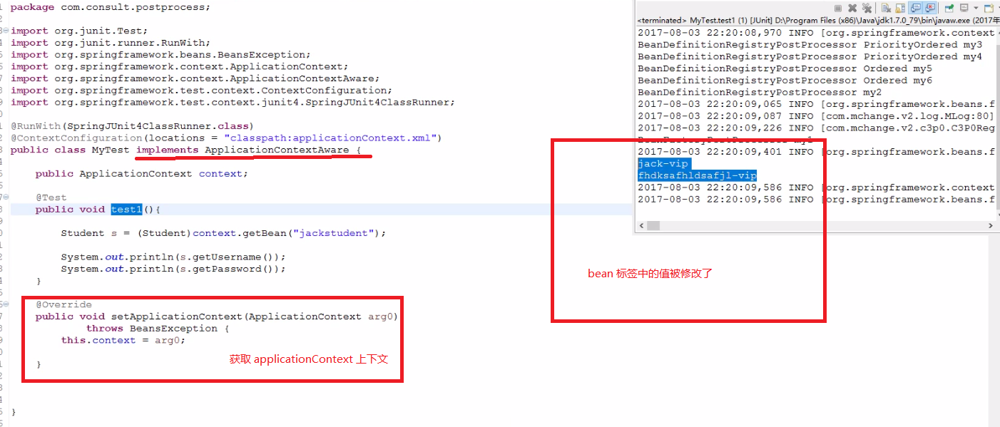
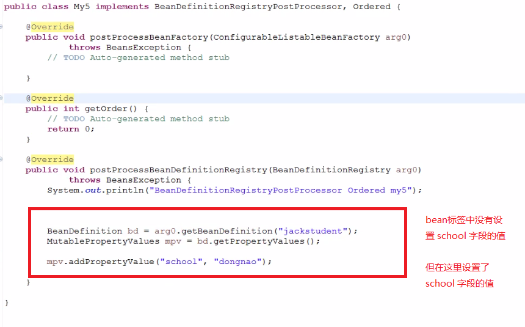
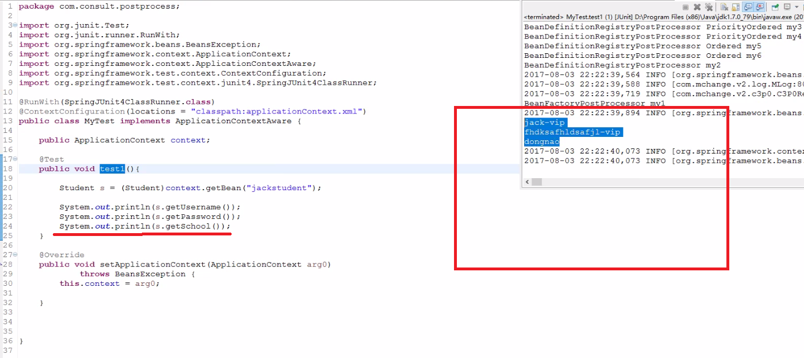
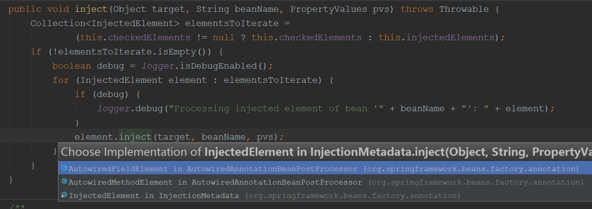

#### AbstractApplicationContext 类中的refresh 方法代码
> 该方法会被 spring 容器 和 spring mvc 容器 都调用到
```
    @Override
	public void refresh() throws BeansException, IllegalStateException {
		synchronized (this.startupShutdownMonitor) {
			// Prepare this context for refreshing.
			prepareRefresh();

			// Tell the subclass to refresh the internal bean factory.

			// FIXME: 2017/11/6 1. xml解析   2. annotation的支持
			ConfigurableListableBeanFactory beanFactory = obtainFreshBeanFactory();

			// Prepare the bean factory for use in this context.
			prepareBeanFactory(beanFactory);

			try {
				// Allows post-processing of the bean factory in context subclasses.			
				postProcessBeanFactory(beanFactory);

				// Invoke factory processors registered as beans in the context.
				
				// 查看该方法，俱体分析看下面，涉及到spring 对 BeanDefinition 的扩展接口
				invokeBeanFactoryPostProcessors(beanFactory);

				// Register bean processors that intercept bean creation.
				// 查看该方法，将 beanFactory 注册到 容器中，完成BeanPostProcessors的注册
				registerBeanPostProcessors(beanFactory);

				// Initialize message source for this context.
				initMessageSource();

				// Initialize event multicaster for this context.
				initApplicationEventMulticaster();

				// Initialize other special beans in specific context subclasses.
				onRefresh();

				// Check for listener beans and register them.
				
				// 它是容器的注册器 ，该方法 涉及到 ApplicationListener 和 ApplicationEvent 解析，查看该方法，俱体分析看下面
				registerListeners();// spring 的扩展点

				// Instantiate all remaining (non-lazy-init) singletons.
				
				//查看该方法
				finishBeanFactoryInitialization(beanFactory);

				// Last step: publish corresponding event.
				finishRefresh();
			}

			catch (BeansException ex) {
				if (logger.isWarnEnabled()) {
					logger.warn("Exception encountered during context initialization - " +
							"cancelling refresh attempt: " + ex);
				}

				// Destroy already created singletons to avoid dangling resources.
				destroyBeans();

				// Reset 'active' flag.
				cancelRefresh(ex);

				// Propagate exception to caller.
				throw ex;
			}

			finally {
				// Reset common introspection caches in Spring's core, since we
				// might not ever need metadata for singleton beans anymore...
				resetCommonCaches();
			}
		}
	}
```
### 分析 invokeBeanFactoryPostProcessors(beanFactory)
```
	protected void invokeBeanFactoryPostProcessors(ConfigurableListableBeanFactory beanFactory) {
		// 查看该方法 invokeBeanFactoryPostProcessors ，分析看下面
		
		//getBeanFactoryPostProcessors() 方法获取到一个list 集合
		// 数据结构为 List<BeanFactoryPostProcessor> beanFactoryPostProcessors =
        //         			new ArrayList<BeanFactoryPostProcessor>()
        //那么什么时候将 BeanFactoryPostProcessor 对象放入这个集合中呢？通过配置添加进来的
		PostProcessorRegistrationDelegate.invokeBeanFactoryPostProcessors(beanFactory, getBeanFactoryPostProcessors());

		// Detect a LoadTimeWeaver and prepare for weaving, if found in the meantime
		// (e.g. through an @Bean method registered by ConfigurationClassPostProcessor)
		if (beanFactory.getTempClassLoader() == null && beanFactory.containsBean(LOAD_TIME_WEAVER_BEAN_NAME)) {
			beanFactory.addBeanPostProcessor(new LoadTimeWeaverAwareProcessor(beanFactory));
			beanFactory.setTempClassLoader(new ContextTypeMatchClassLoader(beanFactory.getBeanClassLoader()));
		}
	}
	
	
```

### 分析 invokeBeanFactoryPostProcessors 方法
AbstractApplicationContext.refresh() ==>> invokeBeanFactoryPostProcessors(beanFactory);  
其中BeanDefinitionRegistryPostProcessor和BeanFactoryPostProcessor接口可以对beanDifinition的扩展        
 比如：对bean标签下的属性进行修改  
 自已测试一下自定义类实现这个接口的效果  
 BeanDefinitionRegistryPostProcessor实现postProcessBeanDefinitionRegistry方法  
 BeanFactoryPostProcessor实现postProcessBeanFactory方法  
 总结：  
    1. BeanDefinitionRegistryPostProcessor  实现该接口可以完成对beanDifinition的修改  
    2. BeanFactoryPostProcessor 实现该接口可以完成对beanDifinition的修改  
    3. PriorityOrdered 实现该接口可以控制类的执行顺序  
    4. Ordered 实现该接口可以控制类的执行顺序  
```
	public static void invokeBeanFactoryPostProcessors(
			ConfigurableListableBeanFactory beanFactory, List<BeanFactoryPostProcessor> beanFactoryPostProcessors) {

		// Invoke BeanDefinitionRegistryPostProcessors first, if any.
		Set<String> processedBeans = new HashSet<String>();

		if (beanFactory instanceof BeanDefinitionRegistry) {
			BeanDefinitionRegistry registry = (BeanDefinitionRegistry) beanFactory;
			
			// 查看 BeanFactoryPostProcessor 类，中有一个 postProcessBeanFactory 方法
			// 
			List<BeanFactoryPostProcessor> regularPostProcessors = new LinkedList<BeanFactoryPostProcessor>();
			List<BeanDefinitionRegistryPostProcessor> registryPostProcessors =
					new LinkedList<BeanDefinitionRegistryPostProcessor>();

            // 循环传进来的 beanFactoryPostProcessors集合，
			for (BeanFactoryPostProcessor postProcessor : beanFactoryPostProcessors) {
			    
			    // BeanDefinitionRegistryPostProcessor 是 BeanFactoryPostProcessor 子类型
				if (postProcessor instanceof BeanDefinitionRegistryPostProcessor) {
					BeanDefinitionRegistryPostProcessor registryPostProcessor =
							(BeanDefinitionRegistryPostProcessor) postProcessor;
					
					registryPostProcessor.postProcessBeanDefinitionRegistry(registry);
					
					// 将这个BeanDefinitionRegistryPostProcessor 类型的 添加到上面定义的集合中
					registryPostProcessors.add(registryPostProcessor);
				}
				else {
					regularPostProcessors.add(postProcessor);
				}
			}

			// Do not initialize FactoryBeans here: We need to leave all regular beans
			// uninitialized to let the bean factory post-processors apply to them!
			// Separate between BeanDefinitionRegistryPostProcessors that implement
			// PriorityOrdered, Ordered, and the rest.
			
			// 获取 所有实现 BeanDefinitionRegistryPostProcessor 接口类型的实现类集合
			// 实现这个BeanDefinitionRegistryPostProcessor接口可能有多个，但它们子类之间的执行顺序是通过
			// PriorityOrdered 这个接口中的getOrder()方法返回值决定的。
			String[] postProcessorNames =
					beanFactory.getBeanNamesForType(BeanDefinitionRegistryPostProcessor.class, true, false);

			// First, invoke the BeanDefinitionRegistryPostProcessors that implement PriorityOrdered.
			List<BeanDefinitionRegistryPostProcessor> priorityOrderedPostProcessors = new ArrayList<BeanDefinitionRegistryPostProcessor>();
			
			for (String ppName : postProcessorNames) {			
			    //如果 子类 类型 和 PriorityOrdered 接口类型匹配
				if (beanFactory.isTypeMatch(ppName, PriorityOrdered.class)) {
					// 加入到 priorityOrderedPostProcessors 集合中
					priorityOrderedPostProcessors.add(beanFactory.getBean(ppName, BeanDefinitionRegistryPostProcessor.class));
					processedBeans.add(ppName);
				}
			}
			sortPostProcessors(beanFactory, priorityOrderedPostProcessors);
			registryPostProcessors.addAll(priorityOrderedPostProcessors);
			
			// 查看该方法 ，对 priorityOrderedPostProcessors 集合进行调用
			invokeBeanDefinitionRegistryPostProcessors(priorityOrderedPostProcessors, registry);

			// Next, invoke the BeanDefinitionRegistryPostProcessors that implement Ordered.
			
			// 获取 BeanDefinitionRegistryPostProcessor 类型的所有实现类的类型
			postProcessorNames = beanFactory.getBeanNamesForType(BeanDefinitionRegistryPostProcessor.class, true, false);
			List<BeanDefinitionRegistryPostProcessor> orderedPostProcessors = new ArrayList<BeanDefinitionRegistryPostProcessor>();
			for (String ppName : postProcessorNames) {
			    // 匹配 子类类型是 Ordered类型的
				if (!processedBeans.contains(ppName) && beanFactory.isTypeMatch(ppName, Ordered.class)) {
					
					// 添加到这个 orderedPostProcessors 集合中 
					orderedPostProcessors.add(beanFactory.getBean(ppName, BeanDefinitionRegistryPostProcessor.class));
					processedBeans.add(ppName);
				}
			}
			sortPostProcessors(beanFactory, orderedPostProcessors);
			registryPostProcessors.addAll(orderedPostProcessors);
			
			// 查看该方法，对 orderedPostProcessors 集合时进行调用
			invokeBeanDefinitionRegistryPostProcessors(orderedPostProcessors, registry);

			// Finally, invoke all other BeanDefinitionRegistryPostProcessors until no further ones appear.
			boolean reiterate = true;
			while (reiterate) {
				reiterate = false;
				
				// 获取这个 BeanDefinitionRegistryPostProcessor 接口的所有实现类类型 
				postProcessorNames = beanFactory.getBeanNamesForType(BeanDefinitionRegistryPostProcessor.class, true, false);
				for (String ppName : postProcessorNames) {
					if (!processedBeans.contains(ppName)) {
						BeanDefinitionRegistryPostProcessor pp = beanFactory.getBean(ppName, BeanDefinitionRegistryPostProcessor.class);
						registryPostProcessors.add(pp);
						processedBeans.add(ppName);
						
						// 这里直接进行了 postProcessBeanDefinitionRegistry 方法的的调用
						pp.postProcessBeanDefinitionRegistry(registry);
						reiterate = true;
					}
				}
			}

			// Now, invoke the postProcessBeanFactory callback of all processors handled so far.
			
			// 查看该方法
			invokeBeanFactoryPostProcessors(registryPostProcessors, beanFactory);
			invokeBeanFactoryPostProcessors(regularPostProcessors, beanFactory);
		}

		else {
			// Invoke factory processors registered with the context instance.
			invokeBeanFactoryPostProcessors(beanFactoryPostProcessors, beanFactory);
		}

		// Do not initialize FactoryBeans here: We need to leave all regular beans
		// uninitialized to let the bean factory post-processors apply to them!
		String[] postProcessorNames =
				beanFactory.getBeanNamesForType(BeanFactoryPostProcessor.class, true, false);

		// Separate between BeanFactoryPostProcessors that implement PriorityOrdered,
		// Ordered, and the rest.
		
		
		List<BeanFactoryPostProcessor> priorityOrderedPostProcessors = new ArrayList<BeanFactoryPostProcessor>();
		List<String> orderedPostProcessorNames = new ArrayList<String>();
		List<String> nonOrderedPostProcessorNames = new ArrayList<String>();
		for (String ppName : postProcessorNames) {
			if (processedBeans.contains(ppName)) {
				// skip - already processed in first phase above
			}
			else if (beanFactory.isTypeMatch(ppName, PriorityOrdered.class)) {
				priorityOrderedPostProcessors.add(beanFactory.getBean(ppName, BeanFactoryPostProcessor.class));
			}
			else if (beanFactory.isTypeMatch(ppName, Ordered.class)) {
				orderedPostProcessorNames.add(ppName);
			}
			else {
				nonOrderedPostProcessorNames.add(ppName);
			}
		}

		// First, invoke the BeanFactoryPostProcessors that implement PriorityOrdered.
		sortPostProcessors(beanFactory, priorityOrderedPostProcessors);
		invokeBeanFactoryPostProcessors(priorityOrderedPostProcessors, beanFactory);

		// Next, invoke the BeanFactoryPostProcessors that implement Ordered.
		List<BeanFactoryPostProcessor> orderedPostProcessors = new ArrayList<BeanFactoryPostProcessor>();
		for (String postProcessorName : orderedPostProcessorNames) {
			orderedPostProcessors.add(beanFactory.getBean(postProcessorName, BeanFactoryPostProcessor.class));
		}
		sortPostProcessors(beanFactory, orderedPostProcessors);
		invokeBeanFactoryPostProcessors(orderedPostProcessors, beanFactory);

		// Finally, invoke all other BeanFactoryPostProcessors.
		List<BeanFactoryPostProcessor> nonOrderedPostProcessors = new ArrayList<BeanFactoryPostProcessor>();
		for (String postProcessorName : nonOrderedPostProcessorNames) {
			nonOrderedPostProcessors.add(beanFactory.getBean(postProcessorName, BeanFactoryPostProcessor.class));
		}
		invokeBeanFactoryPostProcessors(nonOrderedPostProcessors, beanFactory);

		// Clear cached merged bean definitions since the post-processors might have
		// modified the original metadata, e.g. replacing placeholders in values...
		beanFactory.clearMetadataCache();
	}

// 分析 invokeBeanDefinitionRegistryPostProcessors
private static void invokeBeanDefinitionRegistryPostProcessors(
			Collection<? extends BeanDefinitionRegistryPostProcessor> postProcessors, BeanDefinitionRegistry registry) {
        
        //对上面定义的 priorityOrderedPostProcessors 集合，进行循环调用 BeanDefinitionRegistryPostProcessor
		for (BeanDefinitionRegistryPostProcessor postProcessor : postProcessors) {
			postProcessor.postProcessBeanDefinitionRegistry(registry);
		}
	}
	
private static void invokeBeanFactoryPostProcessors(
			Collection<? extends BeanFactoryPostProcessor> postProcessors, ConfigurableListableBeanFactory beanFactory) {

		for (BeanFactoryPostProcessor postProcessor : postProcessors) {
			// 调用 postProcessBeanFactory 方法
			postProcessor.postProcessBeanFactory(beanFactory);
		}
	}	
```

### BeanDefinitionRegistryPostProcessor接口类图


### BeanFactoryPostProcessor 子接口的执行顺序


### bean 标签封装成 BeanDefinition,而 bean 标签中的 property 标签的值封装在 MutablePropertyValues 类
MutablePropertyValues 类中的  propertyValueList 属性里面装有 bean 标签中的 property 标签的值
而 MutablePropertyValues 对象 又放到了 BeanDefinition 对象中，所以可以从 BeanDefinition中获取property 标签的值


### BeanFactoryPostProcessor 接口 和 BeanDefinitionRegistryPostProcessor接口的作用
- bean的属性值-定义  
  

- 启动过程中修改bean的属性值   
  

  

- 启动过程中修改bean的属性值-结果   
  

- 启动过程中添加bean的属性值-添加   
  

- 启动过程中添加bean的属性值-结果   
  

### 到此 invokeBeanFactoryPostProcessors(beanFactory) 方法分析完毕

### 分析 registerBeanPostProcessors(beanFactory) 方法，完成BeanPostProcessors的注册
```
protected void registerBeanPostProcessors(ConfigurableListableBeanFactory beanFactory) {
		PostProcessorRegistrationDelegate.registerBeanPostProcessors(beanFactory, this);
}

public static void registerBeanPostProcessors(
			ConfigurableListableBeanFactory beanFactory, AbstractApplicationContext applicationContext) {

		String[] postProcessorNames = beanFactory.getBeanNamesForType(BeanPostProcessor.class, true, false);

		// Register BeanPostProcessorChecker that logs an info message when
		// a bean is created during BeanPostProcessor instantiation, i.e. when
		// a bean is not eligible for getting processed by all BeanPostProcessors.
		int beanProcessorTargetCount = beanFactory.getBeanPostProcessorCount() + 1 + postProcessorNames.length;
		beanFactory.addBeanPostProcessor(new BeanPostProcessorChecker(beanFactory, beanProcessorTargetCount));

		// Separate between BeanPostProcessors that implement PriorityOrdered,
		// Ordered, and the rest.
		
		List<BeanPostProcessor> priorityOrderedPostProcessors = new ArrayList<BeanPostProcessor>();
		List<BeanPostProcessor> internalPostProcessors = new ArrayList<BeanPostProcessor>();
		List<String> orderedPostProcessorNames = new ArrayList<String>();
		List<String> nonOrderedPostProcessorNames = new ArrayList<String>();
		
		for (String ppName : postProcessorNames) {
		==================>>
			if (beanFactory.isTypeMatch(ppName, PriorityOrdered.class)) {
				BeanPostProcessor pp = beanFactory.getBean(ppName, BeanPostProcessor.class);
				priorityOrderedPostProcessors.add(pp);
				
				if (pp instanceof MergedBeanDefinitionPostProcessor) {
					internalPostProcessors.add(pp);
				}
			}
		==================>>	
			else if (beanFactory.isTypeMatch(ppName, Ordered.class)) {
				orderedPostProcessorNames.add(ppName);
			}
			else {
				nonOrderedPostProcessorNames.add(ppName);
			}
		}

		// First, register the BeanPostProcessors that implement PriorityOrdered.
		sortPostProcessors(beanFactory, priorityOrderedPostProcessors);
		
		// 查看该方法
		registerBeanPostProcessors(beanFactory, priorityOrderedPostProcessors);

		// Next, register the BeanPostProcessors that implement Ordered.
		List<BeanPostProcessor> orderedPostProcessors = new ArrayList<BeanPostProcessor>();
		for (String ppName : orderedPostProcessorNames) {
			BeanPostProcessor pp = beanFactory.getBean(ppName, BeanPostProcessor.class);
			orderedPostProcessors.add(pp);
			if (pp instanceof MergedBeanDefinitionPostProcessor) {
				internalPostProcessors.add(pp);
			}
		}
		sortPostProcessors(beanFactory, orderedPostProcessors);
		registerBeanPostProcessors(beanFactory, orderedPostProcessors);

		// Now, register all regular BeanPostProcessors.
		List<BeanPostProcessor> nonOrderedPostProcessors = new ArrayList<BeanPostProcessor>();
		for (String ppName : nonOrderedPostProcessorNames) {
			BeanPostProcessor pp = beanFactory.getBean(ppName, BeanPostProcessor.class);
			nonOrderedPostProcessors.add(pp);
			if (pp instanceof MergedBeanDefinitionPostProcessor) {
				internalPostProcessors.add(pp);
			}
		}
		registerBeanPostProcessors(beanFactory, nonOrderedPostProcessors);

		// Finally, re-register all internal BeanPostProcessors.
		sortPostProcessors(beanFactory, internalPostProcessors);
		registerBeanPostProcessors(beanFactory, internalPostProcessors);

        // 加入到 beanFactory 中
		beanFactory.addBeanPostProcessor(new ApplicationListenerDetector(applicationContext));
	}	
	
private static void registerBeanPostProcessors(
			ConfigurableListableBeanFactory beanFactory, List<BeanPostProcessor> postProcessors) {

		for (BeanPostProcessor postProcessor : postProcessors) {
			beanFactory.addBeanPostProcessor(postProcessor);
		}
}	
```
### BeanPostProcessor 类
实现这个类，就可以将 自已的类注册到容器中，就完成了注册

### 关于 spring 容器
- spring 父容器入口  ContextLoaderListener 类，也就是 ServletListener ，进入到 contextInitialized(ServletContextEvent event) 方法
- spring 子容器入口，也就是 spring mvc 入口 DispatcherServlet 类,
- 不论是子容器还是父容器都会调用 AbstractApplicationContext 中的 refresh() 方法，所以 refresh() 方法 会被调用两次


### 分析 registerListeners() 注册spring事件监听
- 实现了ApplicationListener接口的所有实现类注册到applicationListenerBeans容器中
- 往spring容器中注册发布ApplicationEvent，监听器方法将会被触发
```
// Check for listener beans and register them.
registerListeners(); // 查看该方法

protected void registerListeners() {
		// Register statically specified listeners first.
		
		// getApplicationListeners() 获取容器中的所有监听器
		for (ApplicationListener<?> listener : getApplicationListeners()) {
		    
		    // 添加到集合中
			getApplicationEventMulticaster().addApplicationListener(listener);
		}

		// Do not initialize FactoryBeans here: We need to leave all regular beans
		// uninitialized to let post-processors apply to them!
		
		// 获取 ApplicationListener 类型的所有 类的名字
		String[] listenerBeanNames = getBeanNamesForType(ApplicationListener.class, true, false);
		for (String listenerBeanName : listenerBeanNames) {
		
		    // 添加到集合中
			getApplicationEventMulticaster().addApplicationListenerBean(listenerBeanName);
		}

		// Publish early application events now that we finally have a multicaster...
		Set<ApplicationEvent> earlyEventsToProcess = this.earlyApplicationEvents;
		this.earlyApplicationEvents = null;
		if (earlyEventsToProcess != null) {
			for (ApplicationEvent earlyEvent : earlyEventsToProcess) {
			    
			    // 查看该方法
				getApplicationEventMulticaster().multicastEvent(earlyEvent);
			}
		}
	}
	
    @Override
	public void multicastEvent(ApplicationEvent event) {
	    // 查看该方法
		multicastEvent(event, resolveDefaultEventType(event));
	}	
	
    @Override
	public void multicastEvent(final ApplicationEvent event, ResolvableType eventType) {
		ResolvableType type = (eventType != null ? eventType : resolveDefaultEventType(event));
		
		// getApplicationListeners 获取所有的监听器，将事件广播给所有的监听器
		for (final ApplicationListener<?> listener : getApplicationListeners(event, type)) {
			Executor executor = getTaskExecutor();
			if (executor != null) {
				executor.execute(new Runnable() {				
				    // 对每个 ApplicationListener 起个线程，进行调用 ApplicationListener 中的方法
					@Override
					public void run() {
					    // 查看该方法
						invokeListener(listener, event);
					}
				});
			}
			else {
				invokeListener(listener, event);
			}
		}
	}
	
    @SuppressWarnings({"unchecked", "rawtypes"})
	protected void invokeListener(ApplicationListener listener, ApplicationEvent event) {
		ErrorHandler errorHandler = getErrorHandler();
		if (errorHandler != null) {
			try {
			    
				listener.onApplicationEvent(event);
			}
			catch (Throwable err) {
				errorHandler.handleError(err);
			}
		}
		else {
			try {
				listener.onApplicationEvent(event);
			}
			catch (ClassCastException ex) {
				// Possibly a lambda-defined listener which we could not resolve the generic event type for
				LogFactory.getLog(getClass()).debug("Non-matching event type for listener: " + listener, ex);
			}
		}
	}			
``` 

### 自定义监听事件
1. 实现 ApplicationListener 接口，也就是监听接口
2. 继承 ApplicationEvent 类
   - 注意要 写构造器，并调用 父类的构造器
3. 在 xml 中配置 bean    
4. 上面是一个典型的观察者模式  
    - 主题 -- subject -- event
    - 观察者 -- oberse -- listener --- 触发 onApplicationEvent 方法
    - 通过 ApplicationContext 中的 publishEvent 方法发布 主题，通知给观察者
    
5. 分析 publishEvent 方法，该方法在 AbstractApplicationContext 类中
```
protected void publishEvent(Object event, ResolvableType eventType) {
		Assert.notNull(event, "Event must not be null");
		if (logger.isTraceEnabled()) {
			logger.trace("Publishing event in " + getDisplayName() + ": " + event);
		}

		// Decorate event as an ApplicationEvent if necessary
		ApplicationEvent applicationEvent;
		if (event instanceof ApplicationEvent) {
			applicationEvent = (ApplicationEvent) event;
		}
		else {
			applicationEvent = new PayloadApplicationEvent<Object>(this, event);
			if (eventType == null) {
				eventType = ((PayloadApplicationEvent)applicationEvent).getResolvableType();
			}
		}

		// Multicast right now if possible - or lazily once the multicaster is initialized
		if (this.earlyApplicationEvents != null) {
			this.earlyApplicationEvents.add(applicationEvent);
		}
		else {
		    // spring 发布事件的过程就在这里，将事件传给所有spring 监听器，并调用 spring 监听器的 onApplicationEvent 方法
			getApplicationEventMulticaster().multicastEvent(applicationEvent, eventType);
		}

		// Publish event via parent context as well...
		if (this.parent != null) {
			if (this.parent instanceof AbstractApplicationContext) {
				((AbstractApplicationContext) this.parent).publishEvent(event, eventType);
			}
			else {
				this.parent.publishEvent(event);
			}
		}
	}

```    
    

#### 分析 finishBeanFactoryInitialization(beanFactory);
- beanDifinition的实例化，ioc依赖注入
```
protected void finishBeanFactoryInitialization(ConfigurableListableBeanFactory beanFactory) {
		// Initialize conversion service for this context.
		
		// conversionService 是一个标签，用于消息转换器
		if (beanFactory.containsBean(CONVERSION_SERVICE_BEAN_NAME) &&
				beanFactory.isTypeMatch(CONVERSION_SERVICE_BEAN_NAME, ConversionService.class)) {
			beanFactory.setConversionService(
					beanFactory.getBean(CONVERSION_SERVICE_BEAN_NAME, ConversionService.class));
		}

		// Register a default embedded value resolver if no bean post-processor
		// (such as a PropertyPlaceholderConfigurer bean) registered any before:
		// at this point, primarily for resolution in annotation attribute values.
		if (!beanFactory.hasEmbeddedValueResolver()) {
			beanFactory.addEmbeddedValueResolver(new StringValueResolver() {
				@Override
				public String resolveStringValue(String strVal) {
					return getEnvironment().resolvePlaceholders(strVal);
				}
			});
		}

		// Initialize LoadTimeWeaverAware beans early to allow for registering their transformers early.
		String[] weaverAwareNames = beanFactory.getBeanNamesForType(LoadTimeWeaverAware.class, false, false);
		for (String weaverAwareName : weaverAwareNames) {
			getBean(weaverAwareName);
		}

		// Stop using the temporary ClassLoader for type matching.
		beanFactory.setTempClassLoader(null);

		// Allow for caching all bean definition metadata, not expecting further changes.
		beanFactory.freezeConfiguration();

		// Instantiate all remaining (non-lazy-init) singletons.
		
		// 查看该方法
		beanFactory.preInstantiateSingletons();
	}
    
    @Override
	public void preInstantiateSingletons() throws BeansException {
		if (this.logger.isDebugEnabled()) {
			this.logger.debug("Pre-instantiating singletons in " + this);
		}

		// Iterate over a copy to allow for init methods which in turn register new bean definitions.
		// While this may not be part of the regular factory bootstrap, it does otherwise work fine.
		
		// this.beanDefinitionNames 在 beanDefinition 注册的时候会将 beanDefinitionName 放入集合中
		List<String> beanNames = new ArrayList<String>(this.beanDefinitionNames);

		// Trigger initialization of all non-lazy singleton beans...
		
		for (String beanName : beanNames) { // 循环所有的 beanName，注意这里，注解的方式注入先执行，后执行 xml 配置
			RootBeanDefinition bd = getMergedLocalBeanDefinition(beanName);
			if (!bd.isAbstract() && bd.isSingleton() && !bd.isLazyInit()) {
				if (isFactoryBean(beanName)) {
					final FactoryBean<?> factory = (FactoryBean<?>) getBean(FACTORY_BEAN_PREFIX + beanName);
					boolean isEagerInit;
					if (System.getSecurityManager() != null && factory instanceof SmartFactoryBean) {
						isEagerInit = AccessController.doPrivileged(new PrivilegedAction<Boolean>() {
							@Override
							public Boolean run() {
								return ((SmartFactoryBean<?>) factory).isEagerInit();
							}
						}, getAccessControlContext());
					}
					else {
						isEagerInit = (factory instanceof SmartFactoryBean &&
								((SmartFactoryBean<?>) factory).isEagerInit());
					}
					if (isEagerInit) {
						getBean(beanName);
					}
				}
				else {
				
				    // 重点
					getBean(beanName);
				}
			}
		}

		// Trigger post-initialization callback for all applicable beans...
		
		// 可以在这里打断点，第一次是父容器进入，第二次是子容器进入，在第二次进入后可以查看自定义的bean 属性的依赖注入过程
		for (String beanName : beanNames) {
			Object singletonInstance = getSingleton(beanName);
			if (singletonInstance instanceof SmartInitializingSingleton) {
				final SmartInitializingSingleton smartSingleton = (SmartInitializingSingleton) singletonInstance;
				if (System.getSecurityManager() != null) {
					AccessController.doPrivileged(new PrivilegedAction<Object>() {
						@Override
						public Object run() {
							smartSingleton.afterSingletonsInstantiated();
							return null;
						}
					}, getAccessControlContext());
				}
				else {
					smartSingleton.afterSingletonsInstantiated();
				}
			}
		}
	}	
	
// 分析 getBean 方法
    @Override
	public Object getBean(String name) throws BeansException {
	    // 查看该方法
		return doGetBean(name, null, null, false);
	}

    @SuppressWarnings("unchecked")
	protected <T> T doGetBean(
			final String name, final Class<T> requiredType, final Object[] args, boolean typeCheckOnly)
			throws BeansException {

		final String beanName = transformedBeanName(name);
		Object bean;

		// Eagerly check singleton cache for manually registered singletons.
		Object sharedInstance = getSingleton(beanName);
		if (sharedInstance != null && args == null) {
			if (logger.isDebugEnabled()) {
				if (isSingletonCurrentlyInCreation(beanName)) {
					logger.debug("Returning eagerly cached instance of singleton bean '" + beanName +
							"' that is not fully initialized yet - a consequence of a circular reference");
				}
				else {
					logger.debug("Returning cached instance of singleton bean '" + beanName + "'");
				}
			}
			bean = getObjectForBeanInstance(sharedInstance, name, beanName, null);
		}

        // 下面的为重点
		else {
			// Fail if we're already creating this bean instance:
			// We're assumably within a circular reference.
			if (isPrototypeCurrentlyInCreation(beanName)) {
				throw new BeanCurrentlyInCreationException(beanName);
			}

			// Check if bean definition exists in this factory.
			BeanFactory parentBeanFactory = getParentBeanFactory();
			if (parentBeanFactory != null && !containsBeanDefinition(beanName)) {
				// Not found -> check parent.
				String nameToLookup = originalBeanName(name);
				if (args != null) {
					// Delegation to parent with explicit args.
					return (T) parentBeanFactory.getBean(nameToLookup, args);
				}
				else {
					// No args -> delegate to standard getBean method.
					return parentBeanFactory.getBean(nameToLookup, requiredType);
				}
			}

			if (!typeCheckOnly) {
				markBeanAsCreated(beanName);
			}

			try {
				final RootBeanDefinition mbd = getMergedLocalBeanDefinition(beanName);
				checkMergedBeanDefinition(mbd, beanName, args);

				// Guarantee initialization of beans that the current bean depends on.
				String[] dependsOn = mbd.getDependsOn();
				if (dependsOn != null) {
					for (String dependsOnBean : dependsOn) {
						if (isDependent(beanName, dependsOnBean)) {
							throw new BeanCreationException(mbd.getResourceDescription(), beanName,
									"Circular depends-on relationship between '" + beanName + "' and '" + dependsOnBean + "'");
						}
						registerDependentBean(dependsOnBean, beanName);
						getBean(dependsOnBean);
					}
				}

				// Create bean instance.
				
				// mbd就是 beanDefinition 
				if (mbd.isSingleton()) {  // beanDefinition 是不是单例的，spring 默认的 bean 就是单例的
				    // 这里的写法是一个回调写法，创建 ObjectFactory 对象，并在  getSingleton 方法中 回调这个 getObject 方法
					sharedInstance = getSingleton(beanName, new ObjectFactory<Object>() {
						@Override
						public Object getObject() throws BeansException {
							try {
							    // 查看该方法
								return createBean(beanName, mbd, args);
							}
							catch (BeansException ex) {
								// Explicitly remove instance from singleton cache: It might have been put there
								// eagerly by the creation process, to allow for circular reference resolution.
								// Also remove any beans that received a temporary reference to the bean.
								destroySingleton(beanName);
								throw ex;
							}
						}
					});
					bean = getObjectForBeanInstance(sharedInstance, name, beanName, mbd);
				}

				else if (mbd.isPrototype()) { // beanDefinition 是不是多例的
					// It's a prototype -> create a new instance.
					Object prototypeInstance = null;
					try {
						beforePrototypeCreation(beanName);
						prototypeInstance = createBean(beanName, mbd, args);
					}
					finally {
						afterPrototypeCreation(beanName);
					}
					bean = getObjectForBeanInstance(prototypeInstance, name, beanName, mbd);
				}

				else { // beanDefinition 为request 、session 作用域
					String scopeName = mbd.getScope();
					final Scope scope = this.scopes.get(scopeName);
					if (scope == null) {
						throw new IllegalStateException("No Scope registered for scope name '" + scopeName + "'");
					}
					try {
						Object scopedInstance = scope.get(beanName, new ObjectFactory<Object>() {
							@Override
							public Object getObject() throws BeansException {
								beforePrototypeCreation(beanName);
								try {
									return createBean(beanName, mbd, args);
								}
								finally {
									afterPrototypeCreation(beanName);
								}
							}
						});
						bean = getObjectForBeanInstance(scopedInstance, name, beanName, mbd);
					}
					catch (IllegalStateException ex) {
						throw new BeanCreationException(beanName,
								"Scope '" + scopeName + "' is not active for the current thread; consider " +
								"defining a scoped proxy for this bean if you intend to refer to it from a singleton",
								ex);
					}
				}
			}
			catch (BeansException ex) {
				cleanupAfterBeanCreationFailure(beanName);
				throw ex;
			}
		}

		// Check if required type matches the type of the actual bean instance.
		if (requiredType != null && bean != null && !requiredType.isAssignableFrom(bean.getClass())) {
			try {
				return getTypeConverter().convertIfNecessary(bean, requiredType);
			}
			catch (TypeMismatchException ex) {
				if (logger.isDebugEnabled()) {
					logger.debug("Failed to convert bean '" + name + "' to required type [" +
							ClassUtils.getQualifiedName(requiredType) + "]", ex);
				}
				throw new BeanNotOfRequiredTypeException(name, requiredType, bean.getClass());
			}
		}
		return (T) bean;
	}
					
```

### 分析 createBean(beanName, mbd, args)  进入到  AbstractAutowireCapableBeanFactory 类中的 createBean 方法中
作用
- resolveBeforeInstantiation 这个方法是AOP的入口，在这里可能产生代理对象，这个方法是在bean 实例化之前执行的
    - InstantiationAwareBeanPostProcessor接口   postProcessBeforeInstantiation产生代理bean （spring 的扩展点）
    - InstantiationAwareBeanPostProcessor接口   postProcessAfterInitialization对bean进行后置修改
    
- doCreateBean(beanName, mbdToUse, args); 创建实例，ioc依赖注入
    - createBeanInstance(beanName, mbd, args);反射的方式创建bean的实例，但是该bean的实例需要有属性值注入时，这时属性的值还没有注入
    - populateBean(beanName, mbd, instanceWrapper);ioc依赖注入过程，将bean 实例的属性需要要注入的属性值，注入该bean的实例中
        - AutowiredAnnotationBeanPostProcessor  @Autowire注解依赖注入支持 （查看构造器，可以看到这个类中添加了哪些注解,如：this.autowiredAnnotationTypes.add(Autowired.class);）
        - CommonAnnotationBeanPostProcessor     @Resource注解对依赖注入的支持
    - initializeBean(beanName, exposedObject, mbd); (先完成前面两步，以执行此方法，在 ioc 注入以后)
        - 调用BeanPostProcessor接口的postProcessBeforeInitialization，跟InstantiationAwareBeanPostProcessor区别记忆。在bean实例化和ioc依赖注入完后，对bean的前置初始化工作（spring 扩展点）
        - 调用InitializingBean接口的afterPropertiesSet()方法，可以完成一些bean的校验，或者初始化工程其他内容的工作，有一定的侵入性
        - bean上的init-method属性，反射调用这个属性配置的方法，无依赖性，效率比较低。完成bean的校验，或者工程的初始化工作
    - registerDisposableBeanIfNecessary(beanName, bean, mbd);完成bean的缓存注册工作，把bean注册到map中
```
    @Override
	protected Object createBean(String beanName, RootBeanDefinition mbd, Object[] args) throws BeanCreationException {
		if (logger.isDebugEnabled()) {
			logger.debug("Creating instance of bean '" + beanName + "'");
		}
		RootBeanDefinition mbdToUse = mbd;

		// Make sure bean class is actually resolved at this point, and
		// clone the bean definition in case of a dynamically resolved Class
		// which cannot be stored in the shared merged bean definition.
		Class<?> resolvedClass = resolveBeanClass(mbd, beanName);
		if (resolvedClass != null && !mbd.hasBeanClass() && mbd.getBeanClassName() != null) {
			mbdToUse = new RootBeanDefinition(mbd);
			mbdToUse.setBeanClass(resolvedClass);
		}

		// Prepare method overrides.
		try {
			mbdToUse.prepareMethodOverrides();
		}
		catch (BeanDefinitionValidationException ex) {
			throw new BeanDefinitionStoreException(mbdToUse.getResourceDescription(),
					beanName, "Validation of method overrides failed", ex);
		}

		try {
			// Give BeanPostProcessors a chance to return a proxy instead of the target bean instance.
			
			// aop 入口，在解析标签时，就会将 aop 处理类注册到容器中
			Object bean = resolveBeforeInstantiation(beanName, mbdToUse);
			if (bean != null) {
				return bean;
			}
		}
		catch (Throwable ex) {
			throw new BeanCreationException(mbdToUse.getResourceDescription(), beanName,
					"BeanPostProcessor before instantiation of bean failed", ex);
		}

        // 查看该方法
		Object beanInstance = doCreateBean(beanName, mbdToUse, args);
		if (logger.isDebugEnabled()) {
			logger.debug("Finished creating instance of bean '" + beanName + "'");
		}
		return beanInstance;
	}
```

### 分析 doCreateBean(beanName, mbdToUse, args) 方法 ，创建实例，ioc依赖注入
```
protected Object doCreateBean(final String beanName, final RootBeanDefinition mbd, final Object[] args) {
		// Instantiate the bean.
		BeanWrapper instanceWrapper = null;
		if (mbd.isSingleton()) {
			instanceWrapper = this.factoryBeanInstanceCache.remove(beanName);
		}
		if (instanceWrapper == null) {
		    // 根据 beanName 、BeanDefinition 来创建一个bean实例,查看该方法，俱体分析看下面
		    //创建bean 实例
			instanceWrapper = createBeanInstance(beanName, mbd, args);
		}
		final Object bean = (instanceWrapper != null ? instanceWrapper.getWrappedInstance() : null);
		Class<?> beanType = (instanceWrapper != null ? instanceWrapper.getWrappedClass() : null);

		// Allow post-processors to modify the merged bean definition.
		synchronized (mbd.postProcessingLock) {
			if (!mbd.postProcessed) {
				applyMergedBeanDefinitionPostProcessors(mbd, beanType, beanName);
				mbd.postProcessed = true;
			}
		}

		// Eagerly cache singletons to be able to resolve circular references
		// even when triggered by lifecycle interfaces like BeanFactoryAware.
		boolean earlySingletonExposure = (mbd.isSingleton() && this.allowCircularReferences &&
				isSingletonCurrentlyInCreation(beanName));
		if (earlySingletonExposure) {
			if (logger.isDebugEnabled()) {
				logger.debug("Eagerly caching bean '" + beanName +
						"' to allow for resolving potential circular references");
			}
			addSingletonFactory(beanName, new ObjectFactory<Object>() {
				@Override
				public Object getObject() throws BeansException {
					return getEarlyBeanReference(beanName, mbd, bean);
				}
			});
		}

		// Initialize the bean instance.
		Object exposedObject = bean;
		try {
		    
		    //查看该方法，俱体分析看下面
		    // ioc 依赖注入
			populateBean(beanName, mbd, instanceWrapper);
			if (exposedObject != null) {
				exposedObject = initializeBean(beanName, exposedObject, mbd);
			}
		}
		catch (Throwable ex) {
			if (ex instanceof BeanCreationException && beanName.equals(((BeanCreationException) ex).getBeanName())) {
				throw (BeanCreationException) ex;
			}
			else {
				throw new BeanCreationException(mbd.getResourceDescription(), beanName, "Initialization of bean failed", ex);
			}
		}

		if (earlySingletonExposure) {
			Object earlySingletonReference = getSingleton(beanName, false);
			if (earlySingletonReference != null) {
				if (exposedObject == bean) {
					exposedObject = earlySingletonReference;
				}
				else if (!this.allowRawInjectionDespiteWrapping && hasDependentBean(beanName)) {
					String[] dependentBeans = getDependentBeans(beanName);
					Set<String> actualDependentBeans = new LinkedHashSet<String>(dependentBeans.length);
					for (String dependentBean : dependentBeans) {
						if (!removeSingletonIfCreatedForTypeCheckOnly(dependentBean)) {
							actualDependentBeans.add(dependentBean);
						}
					}
					if (!actualDependentBeans.isEmpty()) {
						throw new BeanCurrentlyInCreationException(beanName,
								"Bean with name '" + beanName + "' has been injected into other beans [" +
								StringUtils.collectionToCommaDelimitedString(actualDependentBeans) +
								"] in its raw version as part of a circular reference, but has eventually been " +
								"wrapped. This means that said other beans do not use the final version of the " +
								"bean. This is often the result of over-eager type matching - consider using " +
								"'getBeanNamesOfType' with the 'allowEagerInit' flag turned off, for example.");
					}
				}
			}
		}

		// Register bean as disposable.
		try {
		    //将bean 的实例进行注册，将bean的实例方法map中，到此为止 IOC 依赖注入讲解完毕
			registerDisposableBeanIfNecessary(beanName, bean, mbd);
		}
		catch (BeanDefinitionValidationException ex) {
			throw new BeanCreationException(mbd.getResourceDescription(), beanName, "Invalid destruction signature", ex);
		}

		return exposedObject;
	}
```

### ioc 依赖注入
1. xml  
   通过引用 bean 的id ，注入到该类中的 service 属性中
```
<bean id="id" class="xxxxx">
	<property name="service" value="fdjaslfjdlsaf" ref="" > == PropertyValue
	<property name="service" ref="id"> == PropertyValue
	<property name="service" ref="id"> == PropertyValue
	<property name="service" ref="id"> == PropertyValue
</bean>
```

2. 注解  
通过在类上或属性上写注解 @Component 或 @Controller 或 @Service 或 @Repository  
bean 实例的属性设置值时：注解方式属性的注入先执行，xml配置的属性后执行
```
@Component @Controller @Service  @Repository
public class xxxx {
	List list;  --ph就是属性的类型对象，pd就是  pd.set()，也就是 ph.setValue(this.wrappedObject, valueToApply);
	
	String xxx;
	
	xxxService service;
	
	@Resource
	@Autowired
	xxxService service;  == PropertyValue
	
	@Autowired
	xxxService service;  == PropertyValue
	
	@Autowired
	xxxService service;  == PropertyValue
	
	@Autowired
	xxxService service;  == PropertyValue
	
	public void setList() {
	
	}

```
    
### 分析 createBeanInstance(beanName, mbd, args)
> 反射的方式创建bean的实例
```
protected BeanWrapper createBeanInstance(String beanName, RootBeanDefinition mbd, Object[] args) {
		// Make sure bean class is actually resolved at this point.
		Class<?> beanClass = resolveBeanClass(mbd, beanName);

		if (beanClass != null && !Modifier.isPublic(beanClass.getModifiers()) && !mbd.isNonPublicAccessAllowed()) {
			throw new BeanCreationException(mbd.getResourceDescription(), beanName,
					"Bean class isn't public, and non-public access not allowed: " + beanClass.getName());
		}

		if (mbd.getFactoryMethodName() != null)  {
			return instantiateUsingFactoryMethod(beanName, mbd, args);
		}

		// Shortcut when re-creating the same bean...
		boolean resolved = false;
		boolean autowireNecessary = false;
		if (args == null) {
			synchronized (mbd.constructorArgumentLock) {
				if (mbd.resolvedConstructorOrFactoryMethod != null) {
					resolved = true;
					autowireNecessary = mbd.constructorArgumentsResolved;
				}
			}
		}
		if (resolved) {
			if (autowireNecessary) {
				return autowireConstructor(beanName, mbd, null, null);
			}
			else {
				return instantiateBean(beanName, mbd);
			}
		}

		// Need to determine the constructor...
		Constructor<?>[] ctors = determineConstructorsFromBeanPostProcessors(beanClass, beanName);
		if (ctors != null ||
				mbd.getResolvedAutowireMode() == RootBeanDefinition.AUTOWIRE_CONSTRUCTOR ||
				mbd.hasConstructorArgumentValues() || !ObjectUtils.isEmpty(args))  {
			return autowireConstructor(beanName, mbd, ctors, args);
		}

		// No special handling: simply use no-arg constructor.
		
		// 查看该方法
		return instantiateBean(beanName, mbd);
	}

//分析 instantiateBean(beanName, mbd) 方法
protected BeanWrapper instantiateBean(final String beanName, final RootBeanDefinition mbd) {
		try {
			Object beanInstance;
			final BeanFactory parent = this;
			if (System.getSecurityManager() != null) {
				beanInstance = AccessController.doPrivileged(new PrivilegedAction<Object>() {
					@Override
					public Object run() {
					    // 查看该方法
						return getInstantiationStrategy().instantiate(mbd, beanName, parent);
					}
				}, getAccessControlContext());
			}
			else {
				beanInstance = getInstantiationStrategy().instantiate(mbd, beanName, parent);
			}
			BeanWrapper bw = new BeanWrapperImpl(beanInstance);
			initBeanWrapper(bw);
			return bw;
		}
		catch (Throwable ex) {
			throw new BeanCreationException(mbd.getResourceDescription(), beanName, "Instantiation of bean failed", ex);
		}
	}

    //
    @Override
	public Object instantiate(RootBeanDefinition bd, String beanName, BeanFactory owner) {
		// Don't override the class with CGLIB if no overrides.
		if (bd.getMethodOverrides().isEmpty()) {
			Constructor<?> constructorToUse;
			synchronized (bd.constructorArgumentLock) {
				constructorToUse = (Constructor<?>) bd.resolvedConstructorOrFactoryMethod;
				if (constructorToUse == null) {
					final Class<?> clazz = bd.getBeanClass();
					if (clazz.isInterface()) {
						throw new BeanInstantiationException(clazz, "Specified class is an interface");
					}
					try {
						if (System.getSecurityManager() != null) {
							constructorToUse = AccessController.doPrivileged(new PrivilegedExceptionAction<Constructor<?>>() {
								@Override
								public Constructor<?> run() throws Exception {
									return clazz.getDeclaredConstructor((Class[]) null);
								}
							});
						}
						else {
							constructorToUse =	clazz.getDeclaredConstructor((Class[]) null);
						}
						bd.resolvedConstructorOrFactoryMethod = constructorToUse;
					}
					catch (Throwable ex) {
						throw new BeanInstantiationException(clazz, "No default constructor found", ex);
					}
				}
			}
			 
			// 查看该方法
			return BeanUtils.instantiateClass(constructorToUse);
		}
		else {
			// Must generate CGLIB subclass.
			return instantiateWithMethodInjection(bd, beanName, owner);
		}
	}

// 分析 BeanUtils.instantiateClass(constructorToUse) 方法
public static <T> T instantiateClass(Constructor<T> ctor, Object... args) throws BeanInstantiationException {
		Assert.notNull(ctor, "Constructor must not be null");
		try {
			ReflectionUtils.makeAccessible(ctor);
			
			// 通过构造器对象，传入参数并new 出对象，此时bean 实例创建出来了，但是并没有依赖注入相应的对象
			return ctor.newInstance(args);
		}
		catch (InstantiationException ex) {
			throw new BeanInstantiationException(ctor, "Is it an abstract class?", ex);
		}
		catch (IllegalAccessException ex) {
			throw new BeanInstantiationException(ctor, "Is the constructor accessible?", ex);
		}
		catch (IllegalArgumentException ex) {
			throw new BeanInstantiationException(ctor, "Illegal arguments for constructor", ex);
		}
		catch (InvocationTargetException ex) {
			throw new BeanInstantiationException(ctor, "Constructor threw exception", ex.getTargetException());
		}
	}			
```    

### 分析 populateBean(beanName, mbd, instanceWrapper); ioc依赖注入过程
```
protected void populateBean(String beanName, RootBeanDefinition mbd, BeanWrapper bw) {
        
        // 得到 bean的所有属性值 ，它在 封装后的 BeanDefinition 中 getPropertyValues() 方法中
		PropertyValues pvs = mbd.getPropertyValues();

		if (bw == null) {
			if (!pvs.isEmpty()) {
				throw new BeanCreationException(
						mbd.getResourceDescription(), beanName, "Cannot apply property values to null instance");
			}
			else {
				// Skip property population phase for null instance.
				return;
			}
		}

		// Give any InstantiationAwareBeanPostProcessors the opportunity to modify the
		// state of the bean before properties are set. This can be used, for example,
		// to support styles of field injection.
		boolean continueWithPropertyPopulation = true;

		if (!mbd.isSynthetic() && hasInstantiationAwareBeanPostProcessors()) {
			for (BeanPostProcessor bp : getBeanPostProcessors()) {
				if (bp instanceof InstantiationAwareBeanPostProcessor) {
					InstantiationAwareBeanPostProcessor ibp = (InstantiationAwareBeanPostProcessor) bp;
					
					// spring 的扩展 ，postProcessAfterInstantiation 方法返回false,则进入
					if (!ibp.postProcessAfterInstantiation(bw.getWrappedInstance(), beanName)) {
						continueWithPropertyPopulation = false; // 执行这里
						break;
					}
				}
			}
		}

		if (!continueWithPropertyPopulation) {  // 上面设置 continueWithPropertyPopulation 为false，让 依赖注入不往下执行，也就是不依赖注入
			return;
		}

		if (mbd.getResolvedAutowireMode() == RootBeanDefinition.AUTOWIRE_BY_NAME ||
				mbd.getResolvedAutowireMode() == RootBeanDefinition.AUTOWIRE_BY_TYPE) {
			MutablePropertyValues newPvs = new MutablePropertyValues(pvs);

			// Add property values based on autowire by name if applicable.
			if (mbd.getResolvedAutowireMode() == RootBeanDefinition.AUTOWIRE_BY_NAME) {
				autowireByName(beanName, mbd, bw, newPvs);
			}

			// Add property values based on autowire by type if applicable.
			if (mbd.getResolvedAutowireMode() == RootBeanDefinition.AUTOWIRE_BY_TYPE) {
				autowireByType(beanName, mbd, bw, newPvs);
			}

			pvs = newPvs;
		}

        // 是否有 InstantiationAwareBeanPostProcessor 这个类型的
		boolean hasInstAwareBpps = hasInstantiationAwareBeanPostProcessors();
		boolean needsDepCheck = (mbd.getDependencyCheck() != RootBeanDefinition.DEPENDENCY_CHECK_NONE);
=======================================>>对 Annotation 注解的支持与扩展 重点 ，俱体分析看下面
		if (hasInstAwareBpps || needsDepCheck) {// 对@Autowired @Component 等注解 的支持注入
			PropertyDescriptor[] filteredPds = filterPropertyDescriptorsForDependencyCheck(bw, mbd.allowCaching);
			if (hasInstAwareBpps) {
				for (BeanPostProcessor bp : getBeanPostProcessors()) {
				     // 如果是 InstantiationAwareBeanPostProcessor 的类型，也就是说有 @Autowired @Component 等注解
					if (bp instanceof InstantiationAwareBeanPostProcessor) {
					    
					    // 常用注解的 父接口，例如：CommonAnnotationBeanPostProcessor 这个类，就是 @Component注解的支持 
						InstantiationAwareBeanPostProcessor ibp = (InstantiationAwareBeanPostProcessor) bp;
						
						// 获取注解的属性值，例如：获取 注解 @Autowired 并返回 pvs,也就是注解上属性值
						// 查 postProcessPropertyValues 的方法就可以看到常用注解的解析类
						pvs = ibp.postProcessPropertyValues(pvs, filteredPds, bw.getWrappedInstance(), beanName);
						if (pvs == null) {
							return;
						}
					}
				}
			}
			if (needsDepCheck) {
				checkDependencies(beanName, mbd, filteredPds, pvs);
			}
		}
============================================>>

        // 查看该方法
		applyPropertyValues(beanName, mbd, bw, pvs);
	}
```

### InstantiationAwareBeanPostProcessor  类在 AOP 时调用的
- Object postProcessBeforeInstantiation(Class<?> beanClass, String beanName) throws BeansException;
- boolean postProcessAfterInstantiation(Object bean, String beanName) throws BeansException;

某个类实现 InstantiationAwareBeanPostProcessor 接口中的  postProcessAfterInstantiation，返回fasle，则不会执行依赖注入

### BeanPostProcessor  类在 IOC 依赖注入时调用
- Object postProcessBeforeInitialization(Object bean, String beanName) throws BeansException;
- Object postProcessAfterInitialization(Object bean, String beanName) throws BeansException;

### 分析 applyPropertyValues(beanName, mbd, bw, pvs)
- AbstractPropertyAccessor.setPropertyValues
    - AbstractNestablePropertyAccessor.setPropertyValue(PropertyValue pv)  
        1. PropertyTokenHolder tokens.keys 当array、list、map类型数据时keys数组不为空，里面的元素就是array、list的index，map的key。
        2. PropertyHandler对象封装了PropertyDescriptor，用jdk反射中的内省机制来获取read、write方法，来读写属性的值
    - array类型依赖注入 、 List类型依赖注入、map类型依赖注入、非array、list、map类型依赖注入
```
protected void applyPropertyValues(String beanName, BeanDefinition mbd, BeanWrapper bw, PropertyValues pvs) {
		if (pvs == null || pvs.isEmpty()) {
			return;
		}

		MutablePropertyValues mpvs = null;
		List<PropertyValue> original;

		if (System.getSecurityManager() != null) {
			if (bw instanceof BeanWrapperImpl) {
				((BeanWrapperImpl) bw).setSecurityContext(getAccessControlContext());
			}
		}

        // 传进来的是 MutablePropertyValues 这个类型的
		if (pvs instanceof MutablePropertyValues) {
			mpvs = (MutablePropertyValues) pvs;
			if (mpvs.isConverted()) {
				// Shortcut: use the pre-converted values as-is.
				try {
					bw.setPropertyValues(mpvs);
					return;
				}
				catch (BeansException ex) {
					throw new BeanCreationException(
							mbd.getResourceDescription(), beanName, "Error setting property values", ex);
				}
			}
			original = mpvs.getPropertyValueList(); //获取所有属性值
		}
		else {
			original = Arrays.asList(pvs.getPropertyValues());
		}
    
        // spring 的类型转化器，也可以自定义
		TypeConverter converter = getCustomTypeConverter();
		if (converter == null) {
			converter = bw;
		}
		BeanDefinitionValueResolver valueResolver = new BeanDefinitionValueResolver(this, beanName, mbd, converter);

		// Create a deep copy, resolving any references for values.
		List<PropertyValue> deepCopy = new ArrayList<PropertyValue>(original.size());
		boolean resolveNecessary = false;
		for (PropertyValue pv : original) {
			if (pv.isConverted()) { //不会执行这个
				deepCopy.add(pv);
			}
			else {
				String propertyName = pv.getName();
				Object originalValue = pv.getValue();//获取属性的值，
				 
				// 因为属性的值可能有多个，所以这里要进行类型的解析，属性支持的类型都在这里，查看该方法 
				Object resolvedValue = valueResolver.resolveValueIfNecessary(pv, originalValue);
				Object convertedValue = resolvedValue;
				boolean convertible = bw.isWritableProperty(propertyName) &&
						!PropertyAccessorUtils.isNestedOrIndexedProperty(propertyName);
				if (convertible) {
					convertedValue = convertForProperty(resolvedValue, propertyName, bw, converter);
				}
				// Possibly store converted value in merged bean definition,
				// in order to avoid re-conversion for every created bean instance.
				if (resolvedValue == originalValue) {
					if (convertible) {
						pv.setConvertedValue(convertedValue);
					}
					deepCopy.add(pv);
				}
				else if (convertible && originalValue instanceof TypedStringValue &&
						!((TypedStringValue) originalValue).isDynamic() &&
						!(convertedValue instanceof Collection || ObjectUtils.isArray(convertedValue))) {
					pv.setConvertedValue(convertedValue);
					deepCopy.add(pv);
				}
				else {
					resolveNecessary = true;
					deepCopy.add(new PropertyValue(pv, convertedValue));
				}
			}
		}
		if (mpvs != null && !resolveNecessary) {
			mpvs.setConverted();
		}

		// Set our (possibly massaged) deep copy.
		try {
		
		    // deepCopy 是深拷贝 bean 的属性和值的集合
		    // BeanWrapper 就对 bean 的封装
		    // 查看该方法，俱体看下面
			bw.setPropertyValues(new MutablePropertyValues(deepCopy));
		}
		catch (BeansException ex) {
			throw new BeanCreationException(
					mbd.getResourceDescription(), beanName, "Error setting property values", ex);
		}
	}
```

### 分析 valueResolver.resolveValueIfNecessary(pv, originalValue) 方法
```
public Object resolveValueIfNecessary(Object argName, Object value) {
		// We must check each value to see whether it requires a runtime reference
		// to another bean to be resolved.
		if (value instanceof RuntimeBeanReference) {
			RuntimeBeanReference ref = (RuntimeBeanReference) value;
			return resolveReference(argName, ref);
		}
		else if (value instanceof RuntimeBeanNameReference) {
			String refName = ((RuntimeBeanNameReference) value).getBeanName();
			refName = String.valueOf(doEvaluate(refName));
			if (!this.beanFactory.containsBean(refName)) {
				throw new BeanDefinitionStoreException(
						"Invalid bean name '" + refName + "' in bean reference for " + argName);
			}
			return refName;
		}
		else if (value instanceof BeanDefinitionHolder) {
			// Resolve BeanDefinitionHolder: contains BeanDefinition with name and aliases.
			BeanDefinitionHolder bdHolder = (BeanDefinitionHolder) value;
			return resolveInnerBean(argName, bdHolder.getBeanName(), bdHolder.getBeanDefinition());
		}
		else if (value instanceof BeanDefinition) {
			// Resolve plain BeanDefinition, without contained name: use dummy name.
			BeanDefinition bd = (BeanDefinition) value;
			String innerBeanName = "(inner bean)" + BeanFactoryUtils.GENERATED_BEAN_NAME_SEPARATOR +
					ObjectUtils.getIdentityHexString(bd);
			return resolveInnerBean(argName, innerBeanName, bd);
		}
		else if (value instanceof ManagedArray) { // value 是 array 类型时
			// May need to resolve contained runtime references.
			ManagedArray array = (ManagedArray) value;
			Class<?> elementType = array.resolvedElementType;
			if (elementType == null) {
				String elementTypeName = array.getElementTypeName();
				if (StringUtils.hasText(elementTypeName)) {
					try {
						elementType = ClassUtils.forName(elementTypeName, this.beanFactory.getBeanClassLoader());
						array.resolvedElementType = elementType;
					}
					catch (Throwable ex) {
						// Improve the message by showing the context.
						throw new BeanCreationException(
								this.beanDefinition.getResourceDescription(), this.beanName,
								"Error resolving array type for " + argName, ex);
					}
				}
				else {
					elementType = Object.class;
				}
			}
			return resolveManagedArray(argName, (List<?>) value, elementType);
		}
		else if (value instanceof ManagedList) {// value 是 list 类型时
			// May need to resolve contained runtime references.
			return resolveManagedList(argName, (List<?>) value);
		}
		else if (value instanceof ManagedSet) {// value 是 set 类型时
			// May need to resolve contained runtime references.
			return resolveManagedSet(argName, (Set<?>) value);
		}
		else if (value instanceof ManagedMap) {// value 是 map 类型时
			// May need to resolve contained runtime references.
			return resolveManagedMap(argName, (Map<?, ?>) value);
		}
		else if (value instanceof ManagedProperties) {// value 是 Propertie 类型时
			Properties original = (Properties) value;
			Properties copy = new Properties();
			for (Map.Entry<Object, Object> propEntry : original.entrySet()) {
				Object propKey = propEntry.getKey();
				Object propValue = propEntry.getValue();
				if (propKey instanceof TypedStringValue) {
					propKey = evaluate((TypedStringValue) propKey);
				}
				if (propValue instanceof TypedStringValue) {
					propValue = evaluate((TypedStringValue) propValue);
				}
				copy.put(propKey, propValue);
			}
			return copy;
		}
		else if (value instanceof TypedStringValue) { // value 是 String 类型时
			// Convert value to target type here.
			TypedStringValue typedStringValue = (TypedStringValue) value;
			Object valueObject = evaluate(typedStringValue);
			try {
				Class<?> resolvedTargetType = resolveTargetType(typedStringValue);
				if (resolvedTargetType != null) {
					return this.typeConverter.convertIfNecessary(valueObject, resolvedTargetType);
				}
				else {
					return valueObject;
				}
			}
			catch (Throwable ex) {
				// Improve the message by showing the context.
				throw new BeanCreationException(
						this.beanDefinition.getResourceDescription(), this.beanName,
						"Error converting typed String value for " + argName, ex);
			}
		}
		else {
			return evaluate(value);
		}
	}
```

### 分析 bw.setPropertyValues(new MutablePropertyValues(deepCopy)) 
bw 就是 BeanWrapper 的实现类，其中实现类中的 setPropertyValues 方法就是 IOC 依赖注入的入口的方法
````
    // 在 AbstractPropertyAccessor 类中的 setPropertyValues 方法
    @Override
	public void setPropertyValues(PropertyValues pvs) throws BeansException {
		// 查看该方法
		setPropertyValues(pvs, false, false);
	}	
	
    @Override
	public void setPropertyValues(PropertyValues pvs, boolean ignoreUnknown, boolean ignoreInvalid)
			throws BeansException {

		List<PropertyAccessException> propertyAccessExceptions = null;
		List<PropertyValue> propertyValues = (pvs instanceof MutablePropertyValues ?
				((MutablePropertyValues) pvs).getPropertyValueList() : Arrays.asList(pvs.getPropertyValues()));
		
		for (PropertyValue pv : propertyValues) { // 循环所有属性值，因为 bean 中有多个属性，所以要循环，要依赖注入每个属性的值 
			try {
				// This method may throw any BeansException, which won't be caught
				// here, if there is a critical failure such as no matching field.
				// We can attempt to deal only with less serious exceptions.
				
				// 处理每个属性的值，查看该方法
				setPropertyValue(pv);
			}
			catch (NotWritablePropertyException ex) {
				if (!ignoreUnknown) {
					throw ex;
				}
				// Otherwise, just ignore it and continue...
			}
			catch (NullValueInNestedPathException ex) {
				if (!ignoreInvalid) {
					throw ex;
				}
				// Otherwise, just ignore it and continue...
			}
			catch (PropertyAccessException ex) {
				if (propertyAccessExceptions == null) {
					propertyAccessExceptions = new LinkedList<PropertyAccessException>();
				}
				propertyAccessExceptions.add(ex);
			}
		}

		// If we encountered individual exceptions, throw the composite exception.
		if (propertyAccessExceptions != null) {
			PropertyAccessException[] paeArray =
					propertyAccessExceptions.toArray(new PropertyAccessException[propertyAccessExceptions.size()]);
			throw new PropertyBatchUpdateException(paeArray);
		}
	}	
	
    @Override
	public void setPropertyValue(PropertyValue pv) throws BeansException {
	    // PropertyTokenHolder 中的属性 
	    //    actualName为 BeanDefinition 中的名字 
	    //    keys ： 当array、list、map类型数据时keys数组不为空，里面的元素就是array、list的index (记录当前的索引，也就是添加时控制要顺序用的)，map的key
		PropertyTokenHolder tokens = (PropertyTokenHolder) pv.resolvedTokens;
		
		if (tokens == null) {
			String propertyName = pv.getName();
			AbstractNestablePropertyAccessor nestedPa;
			try {
				nestedPa = getPropertyAccessorForPropertyPath(propertyName);
			}
			catch (NotReadablePropertyException ex) {
				throw new NotWritablePropertyException(getRootClass(), this.nestedPath + propertyName,
						"Nested property in path '" + propertyName + "' does not exist", ex);
			}
			tokens = getPropertyNameTokens(getFinalPath(nestedPa, propertyName));
			if (nestedPa == this) {
				pv.getOriginalPropertyValue().resolvedTokens = tokens;
			}
			nestedPa.setPropertyValue(tokens, pv);
		}
		else {
		    // 查看该方法
			setPropertyValue(tokens, pv);
		}
	}	
	
    @SuppressWarnings("unchecked")
	protected void setPropertyValue(PropertyTokenHolder tokens, PropertyValue pv) throws BeansException {
		String propertyName = tokens.canonicalName;
		String actualName = tokens.actualName;

		if (tokens.keys != null) {//如果为true，说明为 arrray或集合的或map的数据类型时
			// Apply indexes and map keys: fetch value for all keys but the last one.
			
			============>>
			PropertyTokenHolder getterTokens = new PropertyTokenHolder();
			getterTokens.canonicalName = tokens.canonicalName;
			getterTokens.actualName = tokens.actualName;
			getterTokens.keys = new String[tokens.keys.length - 1];
			System.arraycopy(tokens.keys, 0, getterTokens.keys, 0, tokens.keys.length - 1);
			===========>> 这里进行了数组的深拷贝，因为这样可以污染原来的数组，常用的作法
			
			Object propValue;
			try {
			    //查看该方法 ==================>>
				propValue = getPropertyValue(getterTokens);
			}
			catch (NotReadablePropertyException ex) {
				throw new NotWritablePropertyException(getRootClass(), this.nestedPath + propertyName,
						"Cannot access indexed value in property referenced " +
						"in indexed property path '" + propertyName + "'", ex);
			}
			// Set value for last key.
			String key = tokens.keys[tokens.keys.length - 1];
			if (propValue == null) {
				// null map value case
				if (isAutoGrowNestedPaths()) {
					// TODO: cleanup, this is pretty hacky
					int lastKeyIndex = tokens.canonicalName.lastIndexOf('[');
					getterTokens.canonicalName = tokens.canonicalName.substring(0, lastKeyIndex);
					propValue = setDefaultValue(getterTokens);
				}
				else {
					throw new NullValueInNestedPathException(getRootClass(), this.nestedPath + propertyName,
							"Cannot access indexed value in property referenced " +
							"in indexed property path '" + propertyName + "': returned null");
				}
			}
			if (propValue.getClass().isArray()) {
				PropertyHandler ph = getLocalPropertyHandler(actualName);
				Class<?> requiredType = propValue.getClass().getComponentType();
				int arrayIndex = Integer.parseInt(key);
				Object oldValue = null;
				try {
					if (isExtractOldValueForEditor() && arrayIndex < Array.getLength(propValue)) {
						oldValue = Array.get(propValue, arrayIndex);
					}
					Object convertedValue = convertIfNecessary(propertyName, oldValue, pv.getValue(),
							requiredType, ph.nested(tokens.keys.length));
					int length = Array.getLength(propValue);
					if (arrayIndex >= length && arrayIndex < this.autoGrowCollectionLimit) {
						Class<?> componentType = propValue.getClass().getComponentType();
						Object newArray = Array.newInstance(componentType, arrayIndex + 1);
						System.arraycopy(propValue, 0, newArray, 0, length);
						setPropertyValue(actualName, newArray);
						propValue = getPropertyValue(actualName);
					}
					Array.set(propValue, arrayIndex, convertedValue);
				}
				catch (IndexOutOfBoundsException ex) {
					throw new InvalidPropertyException(getRootClass(), this.nestedPath + propertyName,
							"Invalid array index in property path '" + propertyName + "'", ex);
				}
			}
			else if (propValue instanceof List) {
				PropertyHandler ph = getPropertyHandler(actualName);
				Class<?> requiredType = ph.getCollectionType(tokens.keys.length);
				List<Object> list = (List<Object>) propValue;
				int index = Integer.parseInt(key);
				Object oldValue = null;
				if (isExtractOldValueForEditor() && index < list.size()) {
					oldValue = list.get(index);
				}
				Object convertedValue = convertIfNecessary(propertyName, oldValue, pv.getValue(),
						requiredType, ph.nested(tokens.keys.length));
				int size = list.size();
				if (index >= size && index < this.autoGrowCollectionLimit) {
					for (int i = size; i < index; i++) {
						try {
							list.add(null);
						}
						catch (NullPointerException ex) {
							throw new InvalidPropertyException(getRootClass(), this.nestedPath + propertyName,
									"Cannot set element with index " + index + " in List of size " +
									size + ", accessed using property path '" + propertyName +
									"': List does not support filling up gaps with null elements");
						}
					}
					list.add(convertedValue);
				}
				else {
					try {
						list.set(index, convertedValue);
					}
					catch (IndexOutOfBoundsException ex) {
						throw new InvalidPropertyException(getRootClass(), this.nestedPath + propertyName,
								"Invalid list index in property path '" + propertyName + "'", ex);
					}
				}
			}
			else if (propValue instanceof Map) {
				PropertyHandler ph = getLocalPropertyHandler(actualName);
				Class<?> mapKeyType = ph.getMapKeyType(tokens.keys.length);
				Class<?> mapValueType = ph.getMapValueType(tokens.keys.length);
				Map<Object, Object> map = (Map<Object, Object>) propValue;
				// IMPORTANT: Do not pass full property name in here - property editors
				// must not kick in for map keys but rather only for map values.
				TypeDescriptor typeDescriptor = TypeDescriptor.valueOf(mapKeyType);
				Object convertedMapKey = convertIfNecessary(null, null, key, mapKeyType, typeDescriptor);
				Object oldValue = null;
				if (isExtractOldValueForEditor()) {
					oldValue = map.get(convertedMapKey);
				}
				// Pass full property name and old value in here, since we want full
				// conversion ability for map values.
				Object convertedMapValue = convertIfNecessary(propertyName, oldValue, pv.getValue(),
						mapValueType, ph.nested(tokens.keys.length));
				map.put(convertedMapKey, convertedMapValue);
			}
			else {
				throw new InvalidPropertyException(getRootClass(), this.nestedPath + propertyName,
						"Property referenced in indexed property path '" + propertyName +
						"' is neither an array nor a List nor a Map; returned value was [" + propValue + "]");
			}
		}

		else {
		    //通过 bean 的属性名称获取 PropertyDescriptor，也就是bean的属性的 读和写的方法 
		    // PropertyHandler 类中有 bean的属性的 读和写的方法，还有 属性的类型对象，即propertyType 类
		    //根据 bean 的属性的名称获取到 属性的类型对象 PropertyHandler
			PropertyHandler ph = getLocalPropertyHandler(actualName);
			if (ph == null || !ph.isWritable()) {
				if (pv.isOptional()) {
					if (logger.isDebugEnabled()) {
						logger.debug("Ignoring optional value for property '" + actualName +
								"' - property not found on bean class [" + getRootClass().getName() + "]");
					}
					return;
				}
				else {
					throw createNotWritablePropertyException(propertyName);
				}
			}
			Object oldValue = null;
			try {
			    // pv 即 PropertyValue 对象，通过  pv.getValue() 获取属性的值
				Object originalValue = pv.getValue();
				Object valueToApply = originalValue;
				if (!Boolean.FALSE.equals(pv.conversionNecessary)) {
					if (pv.isConverted()) {
						valueToApply = pv.getConvertedValue();
					}
					else {
						if (isExtractOldValueForEditor() && ph.isReadable()) {
							try {
								oldValue = ph.getValue();
							}
							catch (Exception ex) {
								if (ex instanceof PrivilegedActionException) {
									ex = ((PrivilegedActionException) ex).getException();
								}
								if (logger.isDebugEnabled()) {
									logger.debug("Could not read previous value of property '" +
											this.nestedPath + propertyName + "'", ex);
								}
							}
						}
						valueToApply = convertForProperty(
								propertyName, oldValue, originalValue, ph.toTypeDescriptor());
					}
					pv.getOriginalPropertyValue().conversionNecessary = (valueToApply != originalValue);
				}
				
				//因为知道了属性类型和属性的值，所以可以将属性的值 设给属性
				// 这里就是 IOC 依赖注入的方法
				ph.setValue(this.wrappedObject, valueToApply);
			}
			catch (TypeMismatchException ex) {
				throw ex;
			}
			catch (InvocationTargetException ex) {
				PropertyChangeEvent propertyChangeEvent =
						new PropertyChangeEvent(this.rootObject, this.nestedPath + propertyName, oldValue, pv.getValue());
				if (ex.getTargetException() instanceof ClassCastException) {
					throw new TypeMismatchException(propertyChangeEvent, ph.getPropertyType(), ex.getTargetException());
				}
				else {
					Throwable cause = ex.getTargetException();
					if (cause instanceof UndeclaredThrowableException) {
						// May happen e.g. with Groovy-generated methods
						cause = cause.getCause();
					}
					throw new MethodInvocationException(propertyChangeEvent, cause);
				}
			}
			catch (Exception ex) {
				PropertyChangeEvent pce =
						new PropertyChangeEvent(this.rootObject, this.nestedPath + propertyName, oldValue, pv.getValue());
				throw new MethodInvocationException(pce, ex);
			}
		}
	}	
		
````

### 分析 propValue = getPropertyValue(getterTokens)
```
@SuppressWarnings("unchecked")
	protected Object getPropertyValue(PropertyTokenHolder tokens) throws BeansException {
		String propertyName = tokens.canonicalName;
		String actualName = tokens.actualName;
		
		//根据 actualName也就是bean的名字获取到了 PropertyHandler
		// PropertyDescriptor jdk内省机制
           根据field名称，获取到属性的read和write方法，其实就是对应的属性的setter和getter方法
		PropertyHandler ph = getLocalPropertyHandler(actualName);
		if (ph == null || !ph.isReadable()) {
			throw new NotReadablePropertyException(getRootClass(), this.nestedPath + propertyName);
		}
		try {
		    
		    // 调用 field的读方法，也就是 get 方法，获取值
			Object value = ph.getValue();
			if (tokens.keys != null) {
				if (value == null) { //因为是bean初始化的第一次，所以 get 获取的值为 null
					if (isAutoGrowNestedPaths()) {
					    
					    // 其实内部就是判断 bean 中的属性是什么类型的，例如：如果是 list，则初始化一个空list集合，并返回
						value = setDefaultValue(tokens.actualName);
					}
					else {
						throw new NullValueInNestedPathException(getRootClass(), this.nestedPath + propertyName,
								"Cannot access indexed value of property referenced in indexed " +
										"property path '" + propertyName + "': returned null");
					}
				}
				String indexedPropertyName = tokens.actualName;
				// apply indexes and map keys
				for (int i = 0; i < tokens.keys.length; i++) {
					String key = tokens.keys[i];
					if (value == null) {
						throw new NullValueInNestedPathException(getRootClass(), this.nestedPath + propertyName,
								"Cannot access indexed value of property referenced in indexed " +
										"property path '" + propertyName + "': returned null");
					}
					else if (value.getClass().isArray()) {
						int index = Integer.parseInt(key);
						value = growArrayIfNecessary(value, index, indexedPropertyName);
						value = Array.get(value, index);
					}
					else if (value instanceof List) {
						int index = Integer.parseInt(key);
						List<Object> list = (List<Object>) value;
						growCollectionIfNecessary(list, index, indexedPropertyName, ph, i + 1);
						value = list.get(index);
					}
					else if (value instanceof Set) {
						// Apply index to Iterator in case of a Set.
						Set<Object> set = (Set<Object>) value;
						int index = Integer.parseInt(key);
						if (index < 0 || index >= set.size()) {
							throw new InvalidPropertyException(getRootClass(), this.nestedPath + propertyName,
									"Cannot get element with index " + index + " from Set of size " +
											set.size() + ", accessed using property path '" + propertyName + "'");
						}
						Iterator<Object> it = set.iterator();
						for (int j = 0; it.hasNext(); j++) {
							Object elem = it.next();
							if (j == index) {
								value = elem;
								break;
							}
						}
					}
					else if (value instanceof Map) {
						Map<Object, Object> map = (Map<Object, Object>) value;
						Class<?> mapKeyType = ph.getResolvableType().getNested(i + 1).asMap().resolveGeneric(0);
						// IMPORTANT: Do not pass full property name in here - property editors
						// must not kick in for map keys but rather only for map values.
						TypeDescriptor typeDescriptor = TypeDescriptor.valueOf(mapKeyType);
						Object convertedMapKey = convertIfNecessary(null, null, key, mapKeyType, typeDescriptor);
						value = map.get(convertedMapKey);
					}
					else {
						throw new InvalidPropertyException(getRootClass(), this.nestedPath + propertyName,
								"Property referenced in indexed property path '" + propertyName +
										"' is neither an array nor a List nor a Set nor a Map; returned value was [" + value + "]");
					}
					indexedPropertyName += PROPERTY_KEY_PREFIX + key + PROPERTY_KEY_SUFFIX;
				}
			}
			return value;
		}
		catch (IndexOutOfBoundsException ex) {
			throw new InvalidPropertyException(getRootClass(), this.nestedPath + propertyName,
					"Index of out of bounds in property path '" + propertyName + "'", ex);
		}
		catch (NumberFormatException ex) {
			throw new InvalidPropertyException(getRootClass(), this.nestedPath + propertyName,
					"Invalid index in property path '" + propertyName + "'", ex);
		}
		catch (TypeMismatchException ex) {
			throw new InvalidPropertyException(getRootClass(), this.nestedPath + propertyName,
					"Invalid index in property path '" + propertyName + "'", ex);
		}
		catch (InvocationTargetException ex) {
			throw new InvalidPropertyException(getRootClass(), this.nestedPath + propertyName,
					"Getter for property '" + actualName + "' threw exception", ex);
		}
		catch (Exception ex) {
			throw new InvalidPropertyException(getRootClass(), this.nestedPath + propertyName,
					"Illegal attempt to get property '" + actualName + "' threw exception", ex);
		}
	}
```

## 对 Annotation 注解的支持与扩展 重点，下面分析的就是 注解依赖注入的过程
AbstractAutowireCapableBeanFactory 类中的 populateBean 方法 部分代码
```
	if (hasInstAwareBpps || needsDepCheck) {// 对@Autowired @Component 等注解 的支持注入
			PropertyDescriptor[] filteredPds = filterPropertyDescriptorsForDependencyCheck(bw, mbd.allowCaching);
			if (hasInstAwareBpps) {
				for (BeanPostProcessor bp : getBeanPostProcessors()) {
				     // 如果是 InstantiationAwareBeanPostProcessor 的类型，也就是说有 @Autowired @Component 等注解
					if (bp instanceof InstantiationAwareBeanPostProcessor) {
					    
					    // 常用注解的 父接口，例如：CommonAnnotationBeanPostProcessor 这个类，就是 @Component注解的支持 
						InstantiationAwareBeanPostProcessor ibp = (InstantiationAwareBeanPostProcessor) bp;
						
						// 获取注解的属性值，例如：获取 注解 @Autowired 并返回 pvs,也就是注解上属性值
						// 查看 postProcessPropertyValues 的方法的实现类就可以看到常用注解的解析类，
						// 这里进入 CommonAnnotationBeanPostProcessor 类 中的 postProcessPropertyValues 方法中
						
						// 当分析完 CommonAnnotationBeanPostProcessor类时，分析 AutowiredAnnotationBeanPostProcessor中的postProcessPropertyValues 方法
						// 大致和 CommonAnnotationBeanPostProcessor类 一样，不再分析
						pvs = ibp.postProcessPropertyValues(pvs, filteredPds, bw.getWrappedInstance(), beanName);
						if (pvs == null) {
							return;
						}
					}
				}
			}
			if (needsDepCheck) {
				checkDependencies(beanName, mbd, filteredPds, pvs);
			}
		}


// 分析 PropertyValues 方法
@Override
public PropertyValues postProcessPropertyValues(
			PropertyValues pvs, PropertyDescriptor[] pds, Object bean, String beanName) throws BeansException {

        // 参数为 bean.getClass()：获取类，pvs：注解的值   查看 findResourceMetadata 方法
        
        // 分析完这个方法后，得到 metadata，也就是返回封装了 需要依赖注入的字段或者方法
		InjectionMetadata metadata = findResourceMetadata(beanName, bean.getClass(), pvs);
		try {
		    // 进行依赖注入，分析此方法
			metadata.inject(bean, beanName, pvs);
		}
		catch (Throwable ex) {
			throw new BeanCreationException(beanName, "Injection of resource dependencies failed", ex);
		}
		return pvs;
	}
===========================>> 通常对注解解析的思想为：
Class<?> clazz = bean.getClass();

Field[] fs = clazz.getField();
Method[] ms = clazz.getMethod();

for(int i = 0;i<fs.length();i++) {   
	if(ms.isAnnatationPresent(Autowired.class)) { // 方法上是否有这个注解 Autowired
		ms.invoke(bean,value);
	} else if(fs.isAnnatationPresent(Resource.class)) {// 字段上是否有这个注解 Resource
		ms.invoke(bean,value); //将注解的值，注入
	}
}

public class xxx {
	@Autowired
	@Resource
	xxxService service;

	@Autowired
	public void setXXXService() {
	
	}
	public void initMethod() {	
	}
}
============================>>

//分析 findResourceMetadata 方法
private InjectionMetadata findResourceMetadata(String beanName, final Class<?> clazz, PropertyValues pvs) {
		// Fall back to class name as cache key, for backwards compatibility with custom callers.
		String cacheKey = (StringUtils.hasLength(beanName) ? beanName : clazz.getName());
		// Quick check on the concurrent map first, with minimal locking.
		
		// 从缓存中获取 metadata
		InjectionMetadata metadata = this.injectionMetadataCache.get(cacheKey);
		if (InjectionMetadata.needsRefresh(metadata, clazz)) {
			synchronized (this.injectionMetadataCache) {
				metadata = this.injectionMetadataCache.get(cacheKey);
				if (InjectionMetadata.needsRefresh(metadata, clazz)) {
					if (metadata != null) {
						metadata.clear(pvs);
					}
					try {					    
					    // 进入些方法
						metadata = buildResourceMetadata(clazz);
						//如果缓存中没有，则创建  metadata 并放入缓存中
						this.injectionMetadataCache.put(cacheKey, metadata);
					}
					catch (NoClassDefFoundError err) {
						throw new IllegalStateException("Failed to introspect bean class [" + clazz.getName() +
								"] for resource metadata: could not find class that it depends on", err);
					}
				}
			}
		}
		return metadata;
	}
	
// InjectionMetadata 类	
public class InjectionMetadata {
	private final Class<?> targetClass;
	private final Collection<InjectedElement> injectedElements;//依赖注入元素的集合
	private volatile Set<InjectedElement> checkedElements;
}	
// InjectedElement类  依赖注入的元素类，也就是说这个类是用于封装 需要依赖注入的字段或者方法
public static abstract class InjectedElement {
        //a field or a method or a constructor
		protected final Member member; // 成员，是属性，还是方法 ，还是构造器 
		protected final boolean isField; // 属性标识
		protected final PropertyDescriptor pd; // 类型
		protected volatile Boolean skip;
}

// 分析 metadata = buildResourceMetadata(clazz); 
private InjectionMetadata buildResourceMetadata(final Class<?> clazz) {
		LinkedList<InjectionMetadata.InjectedElement> elements = new LinkedList<InjectionMetadata.InjectedElement>();
		Class<?> targetClass = clazz;

		do {//循环
		    
		    //创建集合
			final LinkedList<InjectionMetadata.InjectedElement> currElements =
					new LinkedList<InjectionMetadata.InjectedElement>();

            // 字段 处理
			ReflectionUtils.doWithLocalFields(targetClass, new ReflectionUtils.FieldCallback() {
				@Override
				public void doWith(Field field) throws IllegalArgumentException, IllegalAccessException {
					if (webServiceRefClass != null && field.isAnnotationPresent(webServiceRefClass)) {
						if (Modifier.isStatic(field.getModifiers())) {
							throw new IllegalStateException("@WebServiceRef annotation is not supported on static fields");
						}
						currElements.add(new WebServiceRefElement(field, field, null));
					}
					else if (ejbRefClass != null && field.isAnnotationPresent(ejbRefClass)) {
						if (Modifier.isStatic(field.getModifiers())) {
							throw new IllegalStateException("@EJB annotation is not supported on static fields");
						}
						currElements.add(new EjbRefElement(field, field, null));
					}
					else if (field.isAnnotationPresent(Resource.class)) { // 重点，常用 字段上是否有 @Resource 注解
						if (Modifier.isStatic(field.getModifiers())) {
							throw new IllegalStateException("@Resource annotation is not supported on static fields");
						}
						if (!ignoredResourceTypes.contains(field.getType().getName())) {
						    // 将 字段 封装成  ResourceElement 对象
							currElements.add(new ResourceElement(field, field, null));
						}
					}
				}
			});

            // 方法 处理
			ReflectionUtils.doWithLocalMethods(targetClass, new ReflectionUtils.MethodCallback() {
				@Override
				public void doWith(Method method) throws IllegalArgumentException, IllegalAccessException {
					Method bridgedMethod = BridgeMethodResolver.findBridgedMethod(method);
					if (!BridgeMethodResolver.isVisibilityBridgeMethodPair(method, bridgedMethod)) {
						return;
					}
					if (method.equals(ClassUtils.getMostSpecificMethod(method, clazz))) {
						if (webServiceRefClass != null && bridgedMethod.isAnnotationPresent(webServiceRefClass)) {
							if (Modifier.isStatic(method.getModifiers())) {
								throw new IllegalStateException("@WebServiceRef annotation is not supported on static methods");
							}
							if (method.getParameterTypes().length != 1) {
								throw new IllegalStateException("@WebServiceRef annotation requires a single-arg method: " + method);
							}
							PropertyDescriptor pd = BeanUtils.findPropertyForMethod(bridgedMethod, clazz);
							currElements.add(new WebServiceRefElement(method, bridgedMethod, pd));
						}
						else if (ejbRefClass != null && bridgedMethod.isAnnotationPresent(ejbRefClass)) {
							if (Modifier.isStatic(method.getModifiers())) {
								throw new IllegalStateException("@EJB annotation is not supported on static methods");
							}
							if (method.getParameterTypes().length != 1) {
								throw new IllegalStateException("@EJB annotation requires a single-arg method: " + method);
							}
							PropertyDescriptor pd = BeanUtils.findPropertyForMethod(bridgedMethod, clazz);
							currElements.add(new EjbRefElement(method, bridgedMethod, pd));
						}
						else if (bridgedMethod.isAnnotationPresent(Resource.class)) { // 方法上是否 有 @Resource 注解
							if (Modifier.isStatic(method.getModifiers())) {
								throw new IllegalStateException("@Resource annotation is not supported on static methods");
							}
							Class<?>[] paramTypes = method.getParameterTypes();
							if (paramTypes.length != 1) {
								throw new IllegalStateException("@Resource annotation requires a single-arg method: " + method);
							}
							if (!ignoredResourceTypes.contains(paramTypes[0].getName())) {
								PropertyDescriptor pd = BeanUtils.findPropertyForMethod(bridgedMethod, clazz);
								将 方法 封装成  ResourceElement 对象 ，并发入集合中
								currElements.add(new ResourceElement(method, bridgedMethod, pd));
							}
						}
					}
				}
			});

            //将 currElements 放入另一个集合中
			elements.addAll(0, currElements);
			targetClass = targetClass.getSuperclass();
		}
		while (targetClass != null && targetClass != Object.class);

        // 将集合放入 InjectionMetadata 这个对象
		return new InjectionMetadata(clazz, elements);
	}
```

### 分析 metadata.inject(bean, beanName, pvs); 方法,进行依赖注入
所有注解都会调用这个方法
```
public void inject(Object target, String beanName, PropertyValues pvs) throws Throwable {
        // 如果一个类中，没有需要依赖注入的，也就是没相关的注解， 那么 InjectedElement 就为 空的 
		Collection<InjectedElement> elementsToIterate =
				(this.checkedElements != null ? this.checkedElements : this.injectedElements);
		
		if (!elementsToIterate.isEmpty()) { // 如果不为空
			boolean debug = logger.isDebugEnabled();
			for (InjectedElement element : elementsToIterate) {
				if (debug) {
					logger.debug("Processing injected element of bean '" + beanName + "': " + element);
				}
				// 对每个元素进行依赖注入，每个元素指：需要依赖注入的属性或方法
				// 查看该方法的实现类，分为方法注入 和字段注入两个类处理
				element.inject(target, beanName, pvs);
			}
		}
	}	
```
### 对每个元素进行依赖注入时，分方法或字段 类来处理


### 依赖注入是 字段时的处理
```
        @Override
		protected void inject(Object bean, String beanName, PropertyValues pvs) throws Throwable {
			Field field = (Field) this.member;
			Object value;
			if (this.cached) {
				value = resolvedCachedArgument(beanName, this.cachedFieldValue);
			}
			else {
				DependencyDescriptor desc = new DependencyDescriptor(field, this.required);
				desc.setContainingClass(bean.getClass());
				Set<String> autowiredBeanNames = new LinkedHashSet<String>(1);
				TypeConverter typeConverter = beanFactory.getTypeConverter();
				try {
					value = beanFactory.resolveDependency(desc, beanName, autowiredBeanNames, typeConverter);
				}
				catch (BeansException ex) {
					throw new UnsatisfiedDependencyException(null, beanName, new InjectionPoint(field), ex);
				}
				synchronized (this) {
					if (!this.cached) {
						if (value != null || this.required) {
							this.cachedFieldValue = desc;
							registerDependentBeans(beanName, autowiredBeanNames);
							if (autowiredBeanNames.size() == 1) {
								String autowiredBeanName = autowiredBeanNames.iterator().next();
								if (beanFactory.containsBean(autowiredBeanName)) {
									if (beanFactory.isTypeMatch(autowiredBeanName, field.getType())) {
										this.cachedFieldValue = new ShortcutDependencyDescriptor(
												desc, autowiredBeanName, field.getType());
									}
								}
							}
						}
						else {
							this.cachedFieldValue = null;
						}
						this.cached = true;
					}
				}
			}
			if (value != null) {// 当 注解的值不为null 时，就将值 设给这个字段
				ReflectionUtils.makeAccessible(field);
				field.set(bean, value);//字段设置依赖注入的值
			}
		}
```
### 依赖注入是 方法时的处理
```
@Override
		protected void inject(Object bean, String beanName, PropertyValues pvs) throws Throwable {
			if (checkPropertySkipping(pvs)) {
				return;
			}
			Method method = (Method) this.member;
			Object[] arguments;
			if (this.cached) {
				// Shortcut for avoiding synchronization...
				    
				// 解析方法的入参    
				arguments = resolveCachedArguments(beanName);
			}
			else {
				Class<?>[] paramTypes = method.getParameterTypes();
				arguments = new Object[paramTypes.length];
				DependencyDescriptor[] descriptors = new DependencyDescriptor[paramTypes.length];
				Set<String> autowiredBeanNames = new LinkedHashSet<String>(paramTypes.length);
				TypeConverter typeConverter = beanFactory.getTypeConverter();
				for (int i = 0; i < arguments.length; i++) {
					MethodParameter methodParam = new MethodParameter(method, i);
					DependencyDescriptor currDesc = new DependencyDescriptor(methodParam, this.required);
					currDesc.setContainingClass(bean.getClass());
					descriptors[i] = currDesc;
					try {
						Object arg = beanFactory.resolveDependency(currDesc, beanName, autowiredBeanNames, typeConverter);
						if (arg == null && !this.required) {
							arguments = null;
							break;
						}
						arguments[i] = arg;
					}
					catch (BeansException ex) {
						throw new UnsatisfiedDependencyException(null, beanName, new InjectionPoint(methodParam), ex);
					}
				}
				synchronized (this) {
					if (!this.cached) {
						if (arguments != null) {
							this.cachedMethodArguments = new Object[paramTypes.length];
							for (int i = 0; i < arguments.length; i++) {
								this.cachedMethodArguments[i] = descriptors[i];
							}
							registerDependentBeans(beanName, autowiredBeanNames);
							if (autowiredBeanNames.size() == paramTypes.length) {
								Iterator<String> it = autowiredBeanNames.iterator();
								for (int i = 0; i < paramTypes.length; i++) {
									String autowiredBeanName = it.next();
									if (beanFactory.containsBean(autowiredBeanName)) {
										if (beanFactory.isTypeMatch(autowiredBeanName, paramTypes[i])) {
											this.cachedMethodArguments[i] = new ShortcutDependencyDescriptor(
													descriptors[i], autowiredBeanName, paramTypes[i]);
										}
									}
								}
							}
						}
						else {
							this.cachedMethodArguments = null;
						}
						this.cached = true;
					}
				}
			}
			if (arguments != null) {//当参数不为 null 时
				try {
					ReflectionUtils.makeAccessible(method); // 方法可以访问
					method.invoke(bean, arguments); // 方法的调用，参数的值传进来，并调用，这也是依赖注入的过程
				}
				catch (InvocationTargetException ex){
					throw ex.getTargetException();
				}
			}
		}
```

### 分析 ioc依赖注入过程 populateBean(beanName, mbd, instanceWrapper) 之后的代码
部分代码
```
try {
			populateBean(beanName, mbd, instanceWrapper);
			if (exposedObject != null) {
			    // 查看该方法
				exposedObject = initializeBean(beanName, exposedObject, mbd);
			}
		}
// initializeBean 方法代码			
protected Object initializeBean(final String beanName, final Object bean, RootBeanDefinition mbd) {
		if (System.getSecurityManager() != null) {
			AccessController.doPrivileged(new PrivilegedAction<Object>() {
				@Override
				public Object run() {
					invokeAwareMethods(beanName, bean);
					return null;
				}
			}, getAccessControlContext());
		}
		else {
			invokeAwareMethods(beanName, bean);
		}

		Object wrappedBean = bean;
		if (mbd == null || !mbd.isSynthetic()) {
		    // 查看该方法
			wrappedBean = applyBeanPostProcessorsBeforeInitialization(wrappedBean, beanName);
		}

		try {
		    // 这个就是 bean 标签中的 init-method 的执行过程 ，通过反射调用的，这里有 spring 的扩展点
		    // 查看该方法，俱体看下面
			invokeInitMethods(beanName, wrappedBean, mbd);
		}
		catch (Throwable ex) {
			throw new BeanCreationException(
					(mbd != null ? mbd.getResourceDescription() : null),
					beanName, "Invocation of init method failed", ex);
		}

		if (mbd == null || !mbd.isSynthetic()) {
			wrappedBean = applyBeanPostProcessorsAfterInitialization(wrappedBean, beanName);
		}
		return wrappedBean;
	}
	
// 分析 applyBeanPostProcessorsBeforeInitialization 方法			
@Override
public Object applyBeanPostProcessorsBeforeInitialization(Object existingBean, String beanName)
			throws BeansException {

		Object result = existingBean;
		for (BeanPostProcessor beanProcessor : getBeanPostProcessors()) {
		    // 对 bean 的检验，bean 是否创建完成，bean 的初始化工作
			result = beanProcessor.postProcessBeforeInitialization(result, beanName);
			if (result == null) {
				return result;
			}
		}
		return result;
	}							
```

### 分析 invokeInitMethods(beanName, wrappedBean, mbd) 方法 ,spring 扩展点
当某个类 实现 InitializingBean 这个接口时，当bean 实例化之后就会调用接口中的 afterPropertiesSet 这个方法   
在这个方法中可以做一些初始化的工作（在bean实例化以后）
```
	protected void invokeInitMethods(String beanName, final Object bean, RootBeanDefinition mbd)
			throws Throwable {

		boolean isInitializingBean = (bean instanceof InitializingBean);
		if (isInitializingBean && (mbd == null || !mbd.isExternallyManagedInitMethod("afterPropertiesSet"))) {
			if (logger.isDebugEnabled()) {
				logger.debug("Invoking afterPropertiesSet() on bean with name '" + beanName + "'");
			}
			if (System.getSecurityManager() != null) {
				try {
					AccessController.doPrivileged(new PrivilegedExceptionAction<Object>() {
						@Override
						public Object run() throws Exception {
							((InitializingBean) bean).afterPropertiesSet(); //当bean 实例化之后就会调用接口中的 afterPropertiesSet 这个方法
							return null;
						}
					}, getAccessControlContext());
				}
				catch (PrivilegedActionException pae) {
					throw pae.getException();
				}
			}
			else {
				((InitializingBean) bean).afterPropertiesSet();
			}
		}

		if (mbd != null) {
		    // 获取 init-method="getPassword" 配置的属性值
			String initMethodName = mbd.getInitMethodName();
			
			// 配置的方法名字不能为 afterPropertiesSet 这个方法，如果为这个 afterPropertiesSet 方法时，spring 是不会调用的
			if (initMethodName != null && !(isInitializingBean && "afterPropertiesSet".equals(initMethodName)) &&
					!mbd.isExternallyManagedInitMethod(initMethodName)) {
				// 查看该方法，也就是通过反射，spring 调用我们自定义的方法	
				invokeCustomInitMethod(beanName, bean, mbd);
			}
		}
	}


// 分析  invokeCustomInitMethod(beanName, bean, mbd); 方法
protected void invokeCustomInitMethod(String beanName, final Object bean, RootBeanDefinition mbd) throws Throwable {
		String initMethodName = mbd.getInitMethodName();
		final Method initMethod = (mbd.isNonPublicAccessAllowed() ?
		        // 通过 类和方法名称，获取 方法对象
				BeanUtils.findMethod(bean.getClass(), initMethodName) :
				ClassUtils.getMethodIfAvailable(bean.getClass(), initMethodName));
		if (initMethod == null) {
			if (mbd.isEnforceInitMethod()) {
				throw new BeanDefinitionValidationException("Couldn't find an init method named '" +
						initMethodName + "' on bean with name '" + beanName + "'");
			}
			else {
				if (logger.isDebugEnabled()) {
					logger.debug("No default init method named '" + initMethodName +
							"' found on bean with name '" + beanName + "'");
				}
				// Ignore non-existent default lifecycle methods.
				return;
			}
		}

		if (logger.isDebugEnabled()) {
			logger.debug("Invoking init method  '" + initMethodName + "' on bean with name '" + beanName + "'");
		}

		if (System.getSecurityManager() != null) {
			AccessController.doPrivileged(new PrivilegedExceptionAction<Object>() {
				@Override
				public Object run() throws Exception {
					ReflectionUtils.makeAccessible(initMethod);
					return null;
				}
			});
			try {
				AccessController.doPrivileged(new PrivilegedExceptionAction<Object>() {
					@Override
					public Object run() throws Exception {
						initMethod.invoke(bean); // 自定义方法被调用了，但该方法必须为无参的，当有参数时，是不会被调用的
						return null;
					}
				}, getAccessControlContext());
			}
			catch (PrivilegedActionException pae) {
				InvocationTargetException ex = (InvocationTargetException) pae.getException();
				throw ex.getTargetException();
			}
		}
		else {
			try {
				ReflectionUtils.makeAccessible(initMethod);
				initMethod.invoke(bean);
			}
			catch (InvocationTargetException ex) {
				throw ex.getTargetException();
			}
		}
	}
```

