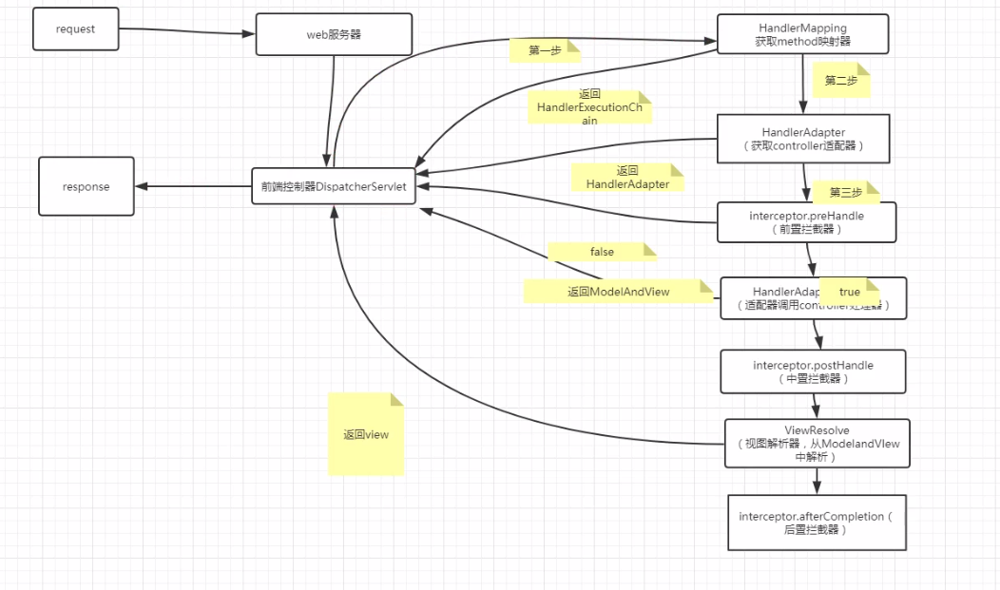
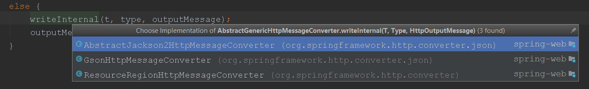

### spring-mvc请求和响应



### FrameworkServlet 类中的 initWebApplicationContext 方法
这前之分析了 configureAndRefreshWebApplicationContext(cwac); 现在分析 onRefresh(wac) 方法，部分代码如下：
```
if (!this.refreshEventReceived) {
			//  重点handMapping 初始化, 调用 DispatcherServlet类中的 onRefresh()方法，对请求和响应做的一些初始化
			// 查看该方法
			onRefresh(wac);
		}
		
@Override
protected void onRefresh(ApplicationContext context) {
	initStrategies(context);
}

protected void initStrategies(ApplicationContext context) {
		initMultipartResolver(context);
		initLocaleResolver(context);
		initThemeResolver(context);
		initHandlerMappings(context); // 初始化 HandlerMapping
		initHandlerAdapters(context); // 初始化 HandlerAdapter
		initHandlerExceptionResolvers(context);
		initRequestToViewNameTranslator(context);
		initViewResolvers(context); // 初始化 ViewResolvers
		initFlashMapManager(context);
}	
============================>>
    <servlet>
        <servlet-name>dn-spring-framework</servlet-name>
        <servlet-class>org.springframework.web.servlet.DispatcherServlet</servlet-class>
        <!--
		contextConfigLocation不是必须的， 如果不配置contextConfigLocation，
		 springmvc的配置文件默认在：WEB-INF/servlet的name+"-servlet.xml"
		 -->
        <init-param>
            <param-name>contextConfigLocation</param-name>
            <param-value>classpath:config/spring/springmvc.xml</param-value>
        </init-param>
        
        // 定义 detectAllHandlerMappings 的属性
        <init-param>
            <param-name>detectAllHandlerMappings</param-name>
            <param-value>false</param-value>
        </init-param>
        <load-on-startup>1</load-on-startup>
    </servlet>

============================>>
// 分析 HandlerMapping
private void initHandlerMappings(ApplicationContext context) {
		this.handlerMappings = null;

        // detectAllHandlerMappings 的值 可以在 <init-param> 的定义 可以在 web.xml 中配置
		if (this.detectAllHandlerMappings) {
			// Find all HandlerMappings in the ApplicationContext, including ancestor contexts.
			Map<String, HandlerMapping> matchingBeans =
			
			        // 获取 HandlerMapping 接口的所有实现类
					BeanFactoryUtils.beansOfTypeIncludingAncestors(context, HandlerMapping.class, true, false);
			if (!matchingBeans.isEmpty()) {
				this.handlerMappings = new ArrayList<HandlerMapping>(matchingBeans.values());
				//对 handlerMappings 进行自然排序
				AnnotationAwareOrderComparator.sort(this.handlerMappings);
			}
		}
		else {
			try {// 从spring 上下文中获取 id为 handlerMapping 这个的 HandlerMapping 对象
				HandlerMapping hm = context.getBean(HANDLER_MAPPING_BEAN_NAME, HandlerMapping.class);
				this.handlerMappings = Collections.singletonList(hm);
			}
			catch (NoSuchBeanDefinitionException ex) {
				// Ignore, we'll add a default HandlerMapping later.
			}
		}
		if (this.handlerMappings == null) {// 如果在xml中没有配置任何的 handlerMapping bean 时，就使用默认的配置
		    // 查看该方法
			this.handlerMappings = getDefaultStrategies(context, HandlerMapping.class);
			if (logger.isDebugEnabled()) {
				logger.debug("No HandlerMappings found in servlet '" + getServletName() + "': using default");
			}
		}
	}	
	
// 分析 getDefaultStrategies(context, HandlerMapping.class); 方法
    @SuppressWarnings("unchecked")
	protected <T> List<T> getDefaultStrategies(ApplicationContext context, Class<T> strategyInterface) {
		String key = strategyInterface.getName();
		
		// defaultStrategies 在静态代码块中初始化的，spring mvc 的默认配置加载在静态代码块中，俱分看下面分析
		String value = defaultStrategies.getProperty(key); //从 spring mvc 中的 默认配置（DispatcherServlet.properties 配置）中获取值 
		if (value != null) {
			String[] classNames = StringUtils.commaDelimitedListToStringArray(value);
			List<T> strategies = new ArrayList<T>(classNames.length);
			for (String className : classNames) {
				try {
					Class<?> clazz = ClassUtils.forName(className, DispatcherServlet.class.getClassLoader());
					Object strategy = createDefaultStrategy(context, clazz);
					strategies.add((T) strategy);
				}
				catch (ClassNotFoundException ex) {
					throw new BeanInitializationException(
							"Could not find DispatcherServlet's default strategy class [" + className +
									"] for interface [" + key + "]", ex);
				}
				catch (LinkageError err) {
					throw new BeanInitializationException(
							"Error loading DispatcherServlet's default strategy class [" + className +
									"] for interface [" + key + "]: problem with class file or dependent class", err);
				}
			}
			return strategies;
		}
		else {
			return new LinkedList<T>();
		}
	}	
	    
// 查看 DispatcherServlet 类中的 静态代码块，获取默认的 配置，DEFAULT_STRATEGIES_PATH 就是 DispatcherServlet.properties 配置文件 
	static {
		// Load default strategy implementations from properties file.
		// This is currently strictly internal and not meant to be customized
		// by application developers.
		try {
			ClassPathResource resource = new ClassPathResource(DEFAULT_STRATEGIES_PATH, DispatcherServlet.class);
			
			// 将 DispatcherServlet.properties 配置文件 加载进来，并找到默认的 HandlerMapping 
			defaultStrategies = PropertiesLoaderUtils.loadProperties(resource);
		}
		catch (IOException ex) {
			throw new IllegalStateException("Could not load 'DispatcherServlet.properties': " + ex.getMessage());
		}
	}
    
==============================>> DispatcherServlet.properties    	
// 查看 DispatcherServlet.properties 配置文件，默认的一些配置 ，也就是说 在配置文件中没有配直 HandlerMapping 、HandlerAdapter、ViewResolver
// spring mvc 会自动配置一些默认的

// 默认的 HandlerMapping
org.springframework.web.servlet.HandlerMapping=org.springframework.web.servlet.handler.BeanNameUrlHandlerMapping,\
	org.springframework.web.servlet.mvc.annotation.DefaultAnnotationHandlerMapping   	

// 默认的 HandlerAdapter	
org.springframework.web.servlet.HandlerAdapter=org.springframework.web.servlet.mvc.HttpRequestHandlerAdapter,\
	org.springframework.web.servlet.mvc.SimpleControllerHandlerAdapter,\
	org.springframework.web.servlet.mvc.annotation.AnnotationMethodHandlerAdapter	

// 默认的 ViewResolver	
org.springframework.web.servlet.ViewResolver=org.springframework.web.servlet.view.InternalResourceViewResolver	
==============================>> 
```

### Request请求进来时,对于 Servlet类 调用的就是 service 方法，对于spring mvc 而言，则就是在 FrameworkServlet 类中的 service 方法
```
	@Override
	protected void service(HttpServletRequest request, HttpServletResponse response)
			throws ServletException, IOException {

		HttpMethod httpMethod = HttpMethod.resolve(request.getMethod());
		if (HttpMethod.PATCH == httpMethod || httpMethod == null) {
		
		    // 查看该方法
			processRequest(request, response);
		}
		else {
			super.service(request, response);
		}
	}
	
// 分析 processRequest(request, response);	
protected final void processRequest(HttpServletRequest request, HttpServletResponse response)
			throws ServletException, IOException {

		long startTime = System.currentTimeMillis();
		Throwable failureCause = null;

		LocaleContext previousLocaleContext = LocaleContextHolder.getLocaleContext();
		LocaleContext localeContext = buildLocaleContext(request);

		RequestAttributes previousAttributes = RequestContextHolder.getRequestAttributes();
		ServletRequestAttributes requestAttributes = buildRequestAttributes(request, response, previousAttributes);

		WebAsyncManager asyncManager = WebAsyncUtils.getAsyncManager(request);
		asyncManager.registerCallableInterceptor(FrameworkServlet.class.getName(), new RequestBindingInterceptor());

		initContextHolders(request, localeContext, requestAttributes);

		try {
		    // 这个方法就是 DispatcherServlet 类中的 doService 方法
			doService(request, response);
		}
		catch (ServletException ex) {
			failureCause = ex;
			throw ex;
		}
		catch (IOException ex) {
			failureCause = ex;
			throw ex;
		}
		catch (Throwable ex) {
			failureCause = ex;
			throw new NestedServletException("Request processing failed", ex);
		}

		finally {
			resetContextHolders(request, previousLocaleContext, previousAttributes);
			if (requestAttributes != null) {
				requestAttributes.requestCompleted();
			}

			if (logger.isDebugEnabled()) {
				if (failureCause != null) {
					this.logger.debug("Could not complete request", failureCause);
				}
				else {
					if (asyncManager.isConcurrentHandlingStarted()) {
						logger.debug("Leaving response open for concurrent processing");
					}
					else {
						this.logger.debug("Successfully completed request");
					}
				}
			}

			publishRequestHandledEvent(request, response, startTime, failureCause);
		}
	}
	
```

### spring mvc 中 DispatcherServlet 类 的入口 doService方法
这里对 request 做了很多的初始化工作
```
    @Override
	protected void doService(HttpServletRequest request, HttpServletResponse response) throws Exception {
		if (logger.isDebugEnabled()) {
			String resumed = WebAsyncUtils.getAsyncManager(request).hasConcurrentResult() ? " resumed" : "";
			logger.debug("DispatcherServlet with name '" + getServletName() + "'" + resumed +
					" processing " + request.getMethod() + " request for [" + getRequestUri(request) + "]");
		}

		// Keep a snapshot of the request attributes in case of an include,
		// to be able to restore the original attributes after the include.
		Map<String, Object> attributesSnapshot = null;
		if (WebUtils.isIncludeRequest(request)) {
			attributesSnapshot = new HashMap<String, Object>();
			Enumeration<?> attrNames = request.getAttributeNames();
			while (attrNames.hasMoreElements()) {
				String attrName = (String) attrNames.nextElement();
				if (this.cleanupAfterInclude || attrName.startsWith("org.springframework.web.servlet")) {
					attributesSnapshot.put(attrName, request.getAttribute(attrName));
				}
			}
		}

		// Make framework objects available to handlers and view objects.
		
		// 对 request 做初始化工作
		request.setAttribute(WEB_APPLICATION_CONTEXT_ATTRIBUTE, getWebApplicationContext());
		request.setAttribute(LOCALE_RESOLVER_ATTRIBUTE, this.localeResolver);
		request.setAttribute(THEME_RESOLVER_ATTRIBUTE, this.themeResolver);
		request.setAttribute(THEME_SOURCE_ATTRIBUTE, getThemeSource());

		FlashMap inputFlashMap = this.flashMapManager.retrieveAndUpdate(request, response);
		if (inputFlashMap != null) {
			request.setAttribute(INPUT_FLASH_MAP_ATTRIBUTE, Collections.unmodifiableMap(inputFlashMap));
		}
		request.setAttribute(OUTPUT_FLASH_MAP_ATTRIBUTE, new FlashMap());
		request.setAttribute(FLASH_MAP_MANAGER_ATTRIBUTE, this.flashMapManager);

		try {
		    // 查看该方法
			doDispatch(request, response);
		}
		finally {
			if (!WebAsyncUtils.getAsyncManager(request).isConcurrentHandlingStarted()) {
				// Restore the original attribute snapshot, in case of an include.
				if (attributesSnapshot != null) {
					restoreAttributesAfterInclude(request, attributesSnapshot);
				}
			}
		}
	}
```


## 前端控制器，DispatcherServlet，也就是spring-mvc请求和响应的解析过程
1. 获取 method 的映射器 HandlerMapping
2. 获取 controller 的适配器 HandlerAdapter
3. 前置拦截器 HandlerInterceptor.preHandleRender 
4. 适配器 HandlerAdapter.handle 调用 controller处理器,返回ModelAndView
5. 中置拦截器  HandlerInterceptor.postHandleRender
6. 视图解析器 ViewResolver, 从ModelAndView中解析 ，返回 view
7. 后置拦截器 HandlerInterceptor.afterCompletion
```
请求地址url：http://localhost:8080/springmvc/controller/method1

@Controller
@RequestMapping("/controller")
public class xxxController {
	@RequestMapping("/method1")
	 public String method1(Strig param1,String param2,Map map,List list,HttpServletRequest req) {
	 }  == HandlerMethod
	 
	 @RequestMapping("/method1")
	 public Map method1(Strig param1,String param2,Map map,List list,HttpServletRequest req) {
	 } 
}

HandlerMapping
建立一个url == controller/method1和我们的handlerMethod的映射关系

HandlerAdapter
负责去调用具体的controller里面的方法的，HandlerAdapter 可以解析我们的处理器方法的参数，这里用到了一个策略模式
返回参数的解析，返回参数的解析也是通过策略模式去解析返回参数的

// 分析 doDispatch 方法
protected void doDispatch(HttpServletRequest request, HttpServletResponse response) throws Exception {
		HttpServletRequest processedRequest = request;
		HandlerExecutionChain mappedHandler = null;
		boolean multipartRequestParsed = false;

		WebAsyncManager asyncManager = WebAsyncUtils.getAsyncManager(request);

		try {
			ModelAndView mv = null;
			Exception dispatchException = null;

			try {
			    // 文件上传的
				processedRequest = checkMultipart(request);
				multipartRequestParsed = (processedRequest != request);

				// Determine handler for the current request.
				
				// 查看该方法
				mappedHandler = getHandler(processedRequest);
				if (mappedHandler == null || mappedHandler.getHandler() == null) {
					noHandlerFound(processedRequest, response);
					return;
				}

				// Determine handler adapter for the current request.
				
				// 查看该方法
				HandlerAdapter ha = getHandlerAdapter(mappedHandler.getHandler());

				// Process last-modified header, if supported by the handler.
				String method = request.getMethod();
				boolean isGet = "GET".equals(method);
				if (isGet || "HEAD".equals(method)) {
					long lastModified = ha.getLastModified(request, mappedHandler.getHandler());
					if (logger.isDebugEnabled()) {
						logger.debug("Last-Modified value for [" + getRequestUri(request) + "] is: " + lastModified);
					}
					if (new ServletWebRequest(request, response).checkNotModified(lastModified) && isGet) {
						return;
					}
				}

                // Pre 拦截器处理，查看该方法
				if (!mappedHandler.applyPreHandle(processedRequest, response)) {
					return;
				}

				// Actually invoke the handler.
				// 俱体的方法执行，查看该方法
				mv = ha.handle(processedRequest, response, mappedHandler.getHandler());

				if (asyncManager.isConcurrentHandlingStarted()) {
					return;
				}

				applyDefaultViewName(processedRequest, mv);
				
				// Post 中置拦截器执行过程
				mappedHandler.applyPostHandle(processedRequest, response, mv);
			}
			catch (Exception ex) {
				dispatchException = ex;
			}
			catch (Throwable err) {
				// As of 4.3, we're processing Errors thrown from handler methods as well,
				// making them available for @ExceptionHandler methods and other scenarios.
				dispatchException = new NestedServletException("Handler dispatch failed", err);
			}
			
			// 视图分析过程,分析看下面
			processDispatchResult(processedRequest, response, mappedHandler, mv, dispatchException);
		}
		catch (Exception ex) {
			triggerAfterCompletion(processedRequest, response, mappedHandler, ex);
		}
		catch (Throwable err) {
			  // After 后置拦截器执行
			triggerAfterCompletion(processedRequest, response, mappedHandler,
					new NestedServletException("Handler processing failed", err));
		}
		finally {
			if (asyncManager.isConcurrentHandlingStarted()) {
				// Instead of postHandle and afterCompletion
				if (mappedHandler != null) {
					mappedHandler.applyAfterConcurrentHandlingStarted(processedRequest, response);
				}
			}
			else {
				// Clean up any resources used by a multipart request.
				if (multipartRequestParsed) {
					cleanupMultipart(processedRequest);
				}
			}
		}
	}
```

###  分析 getHandler(processedRequest)
```
protected HandlerExecutionChain getHandler(HttpServletRequest request) throws Exception {
        //handlerMapping :如果配置文件中有，则用配置文件中的，如果没有，则使用默认的 DispatcherServlet.properties 配置文件中 加载
		for (HandlerMapping hm : this.handlerMappings) {
			if (logger.isTraceEnabled()) {
				logger.trace(
						"Testing handler map [" + hm + "] in DispatcherServlet with name '" + getServletName() + "'");
			}
			
			// 查看该方法
			HandlerExecutionChain handler = hm.getHandler(request);
			if (handler != null) {
				return handler;
			}
		}
		return null;
	}
	
	// 分析 hm.getHandler(request); 方法
    @Override
	public final HandlerExecutionChain getHandler(HttpServletRequest request) throws Exception {
		Object handler = getHandlerInternal(request); // 查看该方法
		if (handler == null) {
			handler = getDefaultHandler();
		}
		if (handler == null) {
			return null;
		}
		// Bean name or resolved handler?
		if (handler instanceof String) {
			String handlerName = (String) handler;
			handler = getApplicationContext().getBean(handlerName);
		}

		HandlerExecutionChain executionChain = getHandlerExecutionChain(handler, request);
		if (CorsUtils.isCorsRequest(request)) {
			CorsConfiguration globalConfig = this.corsConfigSource.getCorsConfiguration(request);
			CorsConfiguration handlerConfig = getCorsConfiguration(handler, request);
			CorsConfiguration config = (globalConfig != null ? globalConfig.combine(handlerConfig) : handlerConfig);
			executionChain = getCorsHandlerExecutionChain(request, executionChain, config);
		}
		return executionChain;
	}	
	
	
	============================>> 先分析  afterPropertiesSet() 方法，看下面，再分析该方法
    @Override
	protected HandlerMethod getHandlerInternal(HttpServletRequest request) throws Exception {
	    // 查看getLookupPathForRequest(request) 方法 ，在AbstractHandlerMethodMapping 类中
		String lookupPath = getUrlPathHelper().getLookupPathForRequest(request); // 返回/login/index
		if (logger.isDebugEnabled()) {
			logger.debug("Looking up handler method for path " + lookupPath);
		}
		this.mappingRegistry.acquireReadLock();
		try {
		    // 查看该方法，俱体看下面
			HandlerMethod handlerMethod = lookupHandlerMethod(lookupPath, request);
			if (logger.isDebugEnabled()) {
				if (handlerMethod != null) {
					logger.debug("Returning handler method [" + handlerMethod + "]");
				}
				else {
					logger.debug("Did not find handler method for [" + lookupPath + "]");
				}
			}
			return (handlerMethod != null ? handlerMethod.createWithResolvedBean() : null);
		}
		finally {
			this.mappingRegistry.releaseReadLock();
		}
	}	
	
// 分析 getLookupPathForRequest(request) 方法 
public String getLookupPathForRequest(HttpServletRequest request) {
		// Always use full path within current servlet context?
		if (this.alwaysUseFullPath) {
			return getPathWithinApplication(request);//查看该方法
		}
		// Else, use path within current servlet mapping if applicable
		String rest = getPathWithinServletMapping(request);
		if (!"".equals(rest)) {
			return rest;
		}
		else {
			return getPathWithinApplication(request);
		}
	}
// 分析 getPathWithinApplication(request); 方法	
public String getPathWithinApplication(HttpServletRequest request) {
		String contextPath = getContextPath(request); //工程名： /dn-session
		String requestUri = getRequestUri(request);// 工程名/请求的uri ：/dn-session/login/index
		String path = getRemainingPath(requestUri, contextPath, true); // 请求的uri :/login/index
		if (path != null) {
			// Normal case: URI contains context path.
			return (StringUtils.hasText(path) ? path : "/");
		}
		else {
			return requestUri;
		}
	}	
	
// 分析 lookupHandlerMethod(lookupPath, request);方法
=========================>>>
// 代码在 public abstract class AbstractHandlerMethodMapping<T> extends AbstractHandlerMapping implements InitializingBean
// InitializingBean 看到这个类说明就有 afterPropertiesSet() 方法，这个方法会在 bean初始化后以后调用，代码如下;
	@Override
	public void afterPropertiesSet() {
		initHandlerMethods(); //查看该方法
	}
	
// 分析 initHandlerMethods(); 方法	
protected void initHandlerMethods() {
		if (logger.isDebugEnabled()) {
			logger.debug("Looking for request mappings in application context: " + getApplicationContext());
		}
		
		// 获取容器spring中所有的bean
		String[] beanNames = (this.detectHandlerMethodsInAncestorContexts ?
				BeanFactoryUtils.beanNamesForTypeIncludingAncestors(getApplicationContext(), Object.class) :
				getApplicationContext().getBeanNamesForType(Object.class));

		for (String beanName : beanNames) {
			if (!beanName.startsWith(SCOPED_TARGET_NAME_PREFIX)) {
				Class<?> beanType = null;
				try {
					beanType = getApplicationContext().getType(beanName);
				}
				catch (Throwable ex) {
					// An unresolvable bean type, probably from a lazy bean - let's ignore it.
					if (logger.isDebugEnabled()) {
						logger.debug("Could not resolve target class for bean with name '" + beanName + "'", ex);
					}
				}
				=====================================>>  isHandler(beanType) 方法摘抄 ，在 RequestMappingHandlerMapping类中
					@Override
                	protected boolean isHandler(Class<?> beanType) {
                		return (AnnotatedElementUtils.hasAnnotation(beanType, Controller.class) ||
                				AnnotatedElementUtils.hasAnnotation(beanType, RequestMapping.class));
                	}
				=====================================>>		
				//只过滤是 @Controller 或者@RequestMapping 的类，因为只有 @Controller类才有　uri 的配置,看上面的代码	
				if (beanType != null && isHandler(beanType)) {
					detectHandlerMethods(beanName); // 查看该方法
				}
			}
		}
		handlerMethodsInitialized(getHandlerMethods());
	}	
	
// 分析 detectHandlerMethods(beanName); 方法
protected void detectHandlerMethods(final Object handler) { // handler 就是字符串，@Controller 的类
		Class<?> handlerType = (handler instanceof String ?
				getApplicationContext().getType((String) handler) : handler.getClass());
		final Class<?> userType = ClassUtils.getUserClass(handlerType);

        // 查看该方法
		Map<Method, T> methods = MethodIntrospector.selectMethods(userType, 
				new MethodIntrospector.MetadataLookup<T>() {
					@Override
					public T inspect(Method method) { // 回调方法
						try {
						    // 查看该方法 //进入 RequestMappingHandlerMapping 类中的 getMappingForMethod 方法
							return getMappingForMethod(method, userType); 
							
						}
						catch (Throwable ex) {
							throw new IllegalStateException("Invalid mapping on handler class [" +
									userType.getName() + "]: " + method, ex);
						}
					}
				});

		if (logger.isDebugEnabled()) {
			logger.debug(methods.size() + " request handler methods found on " + userType + ": " + methods);
		}
		for (Map.Entry<Method, T> entry : methods.entrySet()) {
			Method invocableMethod = AopUtils.selectInvocableMethod(entry.getKey(), userType);
			T mapping = entry.getValue();
			registerHandlerMethod(handler, invocableMethod, mapping); // uri 和 方法 建立映射关系，查看该方法
		}
	}	
	
// 分析  MethodIntrospector.selectMethods(userType,new MethodIntrospector.MetadataLookup<T>()方法
public static <T> Map<Method, T> selectMethods(Class<?> targetType, final MetadataLookup<T> metadataLookup) {
		final Map<Method, T> methodMap = new LinkedHashMap<Method, T>();
		Set<Class<?>> handlerTypes = new LinkedHashSet<Class<?>>();
		Class<?> specificHandlerType = null;

		if (!Proxy.isProxyClass(targetType)) {// 是否是动态代理类，如果不是，则添加到容器中 handlerTypes，handlerTypes里面装的是@Controller 里的东西
			handlerTypes.add(targetType);
			specificHandlerType = targetType;
		}
		handlerTypes.addAll(Arrays.asList(targetType.getInterfaces()));

		for (Class<?> currentHandlerType : handlerTypes) {
			final Class<?> targetClass = (specificHandlerType != null ? specificHandlerType : currentHandlerType);

            // 查看  doWithMethods 方法
			ReflectionUtils.doWithMethods(currentHandlerType, new ReflectionUtils.MethodCallback() {
				@Override
				public void doWith(Method method) {
					Method specificMethod = ClassUtils.getMostSpecificMethod(method, targetClass);
					T result = metadataLookup.inspect(specificMethod); // 回调方法
					if (result != null) {
						Method bridgedMethod = BridgeMethodResolver.findBridgedMethod(specificMethod);
						if (bridgedMethod == specificMethod || metadataLookup.inspect(bridgedMethod) == null) {
							methodMap.put(specificMethod, result);
						}
					}
				}
			}, ReflectionUtils.USER_DECLARED_METHODS);
		}

		return methodMap;
	}
	
	
    // 进入 RequestMappingHandlerMapping 类中的  getMappingForMethod 方法
    @Override
	protected RequestMappingInfo getMappingForMethod(Method method, Class<?> handlerType) {
		RequestMappingInfo info = createRequestMappingInfo(method); // 查看该方法
		if (info != null) {
			RequestMappingInfo typeInfo = createRequestMappingInfo(handlerType);
			if (typeInfo != null) {
				info = typeInfo.combine(info);
			}
		}
		return info;
	}	
	
// 分析 createRequestMappingInfo(method); 方法
private RequestMappingInfo createRequestMappingInfo(AnnotatedElement element) {
        // 获取 @RequestMapping 注解
		RequestMapping requestMapping = AnnotatedElementUtils.findMergedAnnotation(element, RequestMapping.class);
		RequestCondition<?> condition = (element instanceof Class<?> ?
				getCustomTypeCondition((Class<?>) element) : getCustomMethodCondition((Method) element));
				
				// 查看该方法
		return (requestMapping != null ? createRequestMappingInfo(requestMapping, condition) : null);
	}
	
// 分析 createRequestMappingInfo(requestMapping, condition)					
protected RequestMappingInfo createRequestMappingInfo(
			RequestMapping requestMapping, RequestCondition<?> customCondition) {

        // 获取 @requestMapping 注解上面的值
		return RequestMappingInfo
				.paths(resolveEmbeddedValuesInPatterns(requestMapping.path()))
				.methods(requestMapping.method())
				.params(requestMapping.params())
				.headers(requestMapping.headers())
				.consumes(requestMapping.consumes())
				.produces(requestMapping.produces())
				.mappingName(requestMapping.name())
				.customCondition(customCondition)
				.options(this.config)
				.build();
	}			
			
			
			
//分析 registerHandlerMethod(handler, invocableMethod, mapping);  在 AbstractMethodMessageHandler 类中的 registerHandlerMethod 方法
protected void registerHandlerMethod(Object handler, Method method, T mapping) {
		Assert.notNull(mapping, "Mapping must not be null");
		HandlerMethod newHandlerMethod = createHandlerMethod(handler, method);
		HandlerMethod oldHandlerMethod = this.handlerMethods.get(mapping);

		if (oldHandlerMethod != null && !oldHandlerMethod.equals(newHandlerMethod)) {
			throw new IllegalStateException("Ambiguous mapping found. Cannot map '" + newHandlerMethod.getBean() +
					"' bean method \n" + newHandlerMethod + "\nto " + mapping + ": There is already '" +
					oldHandlerMethod.getBean() + "' bean method\n" + oldHandlerMethod + " mapped.");
		}

        // 将 url 和 方法 建立映射关系
        {[/session/login],methods=[],params=[],headers=[],consumes=[],produces=[],custom=[]} =
         public java.lang.String com.dongnao.jack.controller.SessionController.login(
         javax.servlet.http.HttpServletRequest,
         javax.servlet.http.HttpServletResponse,java.lang.String)
         
		this.handlerMethods.put(mapping, newHandlerMethod);
		
		if (logger.isInfoEnabled()) {
			logger.info("Mapped \"" + mapping + "\" onto " + newHandlerMethod);
		}

		for (String pattern : getDirectLookupDestinations(mapping)) {
		    // url 和 @RequestMapping 上的值建立关系
		    /session/login  = {[/session/login],methods=[],params=[],headers=[],consumes=[],produces=[],custom=[]}
			this.destinationLookup.add(pattern, mapping);
		}
	}			
=========================>>> this.mappingRegistry 中的值在启动时就完成了，看上面，就是这个容器的初始化过程			
protected HandlerMethod lookupHandlerMethod(String lookupPath, HttpServletRequest request) throws Exception {
		List<Match> matches = new ArrayList<Match>();
		List<T> directPathMatches = this.mappingRegistry.getMappingsByUrl(lookupPath);
		if (directPathMatches != null) {
			addMatchingMappings(directPathMatches, matches, request); // 查看该方法
		}
		if (matches.isEmpty()) {
			// No choice but to go through all mappings...
			addMatchingMappings(this.mappingRegistry.getMappings().keySet(), matches, request);
		}

		if (!matches.isEmpty()) {
			Comparator<Match> comparator = new MatchComparator(getMappingComparator(request));
			Collections.sort(matches, comparator);
			if (logger.isTraceEnabled()) {
				logger.trace("Found " + matches.size() + " matching mapping(s) for [" +
						lookupPath + "] : " + matches);
			}
			Match bestMatch = matches.get(0);
			if (matches.size() > 1) {
				if (CorsUtils.isPreFlightRequest(request)) {
					return PREFLIGHT_AMBIGUOUS_MATCH;
				}
				Match secondBestMatch = matches.get(1);
				if (comparator.compare(bestMatch, secondBestMatch) == 0) {
					Method m1 = bestMatch.handlerMethod.getMethod();
					Method m2 = secondBestMatch.handlerMethod.getMethod();
					throw new IllegalStateException("Ambiguous handler methods mapped for HTTP path '" +
							request.getRequestURL() + "': {" + m1 + ", " + m2 + "}");
				}
			}
			handleMatch(bestMatch.mapping, lookupPath, request);
			return bestMatch.handlerMethod;
		}
		else {
			return handleNoMatch(this.mappingRegistry.getMappings().keySet(), lookupPath, request);
		}
	}
```


###  分析  getHandlerAdapter 方法
````
protected HandlerAdapter getHandlerAdapter(Object handler) throws ServletException {
        // this.handlerAdapters 代表所有 handlerAdapter
		for (HandlerAdapter ha : this.handlerAdapters) { // 循环所有 handlerAdapter
			if (logger.isTraceEnabled()) {
				logger.trace("Testing handler adapter [" + ha + "]");
			}
			if (ha.supports(handler)) { // 如果传进来的 handler 是某个 handlerAdapter 类型的，则返回  handlerAdapter,这里用了策略模式
				return ha;
			}
		}
		throw new ServletException("No adapter for handler [" + handler +
				"]: The DispatcherServlet configuration needs to include a HandlerAdapter that supports this handler");
	}
````

### Pre 拦截器处理
```
// 查看该方法
if (!mappedHandler.applyPreHandle(processedRequest, response)) {
					return;
}

boolean applyPreHandle(HttpServletRequest request, HttpServletResponse response) throws Exception {
		HandlerInterceptor[] interceptors = getInterceptors();
		if (!ObjectUtils.isEmpty(interceptors)) {
			for (int i = 0; i < interceptors.length; i++) {
				HandlerInterceptor interceptor = interceptors[i];
				if (!interceptor.preHandle(request, response, this.handler)) {
					triggerAfterCompletion(request, response, null);
					return false;
				}
				this.interceptorIndex = i; // 记录当前执行拦截器的位置
			}
		}
		return true;
	}
```

### Controller 中俱体的方法执行
```
// 俱体的方法执行，查看该方法
mv = ha.handle(processedRequest, response, mappedHandler.getHandler());
				
	@Override
	public final ModelAndView handle(HttpServletRequest request, HttpServletResponse response, Object handler)
			throws Exception {
         
         // 查看该方法   
		return handleInternal(request, response, (HandlerMethod) handler);
	}
	
    @Override
	protected ModelAndView handleInternal(HttpServletRequest request,
			HttpServletResponse response, HandlerMethod handlerMethod) throws Exception {

		ModelAndView mav;
		checkRequest(request);

		// Execute invokeHandlerMethod in synchronized block if required.
		if (this.synchronizeOnSession) {
			HttpSession session = request.getSession(false);
			if (session != null) {
				Object mutex = WebUtils.getSessionMutex(session);
				synchronized (mutex) {
				    // 查看该方法
					mav = invokeHandlerMethod(request, response, handlerMethod);
				}
			}
			else {
				// No HttpSession available -> no mutex necessary
				mav = invokeHandlerMethod(request, response, handlerMethod);
			}
		}
		else {
			// No synchronization on session demanded at all...
			mav = invokeHandlerMethod(request, response, handlerMethod);
		}

		if (!response.containsHeader(HEADER_CACHE_CONTROL)) {
			if (getSessionAttributesHandler(handlerMethod).hasSessionAttributes()) {
				applyCacheSeconds(response, this.cacheSecondsForSessionAttributeHandlers);
			}
			else {
				prepareResponse(response);
			}
		}

		return mav;
	}	
			
protected ModelAndView invokeHandlerMethod(HttpServletRequest request,
			HttpServletResponse response, HandlerMethod handlerMethod) throws Exception {

		ServletWebRequest webRequest = new ServletWebRequest(request, response);
		try {
			WebDataBinderFactory binderFactory = getDataBinderFactory(handlerMethod);
			ModelFactory modelFactory = getModelFactory(handlerMethod, binderFactory);

			ServletInvocableHandlerMethod invocableMethod = createInvocableHandlerMethod(handlerMethod);
			invocableMethod.setHandlerMethodArgumentResolvers(this.argumentResolvers);
			invocableMethod.setHandlerMethodReturnValueHandlers(this.returnValueHandlers);
			invocableMethod.setDataBinderFactory(binderFactory);
			invocableMethod.setParameterNameDiscoverer(this.parameterNameDiscoverer);

			ModelAndViewContainer mavContainer = new ModelAndViewContainer();
			mavContainer.addAllAttributes(RequestContextUtils.getInputFlashMap(request));
			modelFactory.initModel(webRequest, mavContainer, invocableMethod);
			mavContainer.setIgnoreDefaultModelOnRedirect(this.ignoreDefaultModelOnRedirect);

			AsyncWebRequest asyncWebRequest = WebAsyncUtils.createAsyncWebRequest(request, response);
			asyncWebRequest.setTimeout(this.asyncRequestTimeout);

			WebAsyncManager asyncManager = WebAsyncUtils.getAsyncManager(request);
			asyncManager.setTaskExecutor(this.taskExecutor);
			asyncManager.setAsyncWebRequest(asyncWebRequest);
			asyncManager.registerCallableInterceptors(this.callableInterceptors);
			asyncManager.registerDeferredResultInterceptors(this.deferredResultInterceptors);

			if (asyncManager.hasConcurrentResult()) {
				Object result = asyncManager.getConcurrentResult();
				mavContainer = (ModelAndViewContainer) asyncManager.getConcurrentResultContext()[0];
				asyncManager.clearConcurrentResult();
				if (logger.isDebugEnabled()) {
					logger.debug("Found concurrent result value [" + result + "]");
				}
				invocableMethod = invocableMethod.wrapConcurrentResult(result);
			}
            
            // 查看该方法
			invocableMethod.invokeAndHandle(webRequest, mavContainer);
			
			if (asyncManager.isConcurrentHandlingStarted()) {
				return null;
			}
            
            // 查看该方法，俱体看下面分析
			return getModelAndView(mavContainer, modelFactory, webRequest);
		}
		finally {
			webRequest.requestCompleted();
		}
	}	
	
	public void invokeAndHandle(ServletWebRequest webRequest,
			ModelAndViewContainer mavContainer, Object... providedArgs) throws Exception {
        
        // 查看该方法,每个请求中的参数，都有对应的处理类，每个参数对应的处理类都不一样 
        // returnValue 就是方法的返回值结果
		Object returnValue = invokeForRequest(webRequest, mavContainer, providedArgs);
		setResponseStatus(webRequest);

		if (returnValue == null) {
			if (isRequestNotModified(webRequest) || hasResponseStatus() || mavContainer.isRequestHandled()) {
				mavContainer.setRequestHandled(true); 
				return;
			}
		}
		else if (StringUtils.hasText(this.responseReason)) {
			mavContainer.setRequestHandled(true);
			return;
		}

		mavContainer.setRequestHandled(false); // 参数很重要，当上面的方法返回值后，就对这个属性做了处理
		try {
		
		    // 因为返回值也是多个类型的，所以也会对每一种类型进行处理 ，这也是返回 json 格式的关键
			this.returnValueHandlers.handleReturnValue(
					returnValue, getReturnValueType(returnValue), mavContainer, webRequest);
		}
		catch (Exception ex) {
			if (logger.isTraceEnabled()) {
				logger.trace(getReturnValueHandlingErrorMessage("Error handling return value", returnValue), ex);
			}
			throw ex;
		}
	}
	
public Object invokeForRequest(NativeWebRequest request, ModelAndViewContainer mavContainer,
			Object... providedArgs) throws Exception {
        // 重点 ，查看该方法 args 就是解析方法参数的结果
		Object[] args = getMethodArgumentValues(request, mavContainer, providedArgs);
		
		if (logger.isTraceEnabled()) {
			StringBuilder sb = new StringBuilder("Invoking [");
			sb.append(getBeanType().getSimpleName()).append(".");
			sb.append(getMethod().getName()).append("] method with arguments ");
			sb.append(Arrays.asList(args));
			logger.trace(sb.toString());
		}
		Object returnValue = doInvoke(args);  //将得到的方法参数的值，通过反射 method.invoke(bean,args) 就可以调用方法
		if (logger.isTraceEnabled()) {
			logger.trace("Method [" + getMethod().getName() + "] returned [" + returnValue + "]");
		}
		return returnValue;
	}	
	
private Object[] getMethodArgumentValues(NativeWebRequest request, ModelAndViewContainer mavContainer,
			Object... providedArgs) throws Exception {
        // 获取方法上所有的参数
		MethodParameter[] parameters = getMethodParameters();
		
		Object[] args = new Object[parameters.length];
		for (int i = 0; i < parameters.length; i++) {
			MethodParameter parameter = parameters[i];
			parameter.initParameterNameDiscovery(this.parameterNameDiscoverer);
			GenericTypeResolver.resolveParameterType(parameter, getBean().getClass());
			args[i] = resolveProvidedArgument(parameter, providedArgs);
			if (args[i] != null) {
				continue;
			}
			
			// this.argumentResolvers 容器在 RequestMappingHandlerAdapter 类中的 afterPropertiesSet 方法中初始化的
			// 使用了策略模式，根据参数找到应的处理类
			if (this.argumentResolvers.supportsParameter(parameter)) {// 解析参数，查看该方法
				try {
				    // 参数解析，查看该方法
					args[i] = this.argumentResolvers.resolveArgument(
							parameter, mavContainer, request, this.dataBinderFactory);
					continue;
				}
				catch (Exception ex) {
					if (logger.isDebugEnabled()) {
						logger.debug(getArgumentResolutionErrorMessage("Error resolving argument", i), ex);
					}
					throw ex;
				}
			}
			if (args[i] == null) {
				String msg = getArgumentResolutionErrorMessage("No suitable resolver for argument", i);
				throw new IllegalStateException(msg);
			}
		}
		return args;
	}
	
    @Override
	public boolean supportsParameter(MethodParameter parameter) {
		// 查看该方法
		return (getArgumentResolver(parameter) != null);
	}	
	
private HandlerMethodArgumentResolver getArgumentResolver(MethodParameter parameter) {
		HandlerMethodArgumentResolver result = this.argumentResolverCache.get(parameter);
		if (result == null) {
			for (HandlerMethodArgumentResolver methodArgumentResolver : this.argumentResolvers) {
				if (logger.isTraceEnabled()) {
					logger.trace("Testing if argument resolver [" + methodArgumentResolver + "] supports [" +
							parameter.getGenericParameterType() + "]");
				}
				
				// 查看 supportsParameter 方法，得知支持方法的参数解析类有哪些，可以看到常见的注解解析类，如：@PathVariable 的解析：PathVariableMapMethodArgumentResolver
				if (methodArgumentResolver.supportsParameter(parameter)) {
					result = methodArgumentResolver;
					
			        //解析参数，查看该方法
					this.argumentResolverCache.put(parameter, result);
					break;
				}
			}
		}
		return result;
	}			
	
				
    @Override
	public Object resolveArgument(MethodParameter parameter, ModelAndViewContainer mavContainer,
			NativeWebRequest webRequest, WebDataBinderFactory binderFactory) throws Exception {

		HandlerMethodArgumentResolver resolver = getArgumentResolver(parameter);
		if (resolver == null) {
			throw new IllegalArgumentException("Unknown parameter type [" + parameter.getParameterType().getName() + "]");
		}
		// 查看该方法 ,如 ServletRequestMethodArgumentResolver 解析 request的
		return resolver.resolveArgument(parameter, mavContainer, webRequest, binderFactory);
	}		
	
	// ServletRequestMethodArgumentResolver 解析 request, supportsParameter 方法是支持的参数类型
	@Override
	public Object resolveArgument(MethodParameter parameter, ModelAndViewContainer mavContainer,
			NativeWebRequest webRequest, WebDataBinderFactory binderFactory) throws Exception {

		Class<?> paramType = parameter.getParameterType();
		if (WebRequest.class.isAssignableFrom(paramType)) {
			return webRequest;
		}

		HttpServletRequest request = webRequest.getNativeRequest(HttpServletRequest.class);
		if (ServletRequest.class.isAssignableFrom(paramType) || MultipartRequest.class.isAssignableFrom(paramType)) {
			Object nativeRequest = webRequest.getNativeRequest(paramType);
			if (nativeRequest == null) {
				throw new IllegalStateException(
						"Current request is not of type [" + paramType.getName() + "]: " + request);
			}
			return nativeRequest;
		}
		else if (HttpSession.class.isAssignableFrom(paramType)) {
			return request.getSession();
		}
		else if (HttpMethod.class == paramType) {
			return ((ServletWebRequest) webRequest).getHttpMethod();
		}
		else if (Principal.class.isAssignableFrom(paramType)) {
			return request.getUserPrincipal();
		}
		else if (Locale.class == paramType) {
			return RequestContextUtils.getLocale(request);
		}
		else if (TimeZone.class == paramType) {
			TimeZone timeZone = RequestContextUtils.getTimeZone(request);
			return (timeZone != null ? timeZone : TimeZone.getDefault());
		}
		else if ("java.time.ZoneId".equals(paramType.getName())) {
			return ZoneIdResolver.resolveZoneId(request);
		}
		else if (InputStream.class.isAssignableFrom(paramType)) {
			return request.getInputStream();
		}
		else if (Reader.class.isAssignableFrom(paramType)) {
			return request.getReader();
		}
		else {
			// should never happen...
			throw new UnsupportedOperationException(
					"Unknown parameter type: " + paramType + " in method: " + parameter.getMethod());
		}
	}
			
	// 支持的参数类型																						
    @Override
	public boolean supportsParameter(MethodParameter parameter) {
		Class<?> paramType = parameter.getParameterType();
		return (WebRequest.class.isAssignableFrom(paramType) ||
				ServletRequest.class.isAssignableFrom(paramType) ||
				MultipartRequest.class.isAssignableFrom(paramType) ||
				HttpSession.class.isAssignableFrom(paramType) ||
				Principal.class.isAssignableFrom(paramType) ||
				Locale.class == paramType ||
				TimeZone.class == paramType ||
				"java.time.ZoneId".equals(paramType.getName()) ||
				InputStream.class.isAssignableFrom(paramType) ||
				Reader.class.isAssignableFrom(paramType) ||
				HttpMethod.class == paramType);
	}																																																																																																																																												
																																																								
```

### spring mvc 支持 restful,如何支持 @RequestBody 或者 @ResponseBody 的json 数据格式的,在 RequestResponseBodyMethodProcessor类中
```
    // 支持参数 @RequestBody 注解
 	@Override
 	public boolean supportsParameter(MethodParameter parameter) {
 		return parameter.hasParameterAnnotation(RequestBody.class);
 	}
 
    // 支持 返回值  @ResponseBody 注解
 	@Override
 	public boolean supportsReturnType(MethodParameter returnType) {
 		return (AnnotatedElementUtils.hasAnnotation(returnType.getContainingClass(), ResponseBody.class) ||
 				returnType.hasMethodAnnotation(ResponseBody.class));
 	}
 	
    // 参数解析
	@Override
	public Object resolveArgument(MethodParameter parameter, ModelAndViewContainer mavContainer,
			NativeWebRequest webRequest, WebDataBinderFactory binderFactory) throws Exception {

		Object arg = readWithMessageConverters(webRequest, parameter, parameter.getGenericParameterType());
		String name = Conventions.getVariableNameForParameter(parameter);

		WebDataBinder binder = binderFactory.createBinder(webRequest, arg, name);
		if (arg != null) {
			validateIfApplicable(binder, parameter);
			if (binder.getBindingResult().hasErrors() && isBindExceptionRequired(binder, parameter)) {
				throw new MethodArgumentNotValidException(parameter, binder.getBindingResult());
			}
		}
		mavContainer.addAttribute(BindingResult.MODEL_KEY_PREFIX + name, binder.getBindingResult());

		return arg;
	}
 	
 		@Override
    	protected <T> Object readWithMessageConverters(NativeWebRequest webRequest, MethodParameter methodParam,
    			Type paramType) throws IOException, HttpMediaTypeNotSupportedException, HttpMessageNotReadableException {
    
    		HttpServletRequest servletRequest = webRequest.getNativeRequest(HttpServletRequest.class);
    		ServletServerHttpRequest inputMessage = new ServletServerHttpRequest(servletRequest);
    
            //查看该方法
    		Object arg = readWithMessageConverters(inputMessage, methodParam, paramType);
    		if (arg == null) {
    			if (checkRequired(methodParam)) { //查看该方法参数上是否有@RequestBody 注解，查看该方法
    				throw new HttpMessageNotReadableException("Required request body is missing: " +
    						methodParam.getMethod().toGenericString());
    			}
    		}
    		return arg;
    	}
    
    protected boolean checkRequired(MethodParameter methodParam) {
    		return methodParam.getParameterAnnotation(RequestBody.class).required();
    	}	
    	
    @SuppressWarnings("unchecked")
	protected <T> Object readWithMessageConverters(HttpInputMessage inputMessage, MethodParameter param,
			Type targetType) throws IOException, HttpMediaTypeNotSupportedException, HttpMessageNotReadableException {

		MediaType contentType;
		boolean noContentType = false;
		try {
			contentType = inputMessage.getHeaders().getContentType();
		}
		catch (InvalidMediaTypeException ex) {
			throw new HttpMediaTypeNotSupportedException(ex.getMessage());
		}
		if (contentType == null) {
			noContentType = true;
			contentType = MediaType.APPLICATION_OCTET_STREAM;
		}

		Class<?> contextClass = (param != null ? param.getContainingClass() : null);
		Class<T> targetClass = (targetType instanceof Class<?> ? (Class<T>) targetType : null);
		if (targetClass == null) {
			ResolvableType resolvableType = (param != null ?
					ResolvableType.forMethodParameter(param) : ResolvableType.forType(targetType));
			targetClass = (Class<T>) resolvableType.resolve();
		}

		HttpMethod httpMethod = ((HttpRequest) inputMessage).getMethod();
		Object body = NO_VALUE;

		try {
			inputMessage = new EmptyBodyCheckingHttpInputMessage(inputMessage);

            // messageConverters 消息转换器，查看RequestMappingHandlerAdapter 类中的构造器 ，在这里注册了默认的 messageConverters
            // 在这里 入参数是 json 的格式其实也是字符串,只不过多了个注解
			for (HttpMessageConverter<?> converter : this.messageConverters) {
				Class<HttpMessageConverter<?>> converterType = (Class<HttpMessageConverter<?>>) converter.getClass();
				if (converter instanceof GenericHttpMessageConverter) {
					GenericHttpMessageConverter<?> genericConverter = (GenericHttpMessageConverter<?>) converter;
					if (genericConverter.canRead(targetType, contextClass, contentType)) {
						if (logger.isDebugEnabled()) {
							logger.debug("Read [" + targetType + "] as \"" + contentType + "\" with [" + converter + "]");
						}
						if (inputMessage.getBody() != null) {
							inputMessage = getAdvice().beforeBodyRead(inputMessage, param, targetType, converterType);
							body = genericConverter.read(targetType, contextClass, inputMessage);
							body = getAdvice().afterBodyRead(body, inputMessage, param, targetType, converterType);
						}
						else {
							body = null;
							body = getAdvice().handleEmptyBody(body, inputMessage, param, targetType, converterType);
						}
						break;
					}
				}
				else if (targetClass != null) {
					if (converter.canRead(targetClass, contentType)) {
						if (logger.isDebugEnabled()) {
							logger.debug("Read [" + targetType + "] as \"" + contentType + "\" with [" + converter + "]");
						}
						if (inputMessage.getBody() != null) {
							inputMessage = getAdvice().beforeBodyRead(inputMessage, param, targetType, converterType);
							body = ((HttpMessageConverter<T>) converter).read(targetClass, inputMessage);
							body = getAdvice().afterBodyRead(body, inputMessage, param, targetType, converterType);
						}
						else {
							body = null;
							body = getAdvice().handleEmptyBody(body, inputMessage, param, targetType, converterType);
						}
						break;
					}
				}
			}
		}
		catch (IOException ex) {
			throw new HttpMessageNotReadableException("Could not read document: " + ex.getMessage(), ex);
		}

		if (body == NO_VALUE) {
			if (httpMethod == null || !SUPPORTED_METHODS.contains(httpMethod) ||
					(noContentType && inputMessage.getBody() == null)) {
				return null;
			}
			throw new HttpMediaTypeNotSupportedException(contentType, this.allSupportedMediaTypes);
		}

		return body;
	}  
	
	  	
// 返回值类型的转换	
这部分代码摘抄上面的，得到方法返回值后的处理 ， 查看该方法
this.returnValueHandlers.handleReturnValue(
					returnValue, getReturnValueType(returnValue), mavContainer, webRequest);

    @Override
	public void handleReturnValue(Object returnValue, MethodParameter returnType,
			ModelAndViewContainer mavContainer, NativeWebRequest webRequest) throws Exception {
        
        // 根据 方法返回值类型，得到返回值处理类，查看该方法
		HandlerMethodReturnValueHandler handler = selectHandler(returnValue, returnType);
		if (handler == null) {
			throw new IllegalArgumentException("Unknown return value type: " + returnType.getParameterType().getName());
		}
		
		// 返回值类型，对返回值进行处理 
		// 如 ViewMethodReturnValueHandler 类 对 View 的处理
		// 如 ViewNameMethodReturnValueHandler 类对 String 的处理，返回视图
		// 如 RequestResponseBodyMethodProcessor 类对 @ResponseBody 的处理，返回json
		handler.handleReturnValue(returnValue, returnType, mavContainer, webRequest);
		
		=========================================>> 返回 json  处理
			@Override
        	public void handleReturnValue(Object returnValue, MethodParameter returnType,
        			ModelAndViewContainer mavContainer, NativeWebRequest webRequest)
        			throws IOException, HttpMediaTypeNotAcceptableException, HttpMessageNotWritableException {
        
        		mavContainer.setRequestHandled(true); // 这个参数很重要
        		ServletServerHttpRequest inputMessage = createInputMessage(webRequest);
        		ServletServerHttpResponse outputMessage = createOutputMessage(webRequest);
        
        		// Try even with null return value. ResponseBodyAdvice could get involved.
        		
        		// 查看该方法
        		writeWithMessageConverters(returnValue, returnType, inputMessage, outputMessage);
        	}
        	
        		@SuppressWarnings("unchecked")
            	protected <T> void writeWithMessageConverters(T value, MethodParameter returnType,
            			ServletServerHttpRequest inputMessage, ServletServerHttpResponse outputMessage)
            			throws IOException, HttpMediaTypeNotAcceptableException, HttpMessageNotWritableException {
            
            		Object outputValue;
            		Class<?> valueType;
            		Type declaredType;
            
            		if (value instanceof CharSequence) {
            			outputValue = value.toString();
            			valueType = String.class;
            			declaredType = String.class;
            		}
            		else {
            			outputValue = value;
            			valueType = getReturnValueType(outputValue, returnType);
            			declaredType = getGenericType(returnType);
            		}
            
            		HttpServletRequest request = inputMessage.getServletRequest();
            		List<MediaType> requestedMediaTypes = getAcceptableMediaTypes(request);
            		List<MediaType> producibleMediaTypes = getProducibleMediaTypes(request, valueType, declaredType);
            
            		if (outputValue != null && producibleMediaTypes.isEmpty()) {
            			throw new IllegalArgumentException("No converter found for return value of type: " + valueType);
            		}
            
            		Set<MediaType> compatibleMediaTypes = new LinkedHashSet<MediaType>();
            		for (MediaType requestedType : requestedMediaTypes) {
            			for (MediaType producibleType : producibleMediaTypes) {
            				if (requestedType.isCompatibleWith(producibleType)) {
            					compatibleMediaTypes.add(getMostSpecificMediaType(requestedType, producibleType));
            				}
            			}
            		}
            		if (compatibleMediaTypes.isEmpty()) {
            			if (outputValue != null) {
            				throw new HttpMediaTypeNotAcceptableException(producibleMediaTypes);
            			}
            			return;
            		}
            
            		List<MediaType> mediaTypes = new ArrayList<MediaType>(compatibleMediaTypes);
            		MediaType.sortBySpecificityAndQuality(mediaTypes);
            
            		MediaType selectedMediaType = null;
            		for (MediaType mediaType : mediaTypes) {
            			if (mediaType.isConcrete()) {
            				selectedMediaType = mediaType;
            				break;
            			}
            			else if (mediaType.equals(MediaType.ALL) || mediaType.equals(MEDIA_TYPE_APPLICATION)) {
            				selectedMediaType = MediaType.APPLICATION_OCTET_STREAM;
            				break;
            			}
            		}
            
            		if (selectedMediaType != null) {
            			selectedMediaType = selectedMediaType.removeQualityValue();
            			
            			// this.messageConverters 这个参数和 入参的 this.messageConverters 是一样的
            			// 当 MappingJackson2HttpMessageConverter 时就会继续往下走
            			for (HttpMessageConverter<?> messageConverter : this.messageConverters) {
            				if (messageConverter instanceof GenericHttpMessageConverter) {
            				    
            					if (((GenericHttpMessageConverter) messageConverter).canWrite(// 查看该方法
            							declaredType, valueType, selectedMediaType)) {
            						outputValue = (T) getAdvice().beforeBodyWrite(outputValue, returnType, selectedMediaType,
            								(Class<? extends HttpMessageConverter<?>>) messageConverter.getClass(),
            								inputMessage, outputMessage);
            						if (outputValue != null) {
            							addContentDispositionHeader(inputMessage, outputMessage);
            							((GenericHttpMessageConverter) messageConverter).write(
            									outputValue, declaredType, selectedMediaType, outputMessage);
            							if (logger.isDebugEnabled()) {
            								logger.debug("Written [" + outputValue + "] as \"" + selectedMediaType +
            										"\" using [" + messageConverter + "]");
            							}
            						}
            						return;
            					}
            				}
            				
            				// 点击这个 canWrite 方法可以看到很多消息转换器，其中包括 json消息转换器 
            				// messageConverter 能不能读取这个请求头类型的数据 selectedMediaType
            				else if (messageConverter.canWrite(valueType, selectedMediaType)) { 
            					outputValue = (T) getAdvice().beforeBodyWrite(outputValue, returnType, selectedMediaType,
            							(Class<? extends HttpMessageConverter<?>>) messageConverter.getClass(),
            							inputMessage, outputMessage);
            					if (outputValue != null) {
            						addContentDispositionHeader(inputMessage, outputMessage);
            						((HttpMessageConverter) messageConverter).write(outputValue, selectedMediaType, outputMessage);
            						if (logger.isDebugEnabled()) {
            							logger.debug("Written [" + outputValue + "] as \"" + selectedMediaType +
            									"\" using [" + messageConverter + "]");
            						}
            					}
            					return;
            				}
            			}
            		}
            
            		if (outputValue != null) {
            			throw new HttpMediaTypeNotAcceptableException(this.allSupportedMediaTypes);
            		}
            	}

        // 分析 write 方法， 在 AbstractGenericHttpMessageConverter 类中
        public final void write(final T t, final Type type, MediaType contentType, HttpOutputMessage outputMessage)
        			throws IOException, HttpMessageNotWritableException {
        
        		final HttpHeaders headers = outputMessage.getHeaders();
        		addDefaultHeaders(headers, t, contentType);
        
        		if (outputMessage instanceof StreamingHttpOutputMessage) {
        			StreamingHttpOutputMessage streamingOutputMessage = (StreamingHttpOutputMessage) outputMessage;
        			streamingOutputMessage.setBody(new StreamingHttpOutputMessage.Body() {
        				@Override
        				public void writeTo(final OutputStream outputStream) throws IOException {
        					writeInternal(t, type, new HttpOutputMessage() {
        						@Override
        						public OutputStream getBody() throws IOException {
        							return outputStream;
        						}
        						@Override
        						public HttpHeaders getHeaders() {
        							return headers;
        						}
        					});
        				}
        			});
        		}
        		else {
        			writeInternal(t, type, outputMessage);// 转成 json 格式
        			outputMessage.getBody().flush();  // 数据写入 response 中，返回给前端
        		}
        	}
		=========================================>>
	}  	  	
	
private HandlerMethodReturnValueHandler selectHandler(Object value, MethodParameter returnType) {
		boolean isAsyncValue = isAsyncReturnValue(value, returnType);
		
		 // 也是用到了策略模式 
		 // this.returnValueHandlers 在 RequestMappingHandlerAdapter 类中的 afterPropertiesSet 中初始化的
		for (HandlerMethodReturnValueHandler handler : this.returnValueHandlers) {
			if (isAsyncValue && !(handler instanceof AsyncHandlerMethodReturnValueHandler)) {
				continue;
			}
			if (handler.supportsReturnType(returnType)) {// 支持的返回值类型
				return handler;
			}
		}
		return null;
	}	  	  	
```
### 返回值json转换器 类


### 注册所有方法参数解析器
```
    @Override
	public void afterPropertiesSet() {
		// Do this first, it may add ResponseBody advice beans
		initControllerAdviceCache();

		if (this.argumentResolvers == null) {
		    // 默认的方法参数解析器注册，查看该方法
			List<HandlerMethodArgumentResolver> resolvers = getDefaultArgumentResolvers();
			this.argumentResolvers = new HandlerMethodArgumentResolverComposite().addResolvers(resolvers);
		}
		if (this.initBinderArgumentResolvers == null) { // 参数绑定解析器注册
			List<HandlerMethodArgumentResolver> resolvers = getDefaultInitBinderArgumentResolvers();
			this.initBinderArgumentResolvers = new HandlerMethodArgumentResolverComposite().addResolvers(resolvers);
		}
		if (this.returnValueHandlers == null) { // 参数返回值 解析器注册
			List<HandlerMethodReturnValueHandler> handlers = getDefaultReturnValueHandlers();
			this.returnValueHandlers = new HandlerMethodReturnValueHandlerComposite().addHandlers(handlers);
		}
	}
	
private List<HandlerMethodArgumentResolver> getDefaultArgumentResolvers() {
		List<HandlerMethodArgumentResolver> resolvers = new ArrayList<HandlerMethodArgumentResolver>();

		// Annotation-based argument resolution
		resolvers.add(new RequestParamMethodArgumentResolver(getBeanFactory(), false));
		resolvers.add(new RequestParamMapMethodArgumentResolver());
		resolvers.add(new PathVariableMethodArgumentResolver());
		resolvers.add(new PathVariableMapMethodArgumentResolver());
		resolvers.add(new MatrixVariableMethodArgumentResolver());
		resolvers.add(new MatrixVariableMapMethodArgumentResolver());
		resolvers.add(new ServletModelAttributeMethodProcessor(false));
		resolvers.add(new RequestResponseBodyMethodProcessor(getMessageConverters(), this.requestResponseBodyAdvice));
		resolvers.add(new RequestPartMethodArgumentResolver(getMessageConverters(), this.requestResponseBodyAdvice));
		resolvers.add(new RequestHeaderMethodArgumentResolver(getBeanFactory()));
		resolvers.add(new RequestHeaderMapMethodArgumentResolver());
		resolvers.add(new ServletCookieValueMethodArgumentResolver(getBeanFactory()));
		resolvers.add(new ExpressionValueMethodArgumentResolver(getBeanFactory()));
		resolvers.add(new SessionAttributeMethodArgumentResolver());
		resolvers.add(new RequestAttributeMethodArgumentResolver());

		// Type-based argument resolution
		resolvers.add(new ServletRequestMethodArgumentResolver());
		resolvers.add(new ServletResponseMethodArgumentResolver());
		resolvers.add(new HttpEntityMethodProcessor(getMessageConverters(), this.requestResponseBodyAdvice));
		resolvers.add(new RedirectAttributesMethodArgumentResolver());
		resolvers.add(new ModelMethodProcessor());
		resolvers.add(new MapMethodProcessor());
		resolvers.add(new ErrorsMethodArgumentResolver());
		resolvers.add(new SessionStatusMethodArgumentResolver());
		resolvers.add(new UriComponentsBuilderMethodArgumentResolver());

		// Custom arguments
		if (getCustomArgumentResolvers() != null) {
			resolvers.addAll(getCustomArgumentResolvers());
		}

		// Catch-all
		resolvers.add(new RequestParamMethodArgumentResolver(getBeanFactory(), true));
		resolvers.add(new ServletModelAttributeMethodProcessor(true));

		return resolvers;
	}	
	
   // 查看RequestMappingHandlerAdapter 类中的构造器 ，在这里注册了默认的 messageConverters,也是messageConverters的初始化，
   // 但这里没有json 消息转换器
	public RequestMappingHandlerAdapter() {
		StringHttpMessageConverter stringHttpMessageConverter = new StringHttpMessageConverter();
		stringHttpMessageConverter.setWriteAcceptCharset(false);  // see SPR-7316

		this.messageConverters = new ArrayList<HttpMessageConverter<?>>(4);
		this.messageConverters.add(new ByteArrayHttpMessageConverter());
		this.messageConverters.add(stringHttpMessageConverter);
		this.messageConverters.add(new SourceHttpMessageConverter<Source>());
		this.messageConverters.add(new AllEncompassingFormHttpMessageConverter());
	}	
```

### 分析 getModelAndView(mavContainer, modelFactory, webRequest);
```
private ModelAndView getModelAndView(ModelAndViewContainer mavContainer,
			ModelFactory modelFactory, NativeWebRequest webRequest) throws Exception {

		modelFactory.updateModel(webRequest, mavContainer);
		if (mavContainer.isRequestHandled()) {// 当为 true时，说明返回的不是视图，例如　返回json时,当返回是字符串时，说明是视图，就不会进这个方法
			return null;
		}
		ModelMap model = mavContainer.getModel();
		ModelAndView mav = new ModelAndView(mavContainer.getViewName(), model, mavContainer.getStatus());
		if (!mavContainer.isViewReference()) {
			mav.setView((View) mavContainer.getView());
		}
		if (model instanceof RedirectAttributes) {
			Map<String, ?> flashAttributes = ((RedirectAttributes) model).getFlashAttributes();
			HttpServletRequest request = webRequest.getNativeRequest(HttpServletRequest.class);
			RequestContextUtils.getOutputFlashMap(request).putAll(flashAttributes);
		}
		return mav;
	}
```


### 当controller 类中的方法返回 字符串时，这时应返回视图,在 ViewNameMethodReturnValueHandler类中的 handleReturnValue 方法处理这种请况
```
	@Override
	public void handleReturnValue(Object returnValue, MethodParameter returnType,
			ModelAndViewContainer mavContainer, NativeWebRequest webRequest) throws Exception {

		if (returnValue instanceof CharSequence) {
			String viewName = returnValue.toString();
			mavContainer.setViewName(viewName); //将字符串的名字作为视图的名字
			if (isRedirectViewName(viewName)) {
				mavContainer.setRedirectModelScenario(true);
			}
		}
		else if (returnValue != null){
			// should not happen
			throw new UnsupportedOperationException("Unexpected return type: " +
					returnType.getParameterType().getName() + " in method: " + returnType.getMethod());
		}
	}

```

### 视图分析过程 processDispatchResult(processedRequest, response, mappedHandler, mv, dispatchException);
````
private void processDispatchResult(HttpServletRequest request, HttpServletResponse response,
			HandlerExecutionChain mappedHandler, ModelAndView mv, Exception exception) throws Exception {

		boolean errorView = false;

		if (exception != null) {
			if (exception instanceof ModelAndViewDefiningException) {
				logger.debug("ModelAndViewDefiningException encountered", exception);
				mv = ((ModelAndViewDefiningException) exception).getModelAndView();
			}
			else {
				Object handler = (mappedHandler != null ? mappedHandler.getHandler() : null);
				mv = processHandlerException(request, response, handler, exception);
				errorView = (mv != null);
			}
		}

		// Did the handler return a view to render?
		if (mv != null && !mv.wasCleared()) {
			render(mv, request, response); // 查看该方法
			if (errorView) {
				WebUtils.clearErrorRequestAttributes(request);
			}
		}
		else {
			if (logger.isDebugEnabled()) {
				logger.debug("Null ModelAndView returned to DispatcherServlet with name '" + getServletName() +
						"': assuming HandlerAdapter completed request handling");
			}
		}

		if (WebAsyncUtils.getAsyncManager(request).isConcurrentHandlingStarted()) {
			// Concurrent handling started during a forward
			return;
		}

		if (mappedHandler != null) {
			mappedHandler.triggerAfterCompletion(request, response, null);
		}
	}
	
// render 分析	
protected void render(ModelAndView mv, HttpServletRequest request, HttpServletResponse response) throws Exception {
		// Determine locale for request and apply it to the response.
		Locale locale = this.localeResolver.resolveLocale(request);
		response.setLocale(locale);

		View view;
		if (mv.isReference()) {
			// We need to resolve the view name.
			
			// 解析视图
			view = resolveViewName(mv.getViewName(), mv.getModelInternal(), locale, request);
			if (view == null) {
				throw new ServletException("Could not resolve view with name '" + mv.getViewName() +
						"' in servlet with name '" + getServletName() + "'");
			}
		}
		else {
			// No need to lookup: the ModelAndView object contains the actual View object.
			view = mv.getView();
			if (view == null) {
				throw new ServletException("ModelAndView [" + mv + "] neither contains a view name nor a " +
						"View object in servlet with name '" + getServletName() + "'");
			}
		}

		// Delegate to the View object for rendering.
		if (logger.isDebugEnabled()) {
			logger.debug("Rendering view [" + view + "] in DispatcherServlet with name '" + getServletName() + "'");
		}
		try {
			if (mv.getStatus() != null) {
				response.setStatus(mv.getStatus().value());
			}
			
			// 获取视图解析器后 ，则返回视图
			view.render(mv.getModelInternal(), request, response);
		}
		catch (Exception ex) {
			if (logger.isDebugEnabled()) {
				logger.debug("Error rendering view [" + view + "] in DispatcherServlet with name '" +
						getServletName() + "'", ex);
			}
			throw ex;
		}
	}	
	
protected View resolveViewName(String viewName, Map<String, Object> model, Locale locale,
			HttpServletRequest request) throws Exception {

		for (ViewResolver viewResolver : this.viewResolvers) {
			View view = viewResolver.resolveViewName(viewName, locale);
			if (view != null) {
				return view;
			}
		}
		return null;
	}	
	
分析 view.render(mv.getModelInternal(), request, response);  在 AbstractView 类中 
    @Override
	public void render(Map<String, ?> model, HttpServletRequest request, HttpServletResponse response) throws Exception {
		if (logger.isTraceEnabled()) {
			logger.trace("Rendering view with name '" + this.beanName + "' with model " + model +
				" and static attributes " + this.staticAttributes);
		}

		Map<String, Object> mergedModel = createMergedOutputModel(model, request, response);
		prepareResponse(request, response);
		
		// 查看该方法 ，进入 InternalResourceView 类中
		renderMergedOutputModel(mergedModel, getRequestToExpose(request), response);
	}
	
	// 在 InternalResourceView 类中
    @Override
	protected void renderMergedOutputModel(
			Map<String, Object> model, HttpServletRequest request, HttpServletResponse response) throws Exception {

		// Expose the model object as request attributes.
		exposeModelAsRequestAttributes(model, request);

		// Expose helpers as request attributes, if any.
		exposeHelpers(request);

		// Determine the path for the request dispatcher.
		
		// 这里的路径为 /WEB-INF/jsp/index.jsp
		String dispatcherPath = prepareForRendering(request, response);

		// Obtain a RequestDispatcher for the target resource (typically a JSP).
		// 这里转发到 dispatcherPath 路径上
		RequestDispatcher rd = getRequestDispatcher(request, dispatcherPath);
		if (rd == null) {
			throw new ServletException("Could not get RequestDispatcher for [" + getUrl() +
					"]: Check that the corresponding file exists within your web application archive!");
		}

		// If already included or response already committed, perform include, else forward.
		if (useInclude(request, response)) {
			response.setContentType(getContentType());
			if (logger.isDebugEnabled()) {
				logger.debug("Including resource [" + getUrl() + "] in InternalResourceView '" + getBeanName() + "'");
			}
			rd.include(request, response);
		}

		else {
			// Note: The forwarded resource is supposed to determine the content type itself.
			if (logger.isDebugEnabled()) {
				logger.debug("Forwarding to resource [" + getUrl() + "] in InternalResourceView '" + getBeanName() + "'");
			}
			rd.forward(request, response);
		}
	}		
````