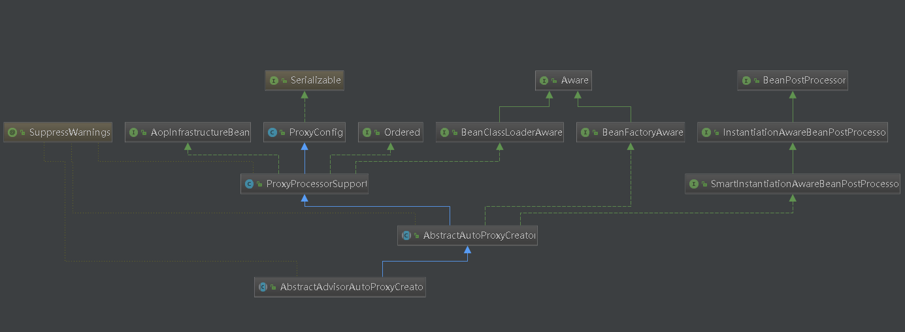

### aop 基本概念
1. 切面（Aspect）
将横切关注点设计为独立可重用的对象，这些对象称为切面。实际上就是一些功能增强的类或者对象的代表，
比如：日志管理、事物管理、异常控制等    
白话：一个服务层方法增强的一类功能点，一类功能实现就是切面，里面可以定义多个advice
    ```
        before : 开启事物
        public void execute() {// 业务方法
                System.out.println("execute执行");
                //        throw new RuntimeException();
        }
        after：关闭事物
    ```
2. 连接点（Joinpoint）
切面在应用程序执行时加入对象的业务流程中的特定点，成为连接点（Joinpoint）。连接点是AOP的核心概念之一。
它用来定义在目标程序的哪里通过AOP加入新的逻辑。一个要被拦截的方法，注意这里是一个被拦截或者需要功能增强的方法点  
白话：就是对应的具体的 被代理的方法：execute(); Joinpoint跟我们具体的被代理的方法一一对应
3. 切点（Pointcut）
切入点是通知要被织入到应用程序中的所有连接点的集合。可以在一个文件中，例如XML文件中，定义一个通知的切入点，
即它的所有连接点。说白了就是一个joinpoint的集合，一个连接点的集合  
白话：可以认为是joinpoint的集合，是很多方法的集合
4. 增强\通知（Advice）
增强是织入到目标类连接点上的一段程序代码。说白了就是一段在被代理类方法上面或者下面、或者环绕增加代码 
    ```
        增强\通知（Advice）
        before : 开启事物 == advice
        after：关闭事物 == advice
    ```
5. Advisor
Advice和Pointcut组成的独立的单元，并且能够传给proxy factory 对象。  
白话：advice和pointcut的组合或封装，Advisor可以认为它是一个只有一个advice的切面
6. 引入（Introduction）
   通过引入，我们可以在一个对象中加入新的方法和属性，而不用修改它的程序。对应切面中的<aop:declare-parents />     
白话：实际上也是一个类的扩展，可以认为往这个被代理类中加入动态方法，自己定义的通知必须要实现 MethodInterceptor
7. 标签说明:  
`<aop:pointcut>`：用来定义切入点，该切入点可以重用；     
`<aop:advisor>`：用来定义只有一个通知和一个切入点的切面;  
`<aop:aspect>`：用来定义切面，该切面可以包含多个切入点和通知，而且标签内部的通知和切入点定义是无序的;
和advisor的区别就在此，advisor只包含一个通知和一个切入点。

8.这个切面用得最多
```
事务通知
<aop:advisor advice-ref="txAdvice" pointcut="execution(public * com.dongnao.jack.service..*.*(..))" order="1"/>
```

### aop的入口类 AspectJAwareAdvisorAutoProxyCreator
### 解析pointcut的时候往BeanDefinition里面注册了AspectJExpressionPointcut
### 解析Aspectj的时候往BeanDefinition里面注册了DeclareParentsAdvisor
### 解析advice的时候往BeanDefinition里面注册了MethodLocatingFactoryBean
在advice解析的时候创建了一个advisor的时候往BeanDefinition里面注册了AspectJPointcutAdvisor
### 解析advisor的时候往BeanDefinition里面注册了DefaultBeanFactoryPointcutAdvisor 

### aop 命名空间解析在 AopNamespaceHandler 类中 
```
根据  <aop:config> 标签 localName 找到命名空间解析类 handle
http\://www.springframework.org/schema/aop=org.springframework.aop.config.AopNamespaceHandler
``` 

### 分析 AopNamespaceHandler 类
````
	@Override
	public void init() {// aop相关标签元素解析类注册
		// In 2.0 XSD as well as in 2.1 XSD.
		registerBeanDefinitionParser("config", new ConfigBeanDefinitionParser());
		registerBeanDefinitionParser("aspectj-autoproxy", new AspectJAutoProxyBeanDefinitionParser());
		registerBeanDefinitionDecorator("scoped-proxy", new ScopedProxyBeanDefinitionDecorator());

		// Only in 2.0 XSD: moved to context namespace as of 2.1
		registerBeanDefinitionParser("spring-configured", new SpringConfiguredBeanDefinitionParser());
	}
````
### 分析 ConfigBeanDefinitionParser 类
```
@Override
	public BeanDefinition parse(Element element, ParserContext parserContext) {
		CompositeComponentDefinition compositeDef =
				new CompositeComponentDefinition(element.getTagName(), parserContext.extractSource(element));
		parserContext.pushContainingComponent(compositeDef);

        //查看该方法
		configureAutoProxyCreator(parserContext, element);

		List<Element> childElts = DomUtils.getChildElements(element);
		for (Element elt: childElts) {
			String localName = parserContext.getDelegate().getLocalName(elt);
			if (POINTCUT.equals(localName)) { // pointcut 标签  表达式
			    // 查看该方法
				parsePointcut(elt, parserContext);
			}
			else if (ADVISOR.equals(localName)) { //advisor 标签
				parseAdvisor(elt, parserContext);
			}
			else if (ASPECT.equals(localName)) { // aspect标签 切面
			    //查看该方法
				parseAspect(elt, parserContext);
			}
		}
		
		parserContext.popAndRegisterContainingComponent();
		return null;
	}
	
private void configureAutoProxyCreator(ParserContext parserContext, Element element) {
		//查看该方法
		AopNamespaceUtils.registerAspectJAutoProxyCreatorIfNecessary(parserContext, element);
	}
	
public static void registerAspectJAutoProxyCreatorIfNecessary(
			ParserContext parserContext, Element sourceElement) {
        //查看该方法，结果：aop 入口类注册
		BeanDefinition beanDefinition = AopConfigUtils.registerAspectJAutoProxyCreatorIfNecessary(
				parserContext.getRegistry(), parserContext.extractSource(sourceElement));
		//查看该方法，结果：使用哪种方式生成代理类
		useClassProxyingIfNecessary(parserContext.getRegistry(), sourceElement);
		registerComponentIfNecessary(beanDefinition, parserContext);
	}
	
public static BeanDefinition registerAspectJAutoProxyCreatorIfNecessary(BeanDefinitionRegistry registry, Object source) {
	// 注册 AspectJAwareAdvisorAutoProxyCreator 类 aop的入口类
	// 查看该方法
	return registerOrEscalateApcAsRequired(AspectJAwareAdvisorAutoProxyCreator.class, registry, source);
	}
// 分析 registerOrEscalateApcAsRequired 类	
private static BeanDefinition registerOrEscalateApcAsRequired(Class<?> cls, BeanDefinitionRegistry registry, Object source) {
		Assert.notNull(registry, "BeanDefinitionRegistry must not be null");
		if (registry.containsBeanDefinition(AUTO_PROXY_CREATOR_BEAN_NAME)) {
			BeanDefinition apcDefinition = registry.getBeanDefinition(AUTO_PROXY_CREATOR_BEAN_NAME);
			if (!cls.getName().equals(apcDefinition.getBeanClassName())) {
				int currentPriority = findPriorityForClass(apcDefinition.getBeanClassName());
				int requiredPriority = findPriorityForClass(cls);
				if (currentPriority < requiredPriority) {
					apcDefinition.setBeanClassName(cls.getName());
				}
			}
			return null;
		}
		
		// 创建 BeanDefinition,将  AspectJAwareAdvisorAutoProxyCreator 的 class 放入 BeanDefinition中的 beanClass属性上
		// 当实例化时，就可以将 aop 入口类给实例化
		RootBeanDefinition beanDefinition = new RootBeanDefinition(cls);
		beanDefinition.setSource(source);
		beanDefinition.getPropertyValues().add("order", Ordered.HIGHEST_PRECEDENCE);
		beanDefinition.setRole(BeanDefinition.ROLE_INFRASTRUCTURE);
		
		// 注册 BeanDefinition名字和beanDefinition，
		// 在beanDefinitionNames 中放入 beanName	代码：this.beanDefinitionNames.add(beanName);
		registry.registerBeanDefinition(AUTO_PROXY_CREATOR_BEAN_NAME, beanDefinition);
		return beanDefinition;
	}				
```
### aop入口类 AspectJAwareAdvisorAutoProxyCreator 类结构
AspectJAwareAdvisorAutoProxyCreator 的顶层接口实现 BeanPostProcessor 接口，才能做为入口类

   

### 分析 useClassProxyingIfNecessary
```
 <aop:config proxy-target-class="true">  cglib的动态代理
 <aop:config proxy-target-class="false">  jdk的动态代理 也就是默认的

private static void useClassProxyingIfNecessary(BeanDefinitionRegistry registry, Element sourceElement) {
		if (sourceElement != null) {
			boolean proxyTargetClass = Boolean.valueOf(sourceElement.getAttribute(PROXY_TARGET_CLASS_ATTRIBUTE));
			if (proxyTargetClass) {
				AopConfigUtils.forceAutoProxyCreatorToUseClassProxying(registry);
			}
			boolean exposeProxy = Boolean.valueOf(sourceElement.getAttribute(EXPOSE_PROXY_ATTRIBUTE));
			if (exposeProxy) {
				AopConfigUtils.forceAutoProxyCreatorToExposeProxy(registry);
			}
		}
	}
```   
    
### 分析 parsePointcut(elt, parserContext); 方法  表达式的分析
```
private AbstractBeanDefinition parsePointcut(Element pointcutElement, ParserContext parserContext) {
		String id = pointcutElement.getAttribute(ID);//id
		String expression = pointcutElement.getAttribute(EXPRESSION);// 表达式

		AbstractBeanDefinition pointcutDefinition = null;

		try {
			this.parseState.push(new PointcutEntry(id));
			
			// 查看该方法 
			pointcutDefinition = createPointcutDefinition(expression);
			pointcutDefinition.setSource(parserContext.extractSource(pointcutElement));

			String pointcutBeanName = id;
			if (StringUtils.hasText(pointcutBeanName)) {
				parserContext.getRegistry().registerBeanDefinition(pointcutBeanName, pointcutDefinition);
			}
			else {
				pointcutBeanName = parserContext.getReaderContext().registerWithGeneratedName(pointcutDefinition);
			}

			parserContext.registerComponent(
					new PointcutComponentDefinition(pointcutBeanName, pointcutDefinition, expression));
		}
		finally {
			this.parseState.pop();
		}

		return pointcutDefinition;
	}

//分析 createPointcutDefinition 方法	
protected AbstractBeanDefinition createPointcutDefinition(String expression) {
        // 注册 AspectJExpressionPointcut 类
		RootBeanDefinition beanDefinition = new RootBeanDefinition(AspectJExpressionPointcut.class);
		
		beanDefinition.setScope(BeanDefinition.SCOPE_PROTOTYPE);
		beanDefinition.setSynthetic(true);
		
		// beanDefinition 加入表达式
		beanDefinition.getPropertyValues().add(EXPRESSION, expression);
		return beanDefinition;
	}	
```   

###  分析 parseAspect(elt, parserContext); 方法 切面的解析
```
private void parseAspect(Element aspectElement, ParserContext parserContext) {
		String aspectId = aspectElement.getAttribute(ID);
		String aspectName = aspectElement.getAttribute(REF);

		try {
			this.parseState.push(new AspectEntry(aspectId, aspectName));
			List<BeanDefinition> beanDefinitions = new ArrayList<BeanDefinition>();
			List<BeanReference> beanReferences = new ArrayList<BeanReference>();
            
            // DECLARE_PARENTS：引入标签
			List<Element> declareParents = DomUtils.getChildElementsByTagName(aspectElement, DECLARE_PARENTS);
			for (int i = METHOD_INDEX; i < declareParents.size(); i++) {
				Element declareParentsElement = declareParents.get(i);
				 
				// 查看该方法 ，俱体分析看下面
				beanDefinitions.add(parseDeclareParents(declareParentsElement, parserContext));
			}

			// We have to parse "advice" and all the advice kinds in one loop, to get the
			// ordering semantics right.
			NodeList nodeList = aspectElement.getChildNodes();
			boolean adviceFoundAlready = false;
			for (int i = 0; i < nodeList.getLength(); i++) {
				Node node = nodeList.item(i);
				if (isAdviceNode(node, parserContext)) { // 判断是不是 Advice，也就是各种通知 ，查看该方法，俱体分析看下面
					if (!adviceFoundAlready) {
						adviceFoundAlready = true;
						if (!StringUtils.hasText(aspectName)) {
							parserContext.getReaderContext().error(
									"<aspect> tag needs aspect bean reference via 'ref' attribute when declaring advices.",
									aspectElement, this.parseState.snapshot());
							return;
						}
						beanReferences.add(new RuntimeBeanReference(aspectName));
					}
					
					// 解析各种通知，俱体分析下面
					AbstractBeanDefinition advisorDefinition = parseAdvice(
							aspectName, i, aspectElement, (Element) node, parserContext, beanDefinitions, beanReferences);
					beanDefinitions.add(advisorDefinition);
				}
			}

			AspectComponentDefinition aspectComponentDefinition = createAspectComponentDefinition(
					aspectElement, aspectId, beanDefinitions, beanReferences, parserContext);
			parserContext.pushContainingComponent(aspectComponentDefinition);

			List<Element> pointcuts = DomUtils.getChildElementsByTagName(aspectElement, POINTCUT);
			for (Element pointcutElement : pointcuts) {
				parsePointcut(pointcutElement, parserContext);
			}

			parserContext.popAndRegisterContainingComponent();
		}
		finally {
			this.parseState.pop();
		}
	}
	
// 分析 parseDeclareParents(declareParentsElement, parserContext) 方法	
private AbstractBeanDefinition parseDeclareParents(Element declareParentsElement, ParserContext parserContext) {
		// BeanDefinition 中注册 DeclareParentsAdvisor 类
		BeanDefinitionBuilder builder = BeanDefinitionBuilder.rootBeanDefinition(DeclareParentsAdvisor.class);
		
		builder.addConstructorArgValue(declareParentsElement.getAttribute(IMPLEMENT_INTERFACE));
		builder.addConstructorArgValue(declareParentsElement.getAttribute(TYPE_PATTERN));

		String defaultImpl = declareParentsElement.getAttribute(DEFAULT_IMPL);
		String delegateRef = declareParentsElement.getAttribute(DELEGATE_REF);

		if (StringUtils.hasText(defaultImpl) && !StringUtils.hasText(delegateRef)) {
			builder.addConstructorArgValue(defaultImpl);
		}
		else if (StringUtils.hasText(delegateRef) && !StringUtils.hasText(defaultImpl)) {
			builder.addConstructorArgReference(delegateRef);
		}
		else {
			parserContext.getReaderContext().error(
					"Exactly one of the " + DEFAULT_IMPL + " or " + DELEGATE_REF + " attributes must be specified",
					declareParentsElement, this.parseState.snapshot());
		}

		AbstractBeanDefinition definition = builder.getBeanDefinition();
		definition.setSource(parserContext.extractSource(declareParentsElement));
		parserContext.getReaderContext().registerWithGeneratedName(definition);
		return definition;
	}
	

// isAdviceNode(node, parserContext) 通知分析
private boolean isAdviceNode(Node aNode, ParserContext parserContext) {
		if (!(aNode instanceof Element)) {
			return false;
		}
		else {
			String name = parserContext.getDelegate().getLocalName(aNode);
			return (BEFORE.equals(name) || AFTER.equals(name) || AFTER_RETURNING_ELEMENT.equals(name) ||
					AFTER_THROWING_ELEMENT.equals(name) || AROUND.equals(name));
		}
	}
	

// 各种通知解析 
AbstractBeanDefinition advisorDefinition = parseAdvice(
							aspectName, i, aspectElement, (Element) node, parserContext, beanDefinitions, beanReferences);
//  parseAdvice 方法分析							
private AbstractBeanDefinition parseAdvice(
			String aspectName, int order, Element aspectElement, Element adviceElement, ParserContext parserContext,
			List<BeanDefinition> beanDefinitions, List<BeanReference> beanReferences) {

		try {
			this.parseState.push(new AdviceEntry(parserContext.getDelegate().getLocalName(adviceElement)));

			// create the method factory bean
			
			// BeanDefinition 中注册 MethodLocatingFactoryBean 类
			RootBeanDefinition methodDefinition = new RootBeanDefinition(MethodLocatingFactoryBean.class);
			methodDefinition.getPropertyValues().add("targetBeanName", aspectName);
			
			// method 标签
			methodDefinition.getPropertyValues().add("methodName", adviceElement.getAttribute("method"));
			methodDefinition.setSynthetic(true);

			// create instance factory definition
			RootBeanDefinition aspectFactoryDef =
					new RootBeanDefinition(SimpleBeanFactoryAwareAspectInstanceFactory.class);
			aspectFactoryDef.getPropertyValues().add("aspectBeanName", aspectName);
			aspectFactoryDef.setSynthetic(true);

			// register the pointcut
			
			// 分析 createAdviceDefinition 方法，俱体分析看下面
			// methodDefinition 就是 method 的 BeanDefinition  
			AbstractBeanDefinition adviceDef = createAdviceDefinition(
					adviceElement, parserContext, aspectName, order, methodDefinition, aspectFactoryDef,
					beanDefinitions, beanReferences);

			// configure the advisor
			RootBeanDefinition advisorDefinition = new RootBeanDefinition(AspectJPointcutAdvisor.class);
			advisorDefinition.setSource(parserContext.extractSource(adviceElement));
			advisorDefinition.getConstructorArgumentValues().addGenericArgumentValue(adviceDef);
			if (aspectElement.hasAttribute(ORDER_PROPERTY)) {
				advisorDefinition.getPropertyValues().add(
						ORDER_PROPERTY, aspectElement.getAttribute(ORDER_PROPERTY));
			}

			// register the final advisor
			parserContext.getReaderContext().registerWithGeneratedName(advisorDefinition);

			return advisorDefinition;
		}
		finally {
			this.parseState.pop();
		}
	}	
	
// 分析 createAdviceDefinition 方法
private AbstractBeanDefinition createAdviceDefinition(
			Element adviceElement, ParserContext parserContext, String aspectName, int order,
			RootBeanDefinition methodDef, RootBeanDefinition aspectFactoryDef,
			List<BeanDefinition> beanDefinitions, List<BeanReference> beanReferences) {

        // 分析 getAdviceClass 方法，各种通知类的注册 俱体分析看下面 
		RootBeanDefinition adviceDefinition = new RootBeanDefinition(getAdviceClass(adviceElement, parserContext));
		adviceDefinition.setSource(parserContext.extractSource(adviceElement));

		adviceDefinition.getPropertyValues().add(ASPECT_NAME_PROPERTY, aspectName);
		
		// 当定义通知有多个时，可以定义每个执行的顺序
		adviceDefinition.getPropertyValues().add(DECLARATION_ORDER_PROPERTY, order);

		if (adviceElement.hasAttribute(RETURNING)) {
			adviceDefinition.getPropertyValues().add(
					RETURNING_PROPERTY, adviceElement.getAttribute(RETURNING));
		}
		if (adviceElement.hasAttribute(THROWING)) {
			adviceDefinition.getPropertyValues().add(
					THROWING_PROPERTY, adviceElement.getAttribute(THROWING));
		}
		if (adviceElement.hasAttribute(ARG_NAMES)) {
			adviceDefinition.getPropertyValues().add(
					ARG_NAMES_PROPERTY, adviceElement.getAttribute(ARG_NAMES));
		}

		ConstructorArgumentValues cav = adviceDefinition.getConstructorArgumentValues();
		cav.addIndexedArgumentValue(METHOD_INDEX, methodDef);

        // 分析 parsePointcutProperty 方法 ，俱体分析看下面
		Object pointcut = parsePointcutProperty(adviceElement, parserContext);
		if (pointcut instanceof BeanDefinition) { // 如果是 BeanDefinition ，说是返回的是表达式
			cav.addIndexedArgumentValue(POINTCUT_INDEX, pointcut);
			beanDefinitions.add((BeanDefinition) pointcut);
		}
		else if (pointcut instanceof String) { // 如果是字符串，说明返回的是表达式的引用字符串
			RuntimeBeanReference pointcutRef = new RuntimeBeanReference((String) pointcut);
			cav.addIndexedArgumentValue(POINTCUT_INDEX, pointcutRef);
			beanReferences.add(pointcutRef);
		}

		cav.addIndexedArgumentValue(ASPECT_INSTANCE_FACTORY_INDEX, aspectFactoryDef);

		return adviceDefinition;
	}
		
// 分析 getAdviceClass 方法 ，各种通知的类
private Class<?> getAdviceClass(Element adviceElement, ParserContext parserContext) {
		String elementName = parserContext.getDelegate().getLocalName(adviceElement);
		if (BEFORE.equals(elementName)) {
			return AspectJMethodBeforeAdvice.class;
		}
		else if (AFTER.equals(elementName)) {
			return AspectJAfterAdvice.class;
		}
		else if (AFTER_RETURNING_ELEMENT.equals(elementName)) {
			return AspectJAfterReturningAdvice.class;
		}
		else if (AFTER_THROWING_ELEMENT.equals(elementName)) {
			return AspectJAfterThrowingAdvice.class;
		}
		else if (AROUND.equals(elementName)) {
			return AspectJAroundAdvice.class;
		}
		else {
			throw new IllegalArgumentException("Unknown advice kind [" + elementName + "].");
		}
	}
	
	
// 分析 parsePointcutProperty(adviceElement, parserContext); 
// pointcut 分析 : pointcut 分两种 pointcut_ref、pointcut
private Object parsePointcutProperty(Element element, ParserContext parserContext) {
		if (element.hasAttribute(POINTCUT) && element.hasAttribute(POINTCUT_REF)) {
			parserContext.getReaderContext().error(
					"Cannot define both 'pointcut' and 'pointcut-ref' on <advisor> tag.",
					element, this.parseState.snapshot());
			return null;
		}
		else if (element.hasAttribute(POINTCUT)) {
			// Create a pointcut for the anonymous pc and register it.
			String expression = element.getAttribute(POINTCUT);
			AbstractBeanDefinition pointcutDefinition = createPointcutDefinition(expression);
			pointcutDefinition.setSource(parserContext.extractSource(element));
			return pointcutDefinition; // 如果是 表达式，就返回对象
		}
		else if (element.hasAttribute(POINTCUT_REF)) {
			String pointcutRef = element.getAttribute(POINTCUT_REF);
			if (!StringUtils.hasText(pointcutRef)) {
				parserContext.getReaderContext().error(
						"'pointcut-ref' attribute contains empty value.", element, this.parseState.snapshot());
				return null;
			}
			return pointcutRef; // 如果是表达式引用，则返回字符串
		}
		else {
			parserContext.getReaderContext().error(
					"Must define one of 'pointcut' or 'pointcut-ref' on <advisor> tag.",
					element, this.parseState.snapshot());
			return null;
		}
	}	
	

```
