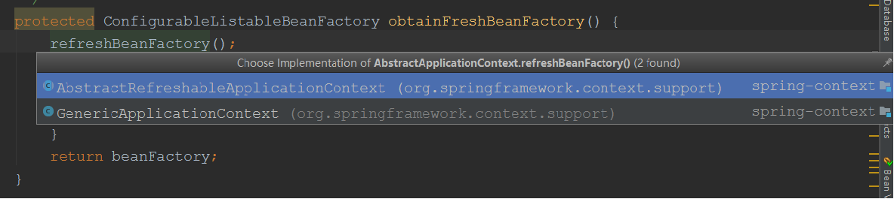
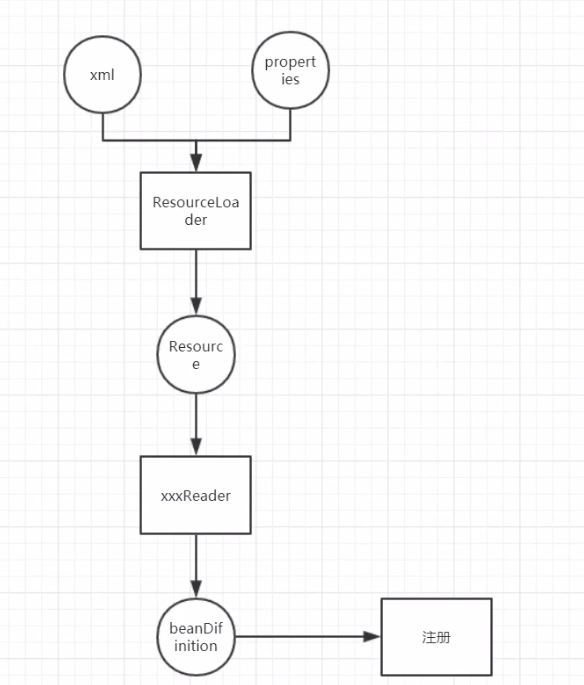
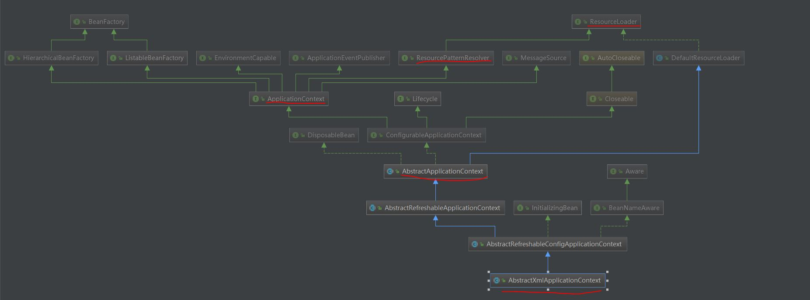
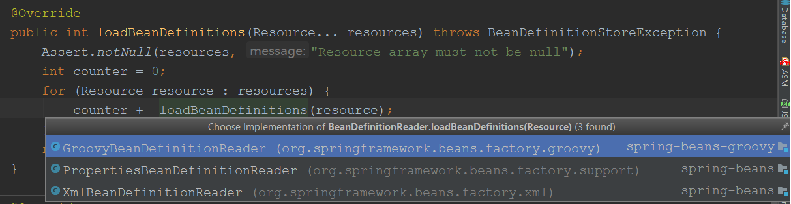

## spring mvc 源码解析
### spring mvc 入口 DispatcherServlet，类关系图如下所示：
  

DispatcherServlet 就是一个 Servlet，可以查看 HttpServletBean 中的 init() 方法，进行 Servlet初始化。init()方法代码如下：
```
    @Override
	public final void init() throws ServletException {	    
		if (logger.isDebugEnabled()) {
		    //当初始化容器时第一个打印的就是这个日志
			logger.debug("Initializing servlet '" + getServletName() + "'");
		}

		// Set bean properties from init parameters.
		try {
		    //包装 bean的属性
			PropertyValues pvs = new ServletConfigPropertyValues(getServletConfig(), this.requiredProperties);
			//包装 bean 实例
			BeanWrapper bw = PropertyAccessorFactory.forBeanPropertyAccess(this);
			//获取配置文件，如
			ResourceLoader resourceLoader = new ServletContextResourceLoader(getServletContext());
			bw.registerCustomEditor(Resource.class, new ResourceEditor(resourceLoader, getEnvironment()));
			initBeanWrapper(bw);
			bw.setPropertyValues(pvs, true);
		}
		catch (BeansException ex) {
			logger.error("Failed to set bean properties on servlet '" + getServletName() + "'", ex);
			throw ex;
		}

		// Let subclasses do whatever initialization they like.
		//调用子类方法，由上面的类图可知会调用：FrameworkServlet中的initServletBean()方法
		initServletBean();

		if (logger.isDebugEnabled()) {
			logger.debug("Servlet '" + getServletName() + "' configured successfully");
		}
	}
```

查看 initServletBean() 方法在哪些子类中  
  
由DispatcherServlet类关系图可知，进入 FrameworkServlet中的initServletBean()方法，查看 initWebApplicationContext() 方法，**重点**
```
protected WebApplicationContext initWebApplicationContext() {
		WebApplicationContext rootContext =
				WebApplicationContextUtils.getWebApplicationContext(getServletContext());
		WebApplicationContext wac = null;

		if (this.webApplicationContext != null) {
			// A context instance was injected at construction time -> use it
			wac = this.webApplicationContext;
			if (wac instanceof ConfigurableWebApplicationContext) {
				ConfigurableWebApplicationContext cwac = (ConfigurableWebApplicationContext) wac;
				if (!cwac.isActive()) {
					// The context has not yet been refreshed -> provide services such as
					// setting the parent context, setting the application context id, etc
					if (cwac.getParent() == null) {
						// The context instance was injected without an explicit parent -> set
						// the root application context (if any; may be null) as the parent
						cwac.setParent(rootContext);
					}
					// 重点
					configureAndRefreshWebApplicationContext(cwac);
				}
			}
		}
		if (wac == null) {
			// No context instance was injected at construction time -> see if one
			// has been registered in the servlet context. If one exists, it is assumed
			// that the parent context (if any) has already been set and that the
			// user has performed any initialization such as setting the context id
			wac = findWebApplicationContext();
		}
		if (wac == null) {
			// No context instance is defined for this servlet -> create a local one
			wac = createWebApplicationContext(rootContext);
		}

		if (!this.refreshEventReceived) {
			// Either the context is not a ConfigurableApplicationContext with refresh
			// support or the context injected at construction time had already been
			// refreshed -> trigger initial onRefresh manually here.
			
			//重点 调用 DispatcherServlet类中的 onRefresh()方法，对请求和响应做的一些初始化
			onRefresh(wac);
		}

		if (this.publishContext) {
			// Publish the context as a servlet context attribute.
			String attrName = getServletContextAttributeName();
			getServletContext().setAttribute(attrName, wac);
			if (this.logger.isDebugEnabled()) {
				this.logger.debug("Published WebApplicationContext of servlet '" + getServletName() +
						"' as ServletContext attribute with name [" + attrName + "]");
			}
		}

		return wac;
	}
```

### 分析 configureAndRefreshWebApplicationContext(cwac) 
```
protected void configureAndRefreshWebApplicationContext(ConfigurableWebApplicationContext wac) {
		if (ObjectUtils.identityToString(wac).equals(wac.getId())) {
			// The application context id is still set to its original default value
			// -> assign a more useful id based on available information
			if (this.contextId != null) {
				wac.setId(this.contextId);
			}
			else {
				// Generate default id...
				wac.setId(ConfigurableWebApplicationContext.APPLICATION_CONTEXT_ID_PREFIX +
						ObjectUtils.getDisplayString(getServletContext().getContextPath()) + "/" + getServletName());
			}
		}
        //在spring 中 设置servlet上下文
		wac.setServletContext(getServletContext());
		//在spring 中 设置 servlet 的配置信息 如xml 中的 <init-param> …… </init-param>
		wac.setServletConfig(getServletConfig());
		wac.setNamespace(getNamespace());
		wac.addApplicationListener(new SourceFilteringListener(wac, new ContextRefreshListener()));

		// The wac environment's #initPropertySources will be called in any case when the context
		// is refreshed; do it eagerly here to ensure servlet property sources are in place for
		// use in any post-processing or initialization that occurs below prior to #refresh
		
		//在spring 中获取工作环境，就是 profile ，可以指定是生产环境还是测试环境
		ConfigurableEnvironment env = wac.getEnvironment();
		if (env instanceof ConfigurableWebEnvironment) {
			((ConfigurableWebEnvironment) env).initPropertySources(getServletContext(), getServletConfig());
		}

		postProcessWebApplicationContext(wac);
		applyInitializers(wac);
		//重点 进入子类 AbstractApplicationContext 中的 refresh()方法
		wac.refresh();
	}
```
refresh() 方法在哪些子类中   
  

### AbstractApplicationContext 类关系图，红色部分为重点类


### AbstractApplicationContext 中的 refresh()方法
```
    @Override
	public void refresh() throws BeansException, IllegalStateException {
		synchronized (this.startupShutdownMonitor) {
			// Prepare this context for refreshing.
			prepareRefresh();

			// Tell the subclass to refresh the internal bean factory.
			
			//重点
			//1. xml解析
            //2. annotation的支持
			ConfigurableListableBeanFactory beanFactory = obtainFreshBeanFactory();

			// Prepare the bean factory for use in this context.
			prepareBeanFactory(beanFactory);

			try {
				// Allows post-processing of the bean factory in context subclasses.
				postProcessBeanFactory(beanFactory);

				// Invoke factory processors registered as beans in the context.
				invokeBeanFactoryPostProcessors(beanFactory);

				// Register bean processors that intercept bean creation.
				registerBeanPostProcessors(beanFactory);

				// Initialize message source for this context.
				initMessageSource();

				// Initialize event multicaster for this context.
				initApplicationEventMulticaster();

				// Initialize other special beans in specific context subclasses.
				onRefresh();

				// Check for listener beans and register them.
				registerListeners();

				// Instantiate all remaining (non-lazy-init) singletons.
				finishBeanFactoryInitialization(beanFactory);

				// Last step: publish corresponding event.
				finishRefresh();
			}

			catch (BeansException ex) {
				if (logger.isWarnEnabled()) {
					logger.warn("Exception encountered during context initialization - " +
							"cancelling refresh attempt: " + ex);
				}

				// Destroy already created singletons to avoid dangling resources.
				destroyBeans();

				// Reset 'active' flag.
				cancelRefresh(ex);

				// Propagate exception to caller.
				throw ex;
			}

			finally {
				// Reset common introspection caches in Spring's core, since we
				// might not ever need metadata for singleton beans anymore...
				resetCommonCaches();
			}
		}
	}
```
### 分析 obtainFreshBeanFactory()
```
protected ConfigurableListableBeanFactory obtainFreshBeanFactory() {
		refreshBeanFactory();
		ConfigurableListableBeanFactory beanFactory = getBeanFactory();
		if (logger.isDebugEnabled()) {
			logger.debug("Bean factory for " + getDisplayName() + ": " + beanFactory);
		}
		return beanFactory;
	}
```
查看refreshBeanFactory() 方法在哪些子类中  


### 进入 AbstractRefreshableApplicationContext 类中的 refreshBeanFactory()方法
```
@Override
	protected final void refreshBeanFactory() throws BeansException {
		//判断bean容器是否已经存在了,如果存在了就表示 bean容器已经启动成功了
		if (hasBeanFactory()) {
			destroyBeans();
			closeBeanFactory();
		}
		try {
			DefaultListableBeanFactory beanFactory = createBeanFactory();
			beanFactory.setSerializationId(getId());
			customizeBeanFactory(beanFactory);
			
			//xml 的解析
			loadBeanDefinitions(beanFactory);
			synchronized (this.beanFactoryMonitor) {
				this.beanFactory = beanFactory;
			}
		}
		catch (IOException ex) {
			throw new ApplicationContextException("I/O error parsing bean definition source for " + getDisplayName(), ex);
		}
	}
```
loadBeanDefinitions方法在哪些子类中  
- xml的解析类  
  AbstractXmlApplicationContext
  
- 注解的解析类  
  AnnotationConfigWebApplicationContext
    
   

### xml 解析类 AbstractXmlApplicationContext 中 loadBeanDefinitions方法
```
    @Override
	protected void loadBeanDefinitions(DefaultListableBeanFactory beanFactory) throws BeansException, IOException {
		// Create a new XmlBeanDefinitionReader for the given BeanFactory.
		
		// xml Readerc对象的定义
		XmlBeanDefinitionReader beanDefinitionReader = new XmlBeanDefinitionReader(beanFactory);

		// Configure the bean definition reader with this context's
		// resource loading environment.
		beanDefinitionReader.setEnvironment(this.getEnvironment());
		
		//放入 this,即 AbstractXmlApplicationContext 对象，没有报错:
		//因为AbstractXmlApplicationContext的父类ApplicationContext实现了ResourceLoader
		//具体请看 AbstractXmlApplicationContext 的类图，如下所示
		beanDefinitionReader.setResourceLoader(this);
		beanDefinitionReader.setEntityResolver(new ResourceEntityResolver(this));

		// Allow a subclass to provide custom initialization of the reader,
		// then proceed with actually loading the bean definitions.
		initBeanDefinitionReader(beanDefinitionReader);
		
		//重点：查看这个方法
		loadBeanDefinitions(beanDefinitionReader);
	}
```
### xml 解析过程 类的流转
- 将xml 或 properties 通过 ResourceLoader 加载为 Resource 对象
- 每个 Resource 对象 都有对应的 Reader对象，Reader对象将配置封装成 BeanDefinition
- BeanDefinition 在放入 map或容器中　
> ResourceUtils 类中记录了所有 文件的资源位置的实用方法和位置表示符，例如：classpath: 、jar:、file: 等　



#### AbstractXmlApplicationContext 类图
- beanDefinitionReader.setResourceLoader(this)  没有报错的原因：  
  AbstractXmlApplicationContext的父类ApplicationContext实现了ResourceLoader接口，
  所以 AbstractXmlApplicationContext类也是 ResourceLoader 类型的对象



#### loadBeanDefinitions(beanDefinitionReader) 方法
```
protected void loadBeanDefinitions(XmlBeanDefinitionReader reader) throws BeansException, IOException {
		
		//getConfigResources() 方法进行子类 ClassPathXmlApplicationContext的 getConfigResources()方法中
		//通过 getConfigResources() 这个方法将 所有 xml 文件封装成 Resource对象
		//得到 Resource 对象就得到了文件所对应的 文件流，这个文件流在解析 xml 时会用到。
		//resource == applicationContext.xml封装成resource对象
		Resource[] configResources = getConfigResources();
		
		if (configResources != null) {
			//调用 xml 所对应的 Reader 类中的 loadBeanDefinitions 方法 
			reader.loadBeanDefinitions(configResources);
		}
		String[] configLocations = getConfigLocations();
		if (configLocations != null) {
			reader.loadBeanDefinitions(configLocations);
		}
	}
```

### 进入 AbstractBeanDefinitionReader 类中的 loadBeanDefinitions 方法
```
	@Override
	public int loadBeanDefinitions(Resource... resources) throws BeanDefinitionStoreException {
		Assert.notNull(resources, "Resource array must not be null");
		int counter = 0;
		for (Resource resource : resources) {
		    //查看该方法,如下图所示
			counter += loadBeanDefinitions(resource);
		}
		return counter;
	}
```

### AbstractBeanDefinitionReader中的方法loadBeanDefinitions方法在哪些子类中


### 进入 XmlBeanDefinitionReader 类中的 loadBeanDefinitions 方法
```
    @Override
	public int loadBeanDefinitions(Resource resource) throws BeanDefinitionStoreException {
	   
	     //EncodedResource 类是对 Resource 的再次封装，将 Resource 所对应的编码方式也封装进来了	    
		return loadBeanDefinitions(new EncodedResource(resource));
	}
	
	public int loadBeanDefinitions(EncodedResource encodedResource) throws BeanDefinitionStoreException {
		Assert.notNull(encodedResource, "EncodedResource must not be null");
		if (logger.isInfoEnabled()) {
			logger.info("Loading XML bean definitions from " + encodedResource.getResource());
		}

		Set<EncodedResource> currentResources = this.resourcesCurrentlyBeingLoaded.get();
		if (currentResources == null) {
			currentResources = new HashSet<EncodedResource>(4);
			this.resourcesCurrentlyBeingLoaded.set(currentResources);
		}
		if (!currentResources.add(encodedResource)) {
			throw new BeanDefinitionStoreException(
					"Detected cyclic loading of " + encodedResource + " - check your import definitions!");
		}
		try {
		   
		    //获取 resource 的输入流，也就是配置文件xml的输入流
			InputStream inputStream = encodedResource.getResource().getInputStream();
			try {
			    //xml解析工具有：dom4j、sax
			    //spring 使用 xml解析工具，即dom解析---> jdk中的api
				InputSource inputSource = new InputSource(inputStream);
				if (encodedResource.getEncoding() != null) {
					inputSource.setEncoding(encodedResource.getEncoding());
				}
				//查看该方法
				return doLoadBeanDefinitions(inputSource, encodedResource.getResource());
			}
			finally {
				inputStream.close();
			}
		}
		catch (IOException ex) {
			throw new BeanDefinitionStoreException(
					"IOException parsing XML document from " + encodedResource.getResource(), ex);
		}
		finally {
			currentResources.remove(encodedResource);
			if (currentResources.isEmpty()) {
				this.resourcesCurrentlyBeingLoaded.remove();
			}
		}
	}
	
	
protected int doLoadBeanDefinitions(InputSource inputSource, Resource resource)
			throws BeanDefinitionStoreException {
		try {
		    //xml 解析的  Document 对象，applicationContext.xml 就是 Document
			Document doc = doLoadDocument(inputSource, resource);
			
			//方法分析请看下面
			return registerBeanDefinitions(doc, resource);
		}
		catch (BeanDefinitionStoreException ex) {
			throw ex;
		}
		catch (SAXParseException ex) {
			throw new XmlBeanDefinitionStoreException(resource.getDescription(),
					"Line " + ex.getLineNumber() + " in XML document from " + resource + " is invalid", ex);
		}
		catch (SAXException ex) {
			throw new XmlBeanDefinitionStoreException(resource.getDescription(),
					"XML document from " + resource + " is invalid", ex);
		}
		catch (ParserConfigurationException ex) {
			throw new BeanDefinitionStoreException(resource.getDescription(),
					"Parser configuration exception parsing XML from " + resource, ex);
		}
		catch (IOException ex) {
			throw new BeanDefinitionStoreException(resource.getDescription(),
					"IOException parsing XML document from " + resource, ex);
		}
		catch (Throwable ex) {
			throw new BeanDefinitionStoreException(resource.getDescription(),
					"Unexpected exception parsing XML document from " + resource, ex);
		}
	}	
	
	
protected Document doLoadDocument(InputSource inputSource, Resource resource) throws Exception {
		return this.documentLoader.loadDocument(inputSource, getEntityResolver(), this.errorHandler,
				getValidationModeForResource(resource), isNamespaceAware());
	}

    //进入 this.documentLoader.loadDocument方法后代码如下：
    @Override
	public Document loadDocument(InputSource inputSource, EntityResolver entityResolver,
			ErrorHandler errorHandler, int validationMode, boolean namespaceAware) throws Exception {
        
        //jdk 中的 dom解析 工作  DocumentBuilderFactory
		DocumentBuilderFactory factory = createDocumentBuilderFactory(validationMode, namespaceAware);
		if (logger.isDebugEnabled()) {
			logger.debug("Using JAXP provider [" + factory.getClass().getName() + "]");
		}
		//获取 DocumentBuilder 对象
		DocumentBuilder builder = createDocumentBuilder(factory, entityResolver, errorHandler);
		
		//使用 DocumentBuilder 对象 解析 xml，返回 Document 对象
		return builder.parse(inputSource);
	}		
	
```

### 分析 XmlBeanDefinitionReader 类中的 registerBeanDefinitions(doc, resource)
```
public int registerBeanDefinitions(Document doc, Resource resource) throws BeanDefinitionStoreException {
		//获取reader对象，也就是 Document 的解析器
		BeanDefinitionDocumentReader documentReader = createBeanDefinitionDocumentReader();
		int countBefore = getRegistry().getBeanDefinitionCount();
		
		//查看该方法
		documentReader.registerBeanDefinitions(doc, createReaderContext(resource));
		return getRegistry().getBeanDefinitionCount() - countBefore;
	}

    // DefaultBeanDefinitionDocumentReader 中的	registerBeanDefinitions 方法
    @Override
	public void registerBeanDefinitions(Document doc, XmlReaderContext readerContext) {
		this.readerContext = readerContext;
		logger.debug("Loading bean definitions");
		
		//获取 Document 的根节点，根节点也就是 applicationContext.xml最外面的 beans 标签
		Element root = doc.getDocumentElement();
		
		//查看该方法
		doRegisterBeanDefinitions(root);
	}	
	
// DefaultBeanDefinitionDocumentReader 中的	doRegisterBeanDefinitions 方法	
protected void doRegisterBeanDefinitions(Element root) {
		BeanDefinitionParserDelegate parent = this.delegate;
		this.delegate = createDelegate(getReaderContext(), root, parent);

		if (this.delegate.isDefaultNamespace(root)) {
		    //查看 profile，也就是说 <beans 上的标签可以配置 profile属性，来说明是生产环境还是测试环境>
			String profileSpec = root.getAttribute(PROFILE_ATTRIBUTE);
			if (StringUtils.hasText(profileSpec)) {
				String[] specifiedProfiles = StringUtils.tokenizeToStringArray(
						profileSpec, BeanDefinitionParserDelegate.MULTI_VALUE_ATTRIBUTE_DELIMITERS);
				if (!getReaderContext().getEnvironment().acceptsProfiles(specifiedProfiles)) {
					if (logger.isInfoEnabled()) {
						logger.info("Skipped XML bean definition file due to specified profiles [" + profileSpec +
								"] not matching: " + getReaderContext().getResource());
					}
					return;
				}
			}
		}

		preProcessXml(root);
		//查看该方法
		parseBeanDefinitions(root, this.delegate);
		postProcessXml(root);
		this.delegate = parent;
	}	
	
// DefaultBeanDefinitionDocumentReader 中的	parseBeanDefinitions 方法	
protected void parseBeanDefinitions(Element root, BeanDefinitionParserDelegate delegate) {
		if (delegate.isDefaultNamespace(root)) {
			NodeList nl = root.getChildNodes();
			for (int i = 0; i < nl.getLength(); i++) {//循环根元素,即 beans 标签下的所有节点
				Node node = nl.item(i);
				if (node instanceof Element) {
					Element ele = (Element) node;
					if (delegate.isDefaultNamespace(ele)) {
						
						//解析默认的元素 默认元素：import标签、alias 标签、bean 标签 、beans 标签
						parseDefaultElement(ele, delegate);
					}
					else {
					    //解析自定义的元素，是spring mvc 自定义的元素 重点
						delegate.parseCustomElement(ele);
					}
				}
			}
		}
		else {
			delegate.parseCustomElement(root);
		}
	}
	
//解析默认的元素	
private void parseDefaultElement(Element ele, BeanDefinitionParserDelegate delegate) {
		if (delegate.nodeNameEquals(ele, IMPORT_ELEMENT)) { // 解析 import 标签
			importBeanDefinitionResource(ele);
		}
		//alias 标签 说明：可以给 bean标签的id 起个别名，可以对一个bean 标签的id 起多个别名，都可以获取到这个bean对象
		else if (delegate.nodeNameEquals(ele, ALIAS_ELEMENT)) {// 解析 alias 标签，
			processAliasRegistration(ele);
		}
		else if (delegate.nodeNameEquals(ele, BEAN_ELEMENT)) { // 解析 bean 标签，重点
			processBeanDefinition(ele, delegate);
		}
		else if (delegate.nodeNameEquals(ele, NESTED_BEANS_ELEMENT)) { // 解析 beans 标签
			// recurse
			doRegisterBeanDefinitions(ele);
		}
	}	
	
///解析 bean 标签	 重点	
protected void processBeanDefinition(Element ele, BeanDefinitionParserDelegate delegate) {
		//查看该方法，返回 某一个元素的解析，即 BeanDefinition 的封装类 BeanDefinitionHolder
		BeanDefinitionHolder bdHolder = delegate.parseBeanDefinitionElement(ele);
		if (bdHolder != null) {
			bdHolder = delegate.decorateBeanDefinitionIfRequired(ele, bdHolder);
			try {
				// Register the final decorated instance.
				BeanDefinitionReaderUtils.registerBeanDefinition(bdHolder, getReaderContext().getRegistry());
			}
			catch (BeanDefinitionStoreException ex) {
				getReaderContext().error("Failed to register bean definition with name '" +
						bdHolder.getBeanName() + "'", ele, ex);
			}
			// Send registration event.
			getReaderContext().fireComponentRegistered(new BeanComponentDefinition(bdHolder));
		}
	}	
	
//分析delegate.parseBeanDefinitionElement(ele) 方法
public BeanDefinitionHolder parseBeanDefinitionElement(Element ele) {
		return parseBeanDefinitionElement(ele, null);
	}

//分析parseBeanDefinitionElement 方法
public BeanDefinitionHolder parseBeanDefinitionElement(Element ele, BeanDefinition containingBean) {
		// bean标签的id
		String id = ele.getAttribute(ID_ATTRIBUTE);
		// bean标签的 name
		String nameAttr = ele.getAttribute(NAME_ATTRIBUTE);

        // bean标签的 别名
		List<String> aliases = new ArrayList<String>();
		if (StringUtils.hasLength(nameAttr)) {
			String[] nameArr = StringUtils.tokenizeToStringArray(nameAttr, MULTI_VALUE_ATTRIBUTE_DELIMITERS);
			aliases.addAll(Arrays.asList(nameArr));
		}

        // beanName 对应的 就是 bean 的id
		String beanName = id;
		if (!StringUtils.hasText(beanName) && !aliases.isEmpty()) {
			beanName = aliases.remove(0);
			if (logger.isDebugEnabled()) {
				logger.debug("No XML 'id' specified - using '" + beanName +
						"' as bean name and " + aliases + " as aliases");
			}
		}

		if (containingBean == null) {
			// 检查 bean 的name是否唯一,也就是 bean 的id名字是否唯一
			checkNameUniqueness(beanName, aliases, ele);
		}
        
        //查看该方法 重点
		AbstractBeanDefinition beanDefinition = parseBeanDefinitionElement(ele, beanName, containingBean);
		if (beanDefinition != null) {
			if (!StringUtils.hasText(beanName)) {
				try {
					if (containingBean != null) {
						beanName = BeanDefinitionReaderUtils.generateBeanName(
								beanDefinition, this.readerContext.getRegistry(), true);
					}
					else {
						beanName = this.readerContext.generateBeanName(beanDefinition);
						// Register an alias for the plain bean class name, if still possible,
						// if the generator returned the class name plus a suffix.
						// This is expected for Spring 1.2/2.0 backwards compatibility.
						String beanClassName = beanDefinition.getBeanClassName();
						if (beanClassName != null &&
								beanName.startsWith(beanClassName) && beanName.length() > beanClassName.length() &&
								!this.readerContext.getRegistry().isBeanNameInUse(beanClassName)) {
							aliases.add(beanClassName);
						}
					}
					if (logger.isDebugEnabled()) {
						logger.debug("Neither XML 'id' nor 'name' specified - " +
								"using generated bean name [" + beanName + "]");
					}
				}
				catch (Exception ex) {
					error(ex.getMessage(), ele);
					return null;
				}
			}
			String[] aliasesArray = StringUtils.toStringArray(aliases);
			
			// 返回 BeanDefinition 的封装 对象 BeanDefinition，将bean的 名子和别名，以及BeanDefinition 放入该对象中
			return new BeanDefinitionHolder(beanDefinition, beanName, aliasesArray);
		}

		return null;
	}
	
// 分析 parseBeanDefinitionElement 重点				
public AbstractBeanDefinition parseBeanDefinitionElement(
			Element ele, String beanName, BeanDefinition containingBean) {

		this.parseState.push(new BeanEntry(beanName));

		String className = null;
		if (ele.hasAttribute(CLASS_ATTRIBUTE)) {
		    
		    //获取 bean标签的 class属性，也就是类名
			className = ele.getAttribute(CLASS_ATTRIBUTE).trim();
		}

		try {
			String parent = null;
			if (ele.hasAttribute(PARENT_ATTRIBUTE)) {
				parent = ele.getAttribute(PARENT_ATTRIBUTE);
			}
			
			//查看该方法,返回 BeanDefinition 对象			
			AbstractBeanDefinition bd = createBeanDefinition(className, parent);

            //解析 BeanDefinition 对象的属性，查看该方法，
            // 返回 BeanDefinition 对象，BeanDefinition就是对一系列元素的封装
            // 所有出现在 xml中的标签都会封装在 BeanDefinition 对象中
			parseBeanDefinitionAttributes(ele, beanName, containingBean, bd);
			bd.setDescription(DomUtils.getChildElementValueByTagName(ele, DESCRIPTION_ELEMENT));

			parseMetaElements(ele, bd);
			parseLookupOverrideSubElements(ele, bd.getMethodOverrides());
			parseReplacedMethodSubElements(ele, bd.getMethodOverrides());

			parseConstructorArgElements(ele, bd);
			parsePropertyElements(ele, bd);
			parseQualifierElements(ele, bd);

			bd.setResource(this.readerContext.getResource());
			bd.setSource(extractSource(ele));

			return bd;
		}
		catch (ClassNotFoundException ex) {
			error("Bean class [" + className + "] not found", ele, ex);
		}
		catch (NoClassDefFoundError err) {
			error("Class that bean class [" + className + "] depends on not found", ele, err);
		}
		catch (Throwable ex) {
			error("Unexpected failure during bean definition parsing", ele, ex);
		}
		finally {
			this.parseState.pop();
		}

		return null;
	}
	
// 分析 createBeanDefinition	方法
protected AbstractBeanDefinition createBeanDefinition(String className, String parentName)
			throws ClassNotFoundException {
        
        //查看该方法
		return BeanDefinitionReaderUtils.createBeanDefinition(
				parentName, className, this.readerContext.getBeanClassLoader());
	}	

// 分析 BeanDefinitionReaderUtils.createBeanDefinition 方法
public static AbstractBeanDefinition createBeanDefinition(
			String parentName, String className, ClassLoader classLoader) throws ClassNotFoundException {

		GenericBeanDefinition bd = new GenericBeanDefinition();
		bd.setParentName(parentName);
		if (className != null) {
			if (classLoader != null) {
			    
			    //设置 class 对象
				bd.setBeanClass(ClassUtils.forName(className, classLoader));
			}
			else {
			    
			    // 设置 class 对应的 className
				bd.setBeanClassName(className);
			}
		}
		
		// 返回 BeanDefinition 对象
		return bd;
	}																											
```
### GenericBeanDefinition类图


### 分析 解析 BeanDefinition 对象的属性
```
public AbstractBeanDefinition parseBeanDefinitionAttributes(Element ele, String beanName,
			BeanDefinition containingBean, AbstractBeanDefinition bd) {

		if (ele.hasAttribute(SINGLETON_ATTRIBUTE)) { // bean 的 singleton
			error("Old 1.x 'singleton' attribute in use - upgrade to 'scope' declaration", ele);
		}
		else if (ele.hasAttribute(SCOPE_ATTRIBUTE)) { // bean 的 scope
			bd.setScope(ele.getAttribute(SCOPE_ATTRIBUTE));
		}
		else if (containingBean != null) {
			// Take default from containing bean in case of an inner bean definition.
			bd.setScope(containingBean.getScope());
		}

		if (ele.hasAttribute(ABSTRACT_ATTRIBUTE)) {// bean 的 abstract
			bd.setAbstract(TRUE_VALUE.equals(ele.getAttribute(ABSTRACT_ATTRIBUTE)));
		}

		String lazyInit = ele.getAttribute(LAZY_INIT_ATTRIBUTE);
		if (DEFAULT_VALUE.equals(lazyInit)) {
			lazyInit = this.defaults.getLazyInit();
		}
		bd.setLazyInit(TRUE_VALUE.equals(lazyInit));

		String autowire = ele.getAttribute(AUTOWIRE_ATTRIBUTE);
		bd.setAutowireMode(getAutowireMode(autowire));

		String dependencyCheck = ele.getAttribute(DEPENDENCY_CHECK_ATTRIBUTE);
		bd.setDependencyCheck(getDependencyCheck(dependencyCheck));

		if (ele.hasAttribute(DEPENDS_ON_ATTRIBUTE)) {
			String dependsOn = ele.getAttribute(DEPENDS_ON_ATTRIBUTE);
			bd.setDependsOn(StringUtils.tokenizeToStringArray(dependsOn, MULTI_VALUE_ATTRIBUTE_DELIMITERS));
		}

		String autowireCandidate = ele.getAttribute(AUTOWIRE_CANDIDATE_ATTRIBUTE);
		if ("".equals(autowireCandidate) || DEFAULT_VALUE.equals(autowireCandidate)) {
			String candidatePattern = this.defaults.getAutowireCandidates();
			if (candidatePattern != null) {
				String[] patterns = StringUtils.commaDelimitedListToStringArray(candidatePattern);
				bd.setAutowireCandidate(PatternMatchUtils.simpleMatch(patterns, beanName));
			}
		}
		else {
			bd.setAutowireCandidate(TRUE_VALUE.equals(autowireCandidate));
		}

		if (ele.hasAttribute(PRIMARY_ATTRIBUTE)) {
			bd.setPrimary(TRUE_VALUE.equals(ele.getAttribute(PRIMARY_ATTRIBUTE)));
		}

		if (ele.hasAttribute(INIT_METHOD_ATTRIBUTE)) {
			String initMethodName = ele.getAttribute(INIT_METHOD_ATTRIBUTE);
			if (!"".equals(initMethodName)) {
				bd.setInitMethodName(initMethodName);
			}
		}
		else {
			if (this.defaults.getInitMethod() != null) {
				bd.setInitMethodName(this.defaults.getInitMethod());
				bd.setEnforceInitMethod(false);
			}
		}

		if (ele.hasAttribute(DESTROY_METHOD_ATTRIBUTE)) {
			String destroyMethodName = ele.getAttribute(DESTROY_METHOD_ATTRIBUTE);
			bd.setDestroyMethodName(destroyMethodName);
		}
		else {
			if (this.defaults.getDestroyMethod() != null) {
				bd.setDestroyMethodName(this.defaults.getDestroyMethod());
				bd.setEnforceDestroyMethod(false);
			}
		}

		if (ele.hasAttribute(FACTORY_METHOD_ATTRIBUTE)) {
			bd.setFactoryMethodName(ele.getAttribute(FACTORY_METHOD_ATTRIBUTE));
		}
		if (ele.hasAttribute(FACTORY_BEAN_ATTRIBUTE)) {
			bd.setFactoryBeanName(ele.getAttribute(FACTORY_BEAN_ATTRIBUTE));
		}

        
        //将一系列属性封装 到 BeanDefinition 对象中
		return bd;
	}
```
### BeanDefinition 说明
- 我们会把xml里面的标签元素比如：bean、componentScan、annotation-config等标签封装成beanDefinition对象
- 我们会把annotation比如：@Service、@Controller、@Component、@Resource等注解封装成BeanDefinition


### 分析 解析自定义的元素，是spring mvc 自定义的元素 
```
public BeanDefinition parseCustomElement(Element ele) {
		return parseCustomElement(ele, null);
	}

	
public BeanDefinition parseCustomElement(Element ele, BeanDefinition containingBd) {
        //命名空间 namespaceUri， 也就是 beans 标签的 xmlns 、 xmlns:context、xmlns:aop、xmlns:tx 后面url
		String namespaceUri = getNamespaceURI(ele);
		
		// NamespaceHandler 是自定义标签的知识点
		// getNamespaceHandlerResolver() 命名空间的解析器
		//查看 resolve(namespaceUri) 方法 ,则进入 DefaultNamespaceHandlerResolver 中的 resolve(namespaceUri) 方法
		// 分析结果：解析命名空间 uri,同时实例化所对应的 命名空间处理类对象，这个解析过程会调用 命名空间处理类中的 init()方法
	    //注册所有关于 这个命名空间 有关元素的所有 解析器，例如：`<context:annotation-config />` 的 annotation-config 元素解析器
		NamespaceHandler handler = this.readerContext.getNamespaceHandlerResolver().resolve(namespaceUri);
========================================================》		
		if (handler == null) {
			error("Unable to locate Spring NamespaceHandler for XML schema namespace [" + namespaceUri + "]", ele);
			return null;
		}
		return handler.parse(ele, new ParserContext(this.readerContext, this, containingBd));
	}
	

// DefaultNamespaceHandlerResolver 中的 resolve(namespaceUri) 方法
@Override
public NamespaceHandler resolve(String namespaceUri) {
        // 查看 getHandlerMappings() 方法
		Map<String, Object> handlerMappings = getHandlerMappings();
		
		//通过上面返回的map对象，根据 namespaceUri 找到所对应的 处理类
		Object handlerOrClassName = handlerMappings.get(namespaceUri);
		if (handlerOrClassName == null) {
			return null;
		}
		else if (handlerOrClassName instanceof NamespaceHandler) {
			return (NamespaceHandler) handlerOrClassName;
		}
		else {
			String className = (String) handlerOrClassName;
			try {
			   
			    //找到 命名空间所对应的处理类，通过反射 出来 class 对象
				Class<?> handlerClass = ClassUtils.forName(className, this.classLoader);
				if (!NamespaceHandler.class.isAssignableFrom(handlerClass)) {
					throw new FatalBeanException("Class [" + className + "] for namespace [" + namespaceUri +
							"] does not implement the [" + NamespaceHandler.class.getName() + "] interface");
				}
				
				// 将 命名空间所对应的处理类 实例化出来
				NamespaceHandler namespaceHandler = (NamespaceHandler) BeanUtils.instantiateClass(handlerClass);
				
				//调用 命名空间所对应的处理类 的init() 方法
				namespaceHandler.init();
				
				// 将 命名空间的uri 和 命名空间处理类 存放入 map 中
				handlerMappings.put(namespaceUri, namespaceHandler);
				return namespaceHandler;
			}
			catch (ClassNotFoundException ex) {
				throw new FatalBeanException("NamespaceHandler class [" + className + "] for namespace [" +
						namespaceUri + "] not found", ex);
			}
			catch (LinkageError err) {
				throw new FatalBeanException("Invalid NamespaceHandler class [" + className + "] for namespace [" +
						namespaceUri + "]: problem with handler class file or dependent class", err);
			}
		}
	}	
	
// DefaultNamespaceHandlerResolver 中的	getHandlerMappings() 方法
private Map<String, Object> getHandlerMappings() {
		if (this.handlerMappings == null) {
			synchronized (this) {
				if (this.handlerMappings == null) {
					try {
					    //加载所有 Propertie 配置文件，并放入 Properties 对象中
						Properties mappings =
								PropertiesLoaderUtils.loadAllProperties(this.handlerMappingsLocation, this.classLoader);
						
						if (logger.isDebugEnabled()) {
							logger.debug("Loaded NamespaceHandler mappings: " + mappings);
						}
						//创建 handlerMappings 对象，也就是map对象
						Map<String, Object> handlerMappings = new ConcurrentHashMap<String, Object>(mappings.size());
						
						//查看该方法，将 Properties 对象也就是 key=value 的形式 放入 handlerMappings 对象中，
						CollectionUtils.mergePropertiesIntoMap(mappings, handlerMappings);
						this.handlerMappings = handlerMappings;
					}
					catch (IOException ex) {
						throw new IllegalStateException(
								"Unable to load NamespaceHandler mappings from location [" + this.handlerMappingsLocation + "]", ex);
					}
				}
			}
		}
		
		//返回 map对象
		return this.handlerMappings;
	}					
```

### 查看 xmlns:context  的命名空间
```
//加载所有 Propertie 配置文件
Properties mappings =
		PropertiesLoaderUtils.loadAllProperties(this.handlerMappingsLocation, this.classLoader);						
```
1. 进入 spring-context 模块
2. 进入 resources/META-INF/ 文件夹下面
3. 查看 spring.handlers 配置文件
   可以看到每个命名空间的url 对应一个类。
   例如 xmlns:context 对应的 url `http\://www.springframework.org/schema/context` 对应 ContextNamespaceHandler 类
   每一个命名空间都有对应的解析类 NamespaceHandler ，每一个 命名空间解析类中都有所对应的 命名空间的元素解析器
   ```
    http\://www.springframework.org/schema/context=org.springframework.context.config.ContextNamespaceHandler
   ```
4. ContextNamespaceHandler 代码如下：
```
public class ContextNamespaceHandler extends NamespaceHandlerSupport {

    // 注册 context 标签中 元素的所对应的解析器 ，例如：<context:annotation-config />  annotation-config 元素的解析器
    // 每一个标签所对应的解析器都是不一样的。
    // 每一个命名空间 元素的解析器 就是在对应的 命名空间类中 注册的
	@Override
	public void init() {// init() 方法就是注册 标签元素的解析器的
	// init() 方法在哪里调用，在解析 命名空间的过程中调用的，具体请看下面的分析
	    
	    // 加载数据库配置文件 
	    // context:property-placeholder location="classpath:config.properties" profile="true" />
		registerBeanDefinitionParser("property-placeholder", new PropertyPlaceholderBeanDefinitionParser());
		registerBeanDefinitionParser("property-override", new PropertyOverrideBeanDefinitionParser());
		
		// 对应的标签 <context:annotation-config /> 
		// 根据 context 标签就可以找到 命名空间 uri ，根据uri 就可以找到 ContextNamespaceHandler 这个类
	    // 在这个类中就能找到 元素所对应的解析器
		registerBeanDefinitionParser("annotation-config", new AnnotationConfigBeanDefinitionParser());
		
		//组件扫描标签，是对注解的支持
		//激活Spring注解方式：自动扫描，并注入bean
		//例如：<context:component-scan base-package="com.zhang" />
		registerBeanDefinitionParser("component-scan", new ComponentScanBeanDefinitionParser());
		registerBeanDefinitionParser("load-time-weaver", new LoadTimeWeaverBeanDefinitionParser());
		registerBeanDefinitionParser("spring-configured", new SpringConfiguredBeanDefinitionParser());
		registerBeanDefinitionParser("mbean-export", new MBeanExportBeanDefinitionParser());
		registerBeanDefinitionParser("mbean-server", new MBeanServerBeanDefinitionParser());
	}
}
```  
### context 命名空间 说明
例如：`<context:annotation-config />`  
context找uri，beans有content对应的uri  
spring.handlers里面就有uri对应的处理类，实现NamespaceHandler，会把这个命名空间对应的标签对应的处理注册进来   
